title: NPFL138, Lecture 1
class: title, langtech, cc-by-sa
# Introduction to Deep Learning

## Milan Straka

### February 17, 2026

---
# What is Deep Learning

---
# Deep Learning Highlights

~~~

~~~

~~~

~~~

~~~

~~~
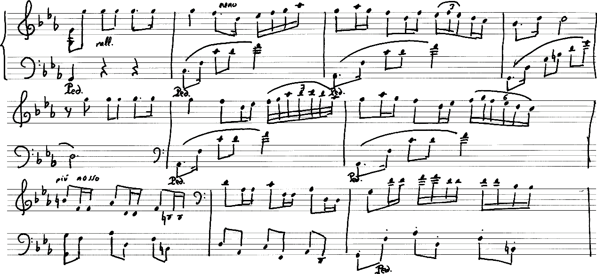

---
# Deep Reinforcement Learning

Deep learning has also been successfully combined with reinforcement learning.

~~~

~~~

~~~

~~~

~~~

~~~

~~~

~~~

---
section: TL;DR
class: section
# What are Neural Networks

---
# What are Neural Networks

Neural networks are just a model for describing computation of outputs from
given inputs.

~~~
#
The model:
- is strong enough to approximate any reasonable function,

~~~
- is reasonably compact,
~~~
- allows heavy parallelization during execution (GPUs, TPUs, …).

~~~
#
Nearly all the time, neural networks generate a _probability distribution_ as
output:

~~~
- distributions allow small changes during training,

~~~
- during prediction, we usually take the most probable outcome (class/label/…).

~~~
#
When there is enough data, neural networks are currently the best performing
machine learning model, especially when the data are high-dimensional (images,
videos, speech, texts, …).

---
section: Organization
class: section
# Organization

---
# Organization

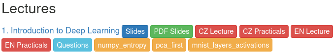

**Course Website:** https://ufal.mff.cuni.cz/courses/npfl138
~~~
  - Slides, recordings, assignments, exam questions
~~~

**Course Repository:** https://github.com/ufal/npfl138
- Templates for the assignments, slide sources.

~~~

## Piazza

- Piazza will be used as a communication platform.
  You can post questions or notes,
  - **privately** to the instructors,
~~~
  - **publicly** to everyone (signed or anonymously).
~~~
    - Other students can answer these too, which allows you to get faster
      response.
~~~
    - However, **do not include even parts of your source code** in public
      questions.
~~~
- Please use Piazza for **all communication** with the instructors.
~~~
- You will get the invite link after the first lecture.

---
# ReCodEx

https://recodex.mff.cuni.cz

- The assignments will be evaluated automatically in ReCodEx.

~~~
- If you have an MFF SIS account, you should be able to create an account
  using your CAS credentials and should automatically see the right group.
~~~
- Otherwise, there will be **instructions** on **Piazza** how to get
  ReCodEx account (generally you will need to send me a message and I will
  create the account for you).

---
# Course Requirements

## Practicals
~~~

- There will be about 2–4 assignments a week, each with a 2-week deadline.
~~~
  - There is also another week-long second deadline, but for fewer points.
~~~
- After solving the assignment, you get non-bonus points, and sometimes also
  bonus points.
~~~
- To pass the practicals, you need to get **80 non-bonus points**. There will be
  assignments for at least 120 non-bonus points.
~~~
- If you get more than 80 points (be it bonus or non-bonus), they will be
  all transferred to the exam. Additionally, if you solve **all the
  assignments**, you pass the exam with grade 1.

~~~
## Lecture

You need to pass a written exam (or solve all the assignments).
~~~
- All questions are publicly listed on the course website.
~~~
- There are questions for 100 points in every exam, plus the surplus
  points from the practicals and plus at most 10 surplus points for **community
  work** (improving slides, …).
~~~
- You need 60/75/90 points to pass with grade 3/2/1.

---
# Organization

- Both the lectures and the practicals are recorded.

~~~
## Consultations

- Regular **completely voluntary** consultations are part of the course schedule.

  - Wednesday, 12:20, S5
~~~
- The consultations take place on the last day of assignment deadlines.
~~~
- The consultations are not recorded and have no predefined content.
~~~
- The consultations start on the **second week** of the semester.

~~~
## Micro-credentials

- Once successfully passing the course, it is possible to obtain a micro-credential, an
  internationally recognized and verifiable digital certificate attesting that
  you gained knowledge and skills in a specific area.

~~~
- Instructions will be sent at the end of the semester.

---
# Organization

## AI Assistance when Solving Assignments

~~~
- Relying blindly on AI during learning seems to have negative effect on skill
  acquisition:

  - https://arxiv.org/abs/2601.20245
  - https://doi.org/10.1016/S2468-1253(25)00133-5
~~~
- Therefore, you are **not allowed** to directly copy the assignment descriptions to
  GenAI and you are **not allowed** to directly use or copy-paste source code
  generated by GenAI.
~~~
- However, discussing your manually written code with GenAI is fine.

---
section: Notation
class: section
# Notation

---
# Notation

- $a$, $→a$, $⇉A$, $⇶A$: scalar (integer or real), vector, matrix, tensor

~~~
  - $c ⋅ ⇉A$ denotes scalar multiplication, $→x ⊙ →y$ denotes element-wise multiplication,
    and $⇉A ⇉B$ denotes matrix multiplication
~~~
  - a vector participating in matrix multiplication is considered to be
    a **column** vector
~~~
  - transposition changes such a column vector into a row vector, so $→a^\T$ is a row vector
~~~
  - we denote the **dot (scalar) product** of the vectors $→a$ and $→b$ using $→a^\T →b$
    - we understand it as matrix multiplication
~~~
  - the $\|→a\|_2$ or just $\|→a\|$ is the Euclidean (or $L^2$) norm
    - $\|→a\|_2 = \sqrt{\sum_i a_i^2}$
~~~

- $⁇a$, $⁇→a$, $⁇⇉A$: scalar, vector, matrix random variable

~~~
- $\frac{∂f}{∂x}$: partial derivative of $f$ with respect to $x$

~~~
- $∇_{→x} f(→x)$: gradient of $f$ with respect to $→x$, i.e.,
  $\left(\frac{∂f(→x)}{∂x_1}, \frac{∂f(→x)}{∂x_2}, \ldots, \frac{∂f(→x)}{∂x_n}\right)$

---
# Linear Algebra Conventions & Broadcasting

## Vector Addition and Other Element-Wise Operations

Classic linear algebra distinguishes between **column vectors** ($N\times 1$
matrices) and **row vectors** ($1\times N$ matrices), often treating
the addition of a row and a column as undefined.

~~~
In the context of **deep learning**, however, vectors outside of matrix
multiplication are treated simply as **1D arrays**. Therefore, adding two
vectors is valid as long as their lengths match, even if one originates as a row
and the other as a column.

~~~
## Matrix-Vector Broadcasting

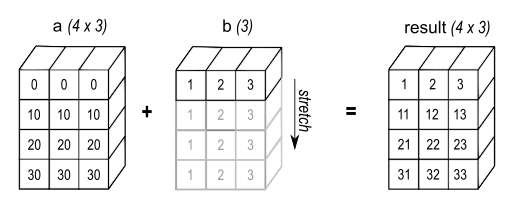

When adding a matrix and a vector, we adopt **broadcasting conventions** common in
NumPy and PyTorch.

~~~
The vector is interpreted as a matrix with a single row, and this
row is then **implicitly copied** (broadcasted) to match the shape of the
matrix.

---
section: Random Variables
class: section
# Random Variables

---
# Random Variables

A random variable $⁇x$ is a result of a random process, and it can be either
discrete or continuous.

~~~
## Probability Distribution
A probability distribution describes the likelihood of each possible value
a random variable can take.

The notation $⁇x ∼ P$ stands for a random variable $⁇x$ having a distribution $P$.

~~~
For discrete variables, the probability that $⁇x$ takes a value $x$ is denoted as
$P(x)$ or explicitly as $P(⁇x = x)$. All probabilities are nonnegative, and the
sum of the probabilities of all possible values of $⁇x$ is $∑_x P(⁇x=x) = 1$.

~~~
For continuous variables, the probability that the value of $⁇x$ lies in the interval
$[a, b]$ is given by $∫_a^b p(x)\d x$, where $p(x)$ is the _probability density
function_, which is always nonnegative and integrates to 1 over the range of
all values of $⁇x$.

---
style: .katex-display { margin: .8em 0 }
# Joint, Conditional, Marginal Probability

For two random variables, a **joint probability distribution** is a distribution
of all possible pairs of outputs (and analogously for more than two):

$$P(⁇x = x_2, ⁇y = y_1).$$

~~~
**Marginal distribution** is a distribution of one (or a subset) of the random
variables and can be obtained by summing over the other variable(s):
$$P(⁇x=x_2) = {\small ∑\nolimits}_y P(⁇x = x_2, ⁇y = y).$$

~~~
**Conditional distribution** is a distribution of one (or a subset) of the
random variables, given that another event has already occurred:
$$P(⁇x=x_2 \mid ⁇y=y_1) = P(⁇x = x_2, ⁇y = y_1) / P(⁇y = y_1).$$

~~~
If $P(⁇x\!=\!x, ⁇y\!=\!y) = P(⁇x\!=\!x)\!⋅\!P(⁇y\!=\!y)$ for all $x,y$, random
variables $⁇x, ⁇y$ are **independent**.

---
# Random Variables

## Expectation
The expectation of a function $f(x)$ with respect to a discrete probability
distribution $P(⁇x)$ is defined as:
$$𝔼_{⁇x ∼ P}[f(x)] ≝ ∑_x P(x)f(x).$$

~~~
For continuous variables, the expectation is computed as:
$$𝔼_{⁇x ∼ p}[f(x)] ≝ ∫_x p(x)f(x)\d x.$$

~~~
If the random variable is obvious from context, we can write only $𝔼_P[x]$,
$𝔼_{⁇x}[x]$, or even $𝔼[x]$.

~~~
Expectation is linear, i.e., for constants $α, β ∈ ℝ$:
$$𝔼_{⁇x} [αf(x) + βg(x)] = α𝔼_{⁇x} [f(x)] + β𝔼_{⁇x} [g(x)].$$

---
# Random Variables

## Variance
Variance measures how much the values of a random variable differ from its
mean $𝔼[x]$.

$$\begin{aligned}
  \Var(x) &≝ 𝔼\left[\big(x - 𝔼[x]\big)^2\right]\textrm{, or more generally,} \\
  \Var_{⁇x ∼ P}(f(x)) &≝ 𝔼\left[\big(f(x) - 𝔼[f(x)]\big)^2\right].
\end{aligned}$$

~~~
It is easy to see that
$$\Var(x) = 𝔼\left[x^2 - 2x⋅𝔼[x] + \big(𝔼[x]\big)^2\right] = 𝔼\left[x^2\right] - \big(𝔼[x]\big)^2,$$
because $𝔼\big[2x⋅𝔼[x]\big] = 2(𝔼[x])^2$.

~~~
Variance is connected to $𝔼[x^2]$, the **second moment** of a random
variable – it is in fact a **centered** second moment.

---
# Common Probability Distributions
## Bernoulli Distribution
The Bernoulli distribution is a distribution over a binary random variable.
It has a single parameter $φ ∈ [0, 1]$, which specifies the probability that
the random variable is equal to 1.

~~~
$$\begin{aligned}
  P(x) &= φ^x (1-φ)^{1-x} \\
  𝔼[x] &= φ \\
  \Var(x) &= φ(1-φ)
\end{aligned}$$

---
# Common Probability Distributions

## Categorical Distribution
Extension of the Bernoulli distribution to random variables taking one of $K$ different
discrete outcomes. It is parametrized by $→p ∈ [0, 1]^K$ such that $∑_{i=0}^{K-1} p_{i} = 1$.

~~~
We represent outcomes as vectors $∈ \{0, 1\}^K$ in the **one-hot encoding**.
Therefore, an outcome $x ∈ \{0, 1, …, K-1\}$ is represented as a vector
$$→1_x ≝ \big([i = x]\big)_{i=0}^{K-1} = \big(\underbrace{0, …, 0}_{x}, 1, \underbrace{0, …, 0}_{K-x-1}\big).$$

~~~
The outcome probability, mean, and variance are very similar to the Bernoulli
distribution.
$$\begin{aligned}
  P(→x) &= ∏\nolimits_{i=0}^{K-1} p_i^{x_i} \\
  𝔼[x_i] &= p_i \\
  \Var(x_i) &= p_i(1-p_i) \\
\end{aligned}$$

---
section: Information Theory
class: section
# Information Theory

---
# Information Theory

## Self-Information

Self-information can be considered the amount of **surprise** when a random variable is sampled.
~~~
- Should be zero for events with probability 1.
~~~
- Less likely events are more surprising.
~~~
- Independent events should have **additive** surprise (information).

~~~

These conditions are fulfilled by **self-information** $I(x)$, also called **surprise**:
$$I(x) ≝ -\log P(x) = \log \frac{1}{P(x)}.$$

---
# Information Theory

## Entropy

Amount of **surprise** in the whole distribution.
$$H(P) ≝ 𝔼_{⁇x∼P}[I(x)] = -𝔼_{⁇x∼P}[\log P(x)]$$

~~~
- for discrete $P$: $H(P) = -∑_x P(x) \log P(x)$
- for continuous $P$: $H(P) = -∫ P(x) \log P(x)\,\mathrm dx$

~~~
Because $\lim_{x → 0} x \log x = 0$, for $P(x) = 0$ we consider\
$P(x) \log P(x)$ to be zero.

~~~ ~~~

- for discrete $P$: $H(P) = -∑_x P(x) \log P(x)$
- for continuous $P$: $H(P) = -∫ P(x) \log P(x)\,\mathrm dx$

Because $\lim_{x → 0} x \log x = 0$, for $P(x) = 0$ we consider
$P(x) \log P(x)$ to be zero.

~~~
Note that in the continuous case, the continuous entropy (also called
_differential entropy_) has slightly different semantics, for example, it can be
negative.

~~~
For binary logarithms, the entropy is measured in **bits**. However,
from now on, all logarithms are _natural logarithms_ with base _e_
(and then the entropy is measured in units called **nats**).

---
# Information Theory

## Cross-Entropy

$$H(P, Q) ≝ -𝔼_{⁇x∼P}[\log Q(x)]$$

~~~
**Gibbs inequality** states that
- $H(P, Q) ≥ H(P)$
- $H(P) = H(P, Q) ⇔ P = Q$
~~~
- Proof: Using the fact that $\log x ≤ (x-1)$ with equality only for $x=1$, we get
  $$∑_x P(x) \log \frac{Q(x)}{P(x)} ≤ ∑_x P(x) \left(\frac{Q(x)}{P(x)}-1\right) = ∑_x Q(x) - ∑_x P(x) = 0.$$
~~~
- Corollary: For a categorical distribution with $n$ outcomes, $H(P) ≤ \log n$,
  because for $Q(x) = 1/n$ we get $H(P) ≤ H(P, Q) = -∑_x P(x) \log Q(x) = \log n.$
~~~

Note that generally $H(P, Q) ≠ H(Q, P)$.

---
# Information Theory

## Kullback–Leibler Divergence (KL Divergence)

Sometimes also called **relative entropy**.

$$D_\textrm{KL}(P \| Q) ≝ H(P, Q) - H(P) = 𝔼_{⁇x∼P}[\log P(x) - \log Q(x)]$$

~~~
- Consequence of Gibbs inequality: $D_\textrm{KL}(P \| Q) ≥ 0$, $D_\textrm{KL}(P \| Q) = 0$ iff $P = Q$.

~~~
- Generally $D_\textrm{KL}(P \| Q) ≠ D_\textrm{KL}(Q \| P)$.

---
# Nonsymmetry of KL Divergence

---
section: Random Variables
# Common Probability Distributions
## Normal (or Gaussian) Distribution
Distribution over real numbers, parametrized by a mean $μ$ and variance $σ^2$:
$$𝓝(x; μ, σ^2) = \sqrt{\frac{1}{2πσ^2}} \exp \left(-\frac{(x - μ)^2}{2σ^2}\right)$$

~~~
For standard values $μ=0$ and $σ^2=1$ we get $𝓝(x; 0, 1) = \sqrt{\frac{1}{2π}} e^{-\frac{x^2}{2}}$.

---
# Why Normal Distribution

## Central Limit Theorem
The sum of independent identically distributed random variables
with finite variance converges to normal distribution.

~~~
## Principle of Maximum Entropy
Given a set of constraints, a distribution with maximal entropy fulfilling the
constraints can be considered the most general one, containing as little
additional assumptions as possible.

~~~
Considering distributions on all real numbers with a given mean and variance, it
can be proven (using variational inference) that such a distribution with
**maximum entropy** is exactly the normal distribution.

---
section: Machine Learning
class: section
# Machine Learning

---
# Machine Learning

A possible definition of learning from Mitchell (1997):
>  A computer program is said to learn from experience E with respect to some
>  class of tasks T and performance measure P, if its performance at tasks in
>  T, as measured by P, improves with experience E.

~~~
- Task T
    - _classification_: assigning one of $k$ categories to a given input
    - _regression_: producing a number $x∈ℝ$ for a given input
    - _structured prediction_, _denoising_, _density estimation_, …
~~~
- Measure P
    - _accuracy_, _error rate_, _F-score_, …
~~~
- Experience E
    - _supervised_: usually a dataset with desired outcomes (_labels_ or
      _targets_)
    - _unsupervised_: usually data without any annotation (raw text, raw images, …)
    - _reinforcement learning_, _semi-supervised learning_, …

---
# Well-known Datasets

| Name | Description | Instances |
| ------ | ------------- | ----------- |
| [MNIST](https://en.wikipedia.org/wiki/MNIST_database) | Images (28x28, grayscale) of handwritten digits. | 60k |
| [CIFAR-10](https://www.cs.toronto.edu/~kriz/cifar.html) | Images (32x32, color) of 10 classes of objects. | 50k |
| [CIFAR-100](https://www.cs.toronto.edu/~kriz/cifar.html) | Images (32x32, color) of 100 classes of objects (with 20 defined superclasses). | 50k |
| [ImageNet](https://image-net.org/) | Labeled object image database (labeled objects, some with bounding boxes). | 14.2M |
| [ImageNet-ILSVRC](https://image-net.org/challenges/LSVRC/) | Subset of ImageNet for Large Scale Visual Recognition Challenge, annotated with 1000 object classes and their bounding boxes. | 1.2M |
| [COCO](https://cocodataset.org/) | _Common Objects in Context_: Complex everyday scenes with descriptions (5) and highlighting of objects (91 types). | 2.5M |

---
class: middle
# Well-known Datasets
## ImageNet-ILSVRC
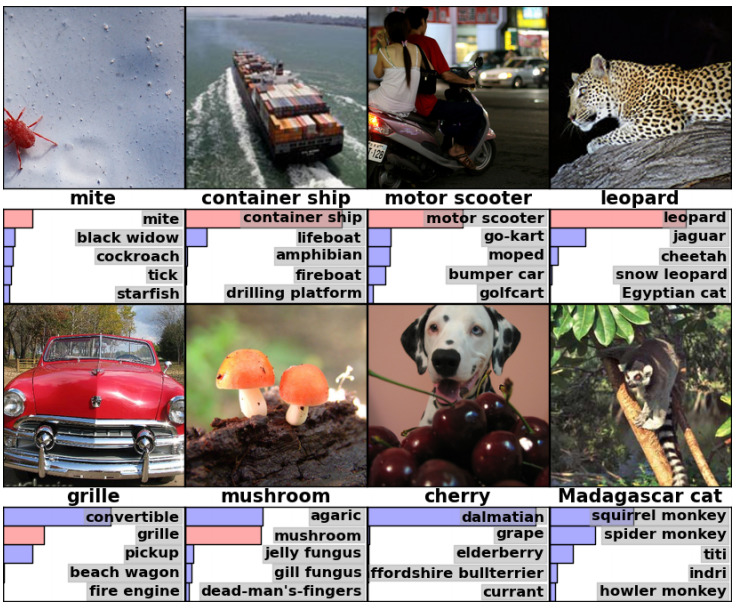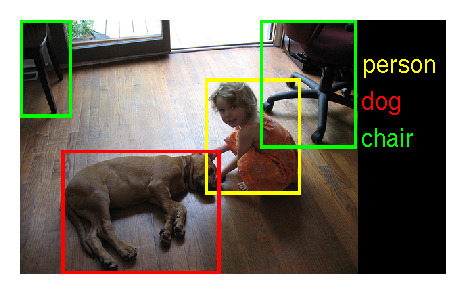

---
class: middle
# Well-known Datasets
## COCO
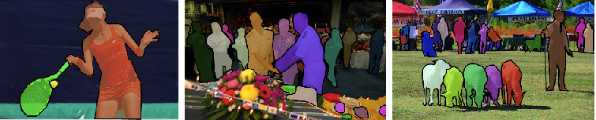

---
# Well-known Datasets

| Name | Description | Instances |
| ------ | ------------- | ----------- |
| [TIMIT](https://catalog.ldc.upenn.edu/LDC93S1) | Recordings of 630 speakers of 8 dialects of American English. | 6.3k sents |
| [CommonVoice](https://voice.mozilla.org/data) | 2,750 hours of verified English speech from 99k speakers 80 hours of verified Czech speech from 1.1k speakers | 25k hours, 289 langs |
| [PTB](https://catalog.ldc.upenn.edu/LDC99T42) | _Penn Treebank_: 2500 stories from Wall Street Journal, with POS tags and parsed into trees. | 1M words |
| [PDT-C](https://ufal.mff.cuni.cz/pdt-c) | _Prague Dependency Treebank – Consolidated_: Czech data annotated on morphological, analytical, tectogrammatical layers. | 3.9M words |
| [UD](https://universaldependencies.org/) | _Universal Dependencies_: Treebanks of 186 languages with consistent annotation of lemmas, POS tags, morphology, syntax. | 296 treebanks |
| [WMT](https://statmt.org/) | Aligned parallel sentences for machine translation. | gigawords |

---
style: td:nth-child(1) { white-space: nowrap}
# Massive Datasets

| Name | Description | Instances |
| ------ | ------------- | ----------- |
| [Open Images](https://storage.googleapis.com/openimages/web/index.html) | Images annotated with image-level labels, object bounding boxes, object segmentation masks, visual relationships, and localized narratives. | 9M |
| [LAION-400M](https://laion.ai/blog/laion-400-open-dataset/) | A collection of (image, English text) pairs. | 400M |
| [LAION-5B](https://laion.ai/blog/laion-5b/) | A collection of (image, text) pairs; 2.3B English descriptions, 2.2B from 100+ other languages, 1B unknown (names, …). | 5.85B |
| [FineWeb](https://huggingface.co/datasets/HuggingFaceFW/fineweb) | A collection of deduplicated and cleaned English web data. | 15T tokens, 47.5TB |
| [FineWeb-2](https://huggingface.co/datasets/HuggingFaceFW/fineweb-2) | Deduplicated and cleaned web data in 1000+ languages. | 3T tokens, 8TB |

---
# ILSVRC Image Recognition Top-5 Error Rates

~~~ ~
# ILSVRC Image Recognition Top-5 Error Rates

---
# ILSVRC Image Recognition Error Rates

In summer 2017, a paper came out describing automatic generation of
neural architectures using reinforcement learning.

---
# ILSVRC Image Recognition Error Rates

Currently, one of the best architectures is EfficientNet, which combines
automatic architecture discovery, multidimensional scaling and elaborate dataset
augmentation methods.

---
# ILSVRC Image Recognition Error Rates

EfficientNet was further improved by EfficientNetV2 two years later.

---
# Machine Translation Improvements

To illustrate deep neural networks improvements in other domains, consider the
English→Czech results of the international Workshop on Machine Translation.
Both the automatic BLEU metric and manual evaluation are presented.

- TectoMT parses the input, transfers to the other language, generates the sentence;
- RBMT is the PC-Translator software;
- SMT is statistical machine translation using the Moses system;
- Online is an online translation system (Google in 2009, `Online-B` since 2010);
- **NMT** is the neural machine translation using deep neural networks.

---
class: wide
# Introduction to Deep Learning History

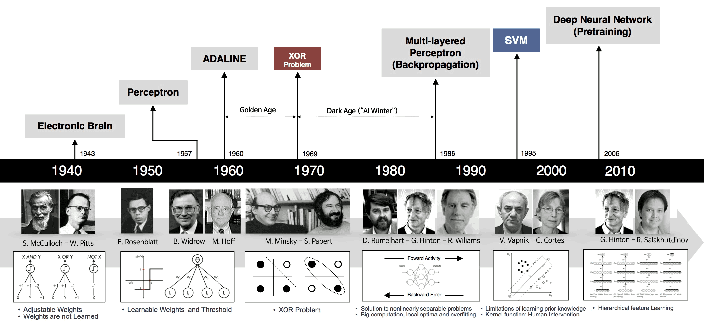

---
# Perceptron – Extra Simple Neural Network

- Assume we have an input node for every input feature.

~~~
- Additionally, we have an output node for every model output.

~~~
- Each input node is connected to every output node by a directed edge, and
  every edge has an associated weight.

~~~
- Value of every (output) node is computed by summing the values of predecessors
  multiplied by the corresponding weights, added to a bias of this node, and
  finally passed through an activation function $a$:
  $$y = a\left(∑\nolimits_j x_j w_j + b\right)$$
  or in vector form $y = a(→x^\T→w+b)$, or for a batch of examples $⇉X$,
  $→y = a(⇉X →w + b)$.

---
# Perceptron – Separating Hyperplane

To classify an example in two classes, we compare the output $y = a(→x^\T→w+b)$
with some threshold $z$, and choose the resulting class depending on
whether $y > z$ or $y < z$.

~~~
When the activation function is monotonous, this is equal to comparing
$→x^\T→w+b > a^{-1}(z)$.

~~~
The resulting classes are therefore divided by a _separating hyperplane_
$→x^\T→w+c$.

---
# Perceptron – Linearly Separable and Nonseparable Data

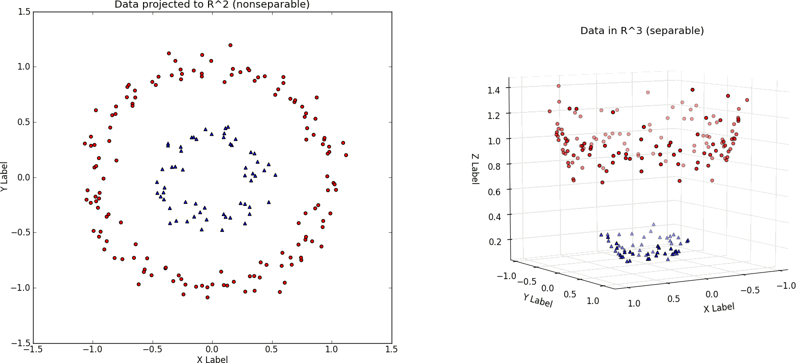

---
section: NNs '80s
class: section
# Neural Network Architecture à la '80s

---
# Neural Network Architecture à la '80s

---
style: .katex-display { margin: .8em 0 }
# Neural Network Architecture

The computation is performed analogously to the perceptron:
$$\begin{aligned}
  h_i &= f\left(∑\nolimits_j x_j w^{(h)}_{j,i} + b^{(h)}_i\right), \\
  y_i &= a\left(∑\nolimits_j h_j w^{(y)}_{j,i} + b^{(y)}_i\right),
\end{aligned}$$
or in matrix form
$$\begin{aligned}
  →h &= f\Big(→x^\T ⇉W^{(h)} + →b^{(h)}\Big), \\
  →y &= a\Big(→h^\T ⇉W^{(y)} + →b^{(y)}\Big),
\end{aligned}$$
or for a whole batch of inputs $⇉H = f\Big(⇉X ⇉W^{(h)} + →b^{(h)}\Big)$ and $⇉Y = a\Big(⇉H ⇉W^{(y)} + →b^{(y)}\Big)$.

The $⇉W^{(h)} ∈ ℝ^{|\mathit{input}|⋅|\mathit{hidden}|}$ is a matrix of weights
and $→b^{(h)} ∈ ℝ^{|\mathit{hidden}|}$ is a vector of biases of the first layer;
$⇉W^{(y)} ∈ ℝ^{|\mathit{hidden}|⋅|\mathit{output}|}$ and $→b^{(y)} ∈ ℝ^{|\mathit{output}|}$
are parameters of the second layer.

---
# Neural Network Activation Functions
## Output Layers
- none (linear regression if there are no hidden layers);

~~~
- $σ$ (sigmoid; logistic regression if there are no hidden layers)

  

  $$σ(x) ≝ \frac{1}{1 + e^{-x}}$$
  is used to model a Bernoulli distribution, i.e., the probability $φ$
  of one of the outcomes;
~~~
  -  the input of the sigmoid is called a **logit**, and it has a value of $\log \frac{φ}{1-φ}$

~~~
- $\softmax$ (maximum entropy model if there are no hidden layers)
  $$\softmax(→x) ∝ e^{→x},~~~~~\softmax(→x)_i ≝ \frac{e^{x_i}}{∑_j e^{x_j}}$$
  is used to model probability distribution $→p$; its input is called
  a **logit**, $\log(→p) + c$.

---
# Neural Network Activation Functions
## Hidden Layers
- none: does not help, composition of linear/affine mappings is a linear/affine mapping

~~~
- $σ$: does not work great – nonsymmetrical, repeated application converges to
  the fixed point $x = σ(x) ≈ 0.659$, and $\frac{dσ}{dx}(0) = 1/4$

~~~
- $\tanh$: result of making $σ$ symmetrical and making the derivative in zero 1
~~~
  

  - $\tanh(x) = 2σ(2x) - 1$

~~~
- ReLU: $\max(0, x)$

---
# Universal Approximation Theorem '89

Let $φ(x) \colon ℝ → ℝ$ be a nonconstant, bounded and nondecreasing continuous function. \
(Later a proof was given also for $φ = \ReLU$ and even for any nonpolynomial
function.)

For any $ε > 0$ and any continuous function $f \colon [0, 1]^D → ℝ$, there exists
$H ∈ ℕ$, $→v ∈ ℝ^H$, $→b ∈ ℝ^H$ and $⇉W ∈ ℝ^{D×H}$, such that if we denote
$$F(→x) = →v^\T φ(→x^\T ⇉W + →b) = ∑_{i=1}^H v_i φ(→x^\T →W_{*, i} + b_i),$$
where $φ$ is applied element-wise,
~~~
then for all $→x ∈ [0, 1]^D$:
$$|F(→x) - f(→x)| < ε.$$

~~~
## One Possible Interpretation

It is always possible to create features using just a single linear layer
followed by a nonlinearity, such that the resulting dataset is always linearly
separable.

---
# Universal Approximation Theorem for ReLUs

Sketch of the proof:

~~~
- If a function is continuous on a closed interval, it can be approximated by
  a sequence of lines to arbitrary precision.

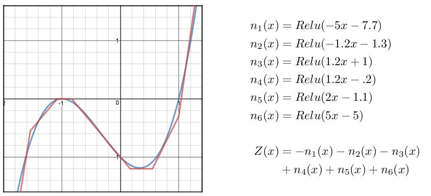

~~~
- However, we can create a sequence of $k$ linear segments as a sum of $k$ ReLU
  units – on every endpoint a new ReLU starts (i.e., the input ReLU value is
  zero at the endpoint), with a tangent which is the difference between the
  target tangent and the tangent of the approximation until this point.

---
# Evolving ReLU Approximation
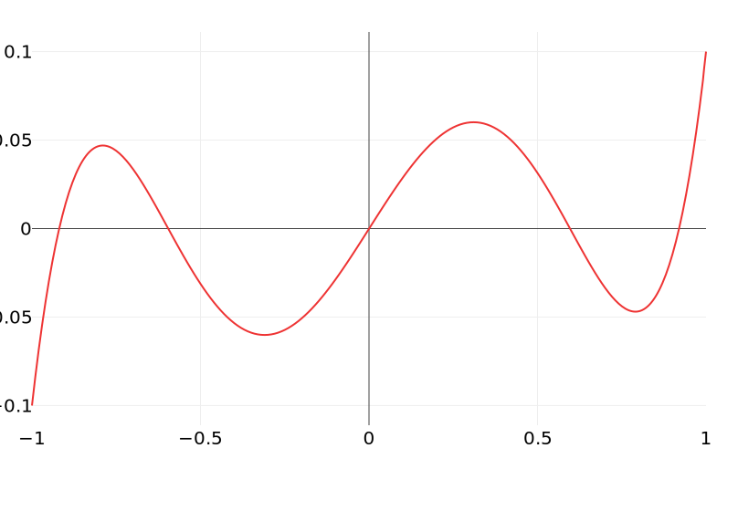

~~~ ~
# Evolving ReLU Approximation
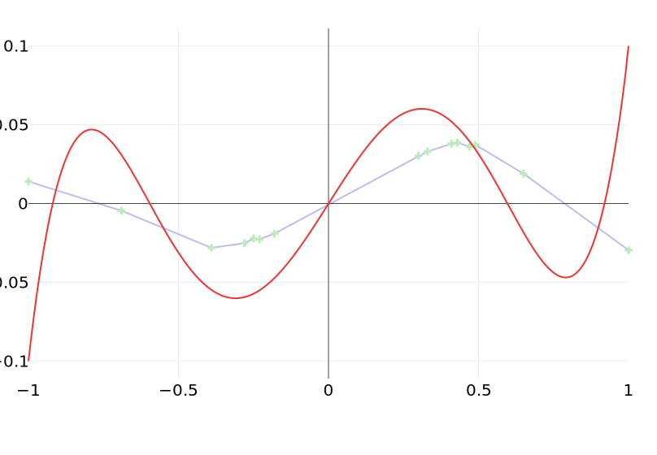

~~~ ~
# Evolving ReLU Approximation
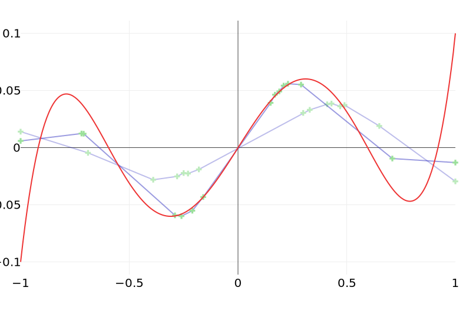

~~~ ~
# Evolving ReLU Approximation
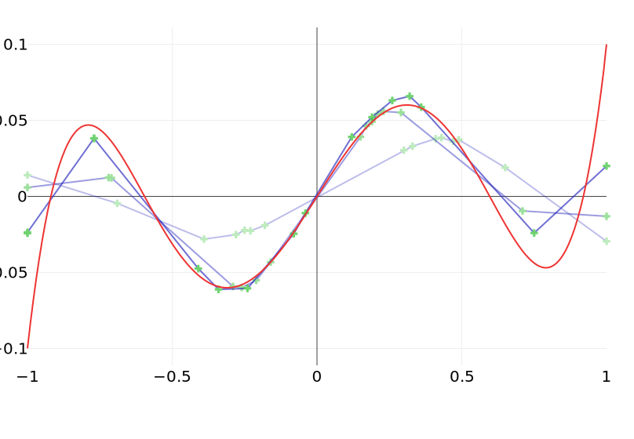

~~~ ~
# Evolving ReLU Approximation
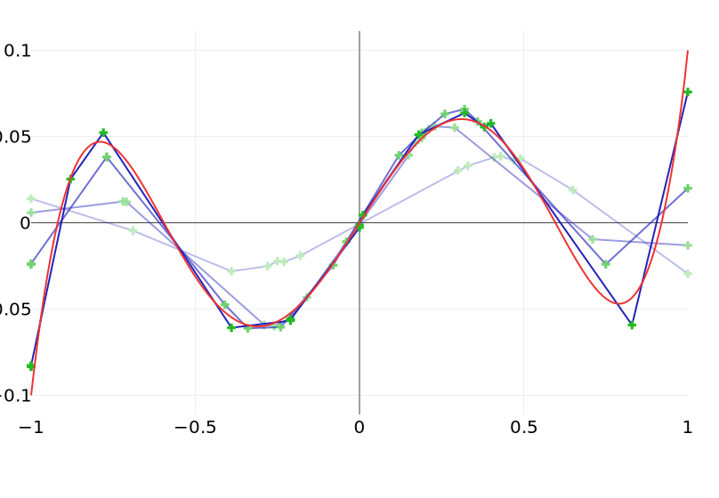

---
# Universal Approximation Theorem for Squashes

Sketch of the proof for a squashing function $φ(x)$ (i.e., nonconstant, bounded and
nondecreasing continuous function like sigmoid):

~~~
- We can prove $φ$ can be arbitrarily close to a hard threshold by compressing
  it horizontally.

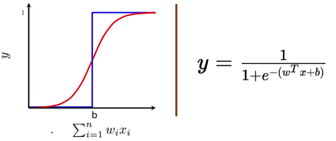

~~~
- Then we approximate the original function using a series of straight line
  segments.

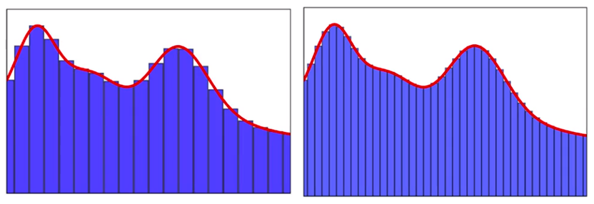

---
# How Good is Current Deep Learning

- DL has seen amazing progress in the last 15 years.

~~~
- Is it enough to get a bigger brain (datasets, models, computer power)?

~~~
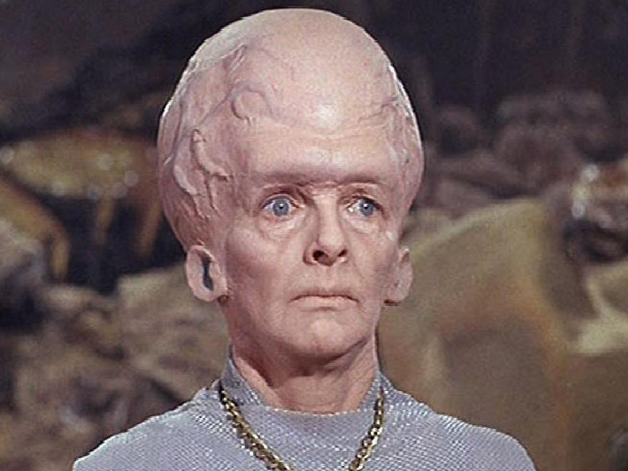

~~~
- Problems compared to Human learning:
  - Sample efficiency

~~~
  - Human-provided labels
~~~
  - Robustness to data distribution change
~~~
  - Stupid errors

---
# How Good is Current Deep Learning

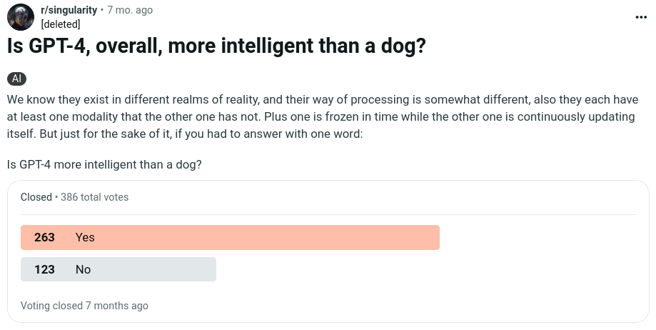

~~~

~~~
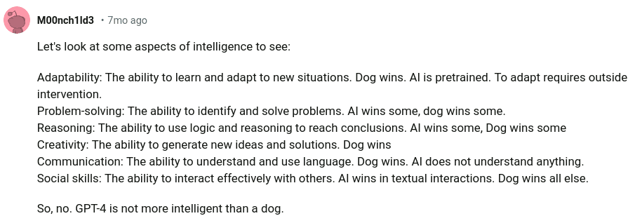

---
class: summary
# Summary

Neural networks are just a model for describing computation of outputs from
given inputs:
- strong enough to approximate any reasonable function,
- reasonably compact,
- allows heavy parallelization during execution (GPUs, TPUs, …).

Nearly all the time, neural networks generate a _probability distribution_ on
output:
- output distribution determines the output activation function,
- distributions allow small changes during training,
- during prediction, we usually take the most probable outcome (class/label/…).

When there is enough data, neural networks are currently the best performing
machine learning model, especially when the data are high-dimensional (images,
speech, text).
- For tabular data, you should also consider gradient-boosted decision trees.
