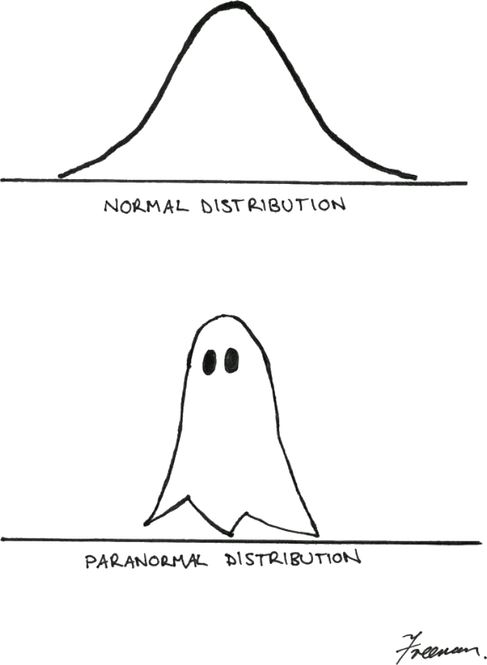
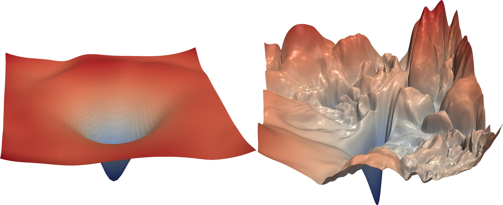
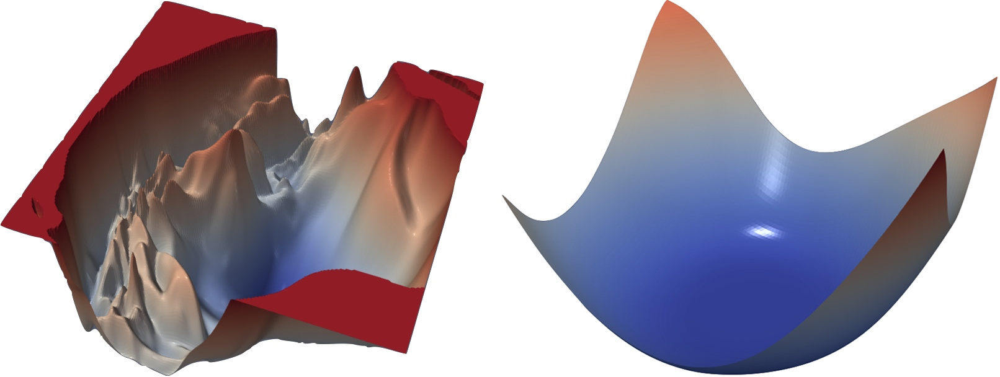
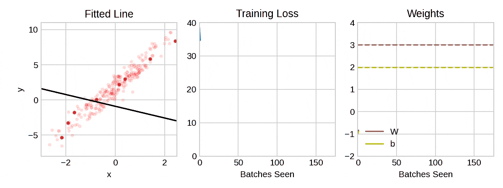
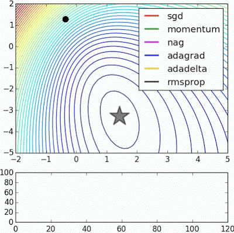
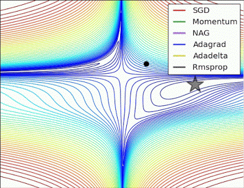
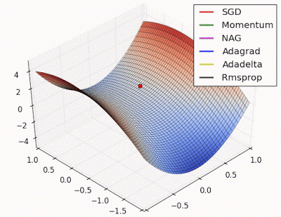
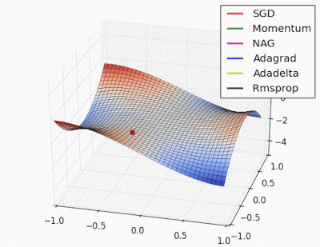

title: NPFL138, Lecture 2
class: title, langtech, cc-by-sa
style: .algorithm { background-color: #eee; padding: .5em }
# Training Neural Networks

## Milan Straka

### February 24, 2026

---
# Refresh – Neural Networks

- Neural network describes a computation, which gets an input tensor and
  produces an output.

~~~
  - For the time being, the input tensor has a fixed size.
~~~
  - The input tensor is usually a vector, but it can be 2D/3D/4D tensor.
    - images, video, time sequences like speech, …
~~~
  - The output usually describes a distribution.
    - normal distribution for regression
    - Bernoulli for binary classification
    - categorical for multiclass classification

~~~
- The basic units are **nodes**, composed in an acyclic graph.

~~~
- The edges have weights, nodes have activation functions.

~~~
- Nodes of neural networks are usually composed in layers.

---
section: ML Basics
class: section
# Machine Learning Basics

---
# Machine Learning Basics

We usually have a **training set**, which is assumed to consist of examples
generated independently from a **data-generating distribution**.

~~~
The goal of _optimization_ is to match the training set as well as possible.

~~~
However, the goal of _machine learning_ is to perform well on _previously
unseen_ data, to achieve lowest **generalization error** or **test error**. We
typically estimate it using a **test set** of examples independent of the
training set, but generated by the same data-generating distribution.

~~~
The **No free lunch theorem** (Wolpert, 1996) states that averaging over
_all possible_ data distributions, every classification algorithm achieves
the same _overall_ error when processing unseen examples (even algorithms
“always return 0” and “return the least probable class”). In a sense, no machine
learning algorithm is _universally_ better than others.
~~~
_But in practice the data distributions are not uniformly random, so some
algorithms might work better in practice than others._

---
# Machine Learning Basics

Challenges in machine learning:
- _underfitting_
- _overfitting_

~~~ ~
# Machine Learning Basics

Challenges in machine learning:
- _underfitting_ (the model is “too weak”, bad performance even on training set)
- _overfitting_ (the model is “too strong”, learned rules are too specific and do
  not generalize)


---
# Machine Learning Basics


---
# Machine Learning Basics

We can control whether a model underfits or overfits by modifying its _capacity_.
~~~
- _representational capacity_ (what the model could represent, depends on the
  model size)

~~~
- _effective capacity_ (what the model actually learns, depends on training,
  regularization, …)

~~~


---
# Machine Learning Basics

Overfitting usually decreases with the amount of the training data.


---
# Machine Learning Basics

Any change in a machine learning algorithm that is designed to _reduce
generalization error_ (but not necessarily its training error) is called
**regularization**.

~~~

**$L^2$ regularization** (also called **weight decay**) penalizes models
with large weights (using a penalty of $\frac{λ}{2}\|→θ\|_2^2$).


---
# Machine Learning Basics

**Hyperparameters** are not adapted by a learning algorithm itself,
while the model **parameters** (weights, biases) are adapted by it.

~~~
Usually a **development set**, also called a **validation set**, is used to
estimate the generalization error, allowing to update hyperparameters accordingly.

---
section: MLE
class: section
# Maximum Likelihood Estimation

---
# Loss Function

A model is usually trained in order to minimize the **loss** on the training data.

~~~

Assuming that a model computes $f(→x;→θ)$ using parameters $→θ$,
the **mean square error** of given $N$ examples $\big(→x^{(1)}, y^{(1)}\big),
\big(→x^{(2)}, y^{(2)}\big), …, \big(→x^{(N)}, y^{(N)}\big)$ is computed as
$$\frac{1}{N} ∑_{i=1}^N \Big(f(→x^{(i)}; →θ) - y^{(i)}\Big)^2.$$

~~~
A common principle used to design loss functions is the **maximum likelihood
principle**.

---
# Maximum Likelihood Estimation

Let $𝕏 = \{→x^{(1)}, →x^{(2)}, …, →x^{(N)}\}$ be training data drawn
independently from the data-generating distribution $p_\textrm{data}$.

~~~
We denote the **empirical data distribution** as $p̂_\textrm{data}$, where
$$p̂_\textrm{data}(→x) ≝ \frac{\big|\{i: →x^{(i)} = →x\}\big|}{N}.$$

~~~
Let $p_\textrm{model}(⁇→x; →θ)$ be a family of distributions.
~~~
- If the weights are fixed, $p_\textrm{model}(⁇→x{\color{lightgray}; →θ})$ is a probability distribution.
~~~
- If we instead consider the fixed training data $𝕏$, then
  $$L(→θ) = p_\textrm{model}(𝕏; →θ) = ∏\nolimits_{i=1}^N p_\textrm{model}(→x^{(i)}; →θ)$$
  is called the **likelihood**.
~~~
  Note that even if the value of the likelihood is in range $[0, 1]$, it is not
  a probability, because the likelihood is not a probability distribution.

---
# Maximum Likelihood Estimation

Let $𝕏 = \{→x^{(1)}, →x^{(2)}, …, →x^{(N)}\}$ be training data drawn
independently from the data-generating distribution $p_\textrm{data}$. We denote
the empirical data distribution as $p̂_\textrm{data}$ and let
$p_\textrm{model}(⁇→x; →θ)$ be a family of distributions.

The **maximum likelihood estimation** of $→θ$ is:

$\displaystyle \kern8em\mathllap{→θ_\mathrm{MLE}} = \argmax_{→θ} p_\textrm{model}(𝕏; →θ) = \argmax_{→θ} ∏\nolimits_{i=1}^N p_\textrm{model}(→x^{(i)}; →θ)$

~~~
$\displaystyle \kern8em{} = \argmin_{→θ} ∑\nolimits_{i=1}^N -\log p_\textrm{model}(→x^{(i)}; →θ)$

~~~
$\displaystyle \kern8em{} = \argmin_{→θ} 𝔼_{⁇→x ∼ p̂_\textrm{data}} [-\log p_\textrm{model}(→x; →θ)]$

~~~
$\displaystyle \kern8em{} = \argmin_{→θ} H(p̂_\textrm{data}(⁇→x), p_\textrm{model}(⁇→x; →θ))$

~~~
$\displaystyle \kern8em{} = \argmin_{→θ} D_\textrm{KL}(p̂_\textrm{data}(⁇→x)\|p_\textrm{model}(⁇→x; →θ)) \color{gray} + H(p̂_\textrm{data}(⁇→x))$

---
style: .katex-display { margin: .6em 0 }
# Maximum Likelihood Estimation

MLE can be easily generalized to the conditional case, where our goal is to predict $y$ given $→x$:

~~~
$$\begin{aligned}
→θ_\mathrm{MLE} &= \argmax_{→θ} p_\textrm{model}(𝕐 | 𝕏; →θ) = \argmax_{→θ} ∏\nolimits_{i=1}^N p_\textrm{model}(y^{(i)} | →x^{(i)}; →θ) \\
                &= \argmin_{→θ} ∑\nolimits_{i=1}^N -\log p_\textrm{model}(y^{(i)} | →x^{(i)}; →θ) \\
                &= \argmin_{→θ} 𝔼_{(⁇→x, ⁇y) ∼ p̂_\textrm{data}} [-\log p_\textrm{model}(y | →x; →θ)] \\
                &= \argmin_{→θ} H(p̂_\textrm{data}(⁇y | ⁇→x), p_\textrm{model}(⁇y | ⁇→x; →θ)) \\
                &= \argmin_{→θ} D_\textrm{KL}(p̂_\textrm{data}(⁇y | ⁇→x)\|p_\textrm{model}(⁇y | ⁇→x; →θ)) \color{gray} + H(p̂_\textrm{data}(⁇y | ⁇→x))
\end{aligned}$$

~~~
where the conditional entropy is defined as
$H(p̂_\textrm{data}) = 𝔼_{(⁇→x, ⁇y) ∼ p̂_\textrm{data}} [-\log (p̂_\textrm{data}(y | →x))]$
and the conditional cross-entropy as
$H(p̂_\textrm{data}, p_\textrm{model}) = 𝔼_{(⁇→x, ⁇y) ∼ p̂_\textrm{data}} [-\log (p_\textrm{model}(y | →x; →θ))]$.

~~~
The resulting _loss function_ is called **negative log-likelihood** (**NLL**), or
**cross-entropy**, or **Kullback-Leibler divergence**.

---
# Estimators and Bias

An **estimator** is a rule for computing an estimate of a given value, often an
expectation of some random value(s).
For example, we might estimate _mean_ of a random variable by sampling a value
according to its probability distribution.

~~~
The **bias** of an estimator is the difference of the expected value of the estimator
and the true value being estimated.
~~~
If the bias is zero, we call the estimator **unbiased**, otherwise **biased**.

~~~
If we have a sequence of estimates, it might also happen that the bias converges
to zero. Consider the well-known sample estimate of variance. Given independent
and identically distributed random variables $⁇x_1, \ldots, ⁇x_N$, we might
estimate the mean and the variance as
$$μ̂ = \frac{1}{N} ∑\nolimits_i x_i,~~~σ̂^2 = \frac{1}{N} ∑\nolimits_i (x_i - μ̂)^2.$$
~~~
Such a mean estimate is unbiased, but the estimate of the variance is biased,
because $𝔼[σ̂^2] = (1 - \frac{1}{N})σ^2$; however, the bias of this estimate
converges to zero for increasing $N$.

~~~
Also, an unbiased estimator does not necessarily have a small variance – in some
cases, it can have a large variance, so a biased estimator with a smaller variance
might be preferred.

---
# Properties of Maximum Likelihood Estimation

Assume that the true data-generating distribution $p_\textrm{data}$ lies within the model
family $p_\textrm{model}(•; →θ)$, and assume there exists a unique
$→θ_{p_\textrm{data}}$ such that $p_\textrm{data} = p_\textrm{model}(•; →θ_{p_\textrm{data}})$.

~~~
- MLE is a _consistent_ estimator. If we denote $→θ_m$ to be the parameters
  found by MLE for a training set with $m$ examples generated by the
  data-generating distribution, then $→θ_m$ converges in probability to
  $→θ_{p_\textrm{data}}$.

  Formally, for any $ε > 0$, $P(\|→θ_m - →θ_{p_\textrm{data}}\| > ε) → 0$
  as $m → ∞$.

~~~
- MLE is in a sense the _most statistically efficient_. For any consistent estimator,
  let us consider the average distance of $→θ_m$ and $→θ_{p_\textrm{data}}$:
  $𝔼_{⁇→x_1, …, ⁇→x_m ∼ p_\textrm{data}} \big[\|→θ_m - →θ_{p_\textrm{data}}\|^2\big]$. \
  It can be shown (Rao 1945, Cramér 1946) that no consistent estimator has
  lower mean squared error than the maximum likelihood estimator.

~~~
Therefore, for reasons of consistency and efficiency, maximum likelihood is
often considered the preferred estimator for machine learning.

---
# Mean Square Error as MLE

During regression, we predict a number, not a real probability distribution.
In order to generate a distribution, we might consider a distribution with
the mean of the predicted value and a fixed variance $σ^2$ – the most general
such a distribution is the normal distribution.


---
# Mean Square Error as MLE

Let $f(→x; →θ)$ be the output of our model, which we assume to be the mean of $y$.

~~~
We define $p(y | →x; →θ)$ as $𝓝(y; f(→x; →θ), σ^2)$ for some fixed $σ^2$.
~~~
The MLE then results in



$\displaystyle \kern8em\mathllap{\argmax_{→θ} p(𝕐 | 𝕏; →θ)} = \argmin_{→θ} ∑_{i=1}^N -\log p(y^{(i)} | →x^{(i)} ; →θ)$

~~~
$\displaystyle \kern1.5em{} = \argmin_{→θ} -∑_{i=1}^N \log \sqrt{\frac{1}{2πσ^2}} e ^ {\normalsize -\frac{(y^{(i)} - f(→x^{(i)}; →θ))^2}{2σ^2}}$

~~~
$\displaystyle \kern1.5em{} = \argmin_{→θ} {\color{gray} -N \log (2πσ^2)^{-1/2}} - ∑_{i=1}^N -\frac{\big(y^{(i)} - f(→x^{(i)}; →θ)\big)^2}{2σ^2}$

~~~
$\displaystyle \kern1.5em{} = \argmin_{→θ} ∑_{i=1}^N \frac{\big(y^{(i)} - f(→x^{(i)}; →θ)\big)^2}{2σ^2} = \argmin_{→θ} \frac{1}{N} ∑_{i=1}^N \big(f(→x^{(i)}; →θ) - y^{(i)}\big)^2.$

---
section: Gradient Descent
class: section
# Gradient Descent

---
# Gradient Descent

Let $f(→x;→θ)$ be a model with parameters $→θ$. For a given per-example loss
function $L$, denote
$$E(→θ) = 𝔼_{(⁇→x, ⁇y)∼p̂_\textrm{data}} L\big(f(→x; →θ), y\big).$$
~~~


Assuming we are minimizing a loss function
$$\argmin_{→θ} E(→θ),$$
we may use _gradient descent_:
$$→θ ← →θ - α ∇_{→θ} E(→θ).$$

~~~
The constant $α$ is called a **learning rate** and specifies the “length”
of a step we perform in every iteration of the gradient descent.

---
# Gradient Descent Variants

The gradient of the loss function $E(→θ)$ can be computed as
$$∇_{→θ} E(→θ) = 𝔼_{(⁇→x, ⁇y)∼p̂_\textrm{data}} ∇_{→θ} L\big(f(→x; →θ), y\big).$$

~~~
- **(Standard/Batch) Gradient Descent**: We use all training data to compute $∇_{→θ} E(→θ)$.

~~~
- **Stochastic (or Online) Gradient Descent**: We estimate $∇_{→θ} E(→θ)$ using
  a single random example from the training data. Such an estimate is unbiased,
  but very noisy.

$$∇_{→θ} E(→θ) ≈ ∇_{→θ} L\big(f(→x; →θ), y\big)\textrm{~~for a randomly chosen~~}(→x, y)\textrm{~~from~~}p̂_\textrm{data}.$$

~~~
- **Minibatch SGD**: Trade-off between gradient descent and SGD – the
  expectation in $∇_{→θ} E(→θ)$ is estimated using $m$ random independent
  examples from the training data.

$$∇_{→θ} E(→θ) ≈ \frac{1}{m} ∑_{i=1}^m ∇_{→θ} L\big(f(→x^{(i)}; →θ), y^{(i)}\big)
  \textrm{~~for randomly chosen~~}(→x^{(i)}, y^{(i)})\textrm{~~from~~}p̂_\textrm{data}.$$

---
# Stochastic Gradient Descent Convergence

Assume that we perform a stochastic gradient descent, using a sequence
of learning rates $α_i$, and using a noisy estimate $J(→θ)$ of the real
gradient $∇_{→θ} E(→θ)$:
$$→θ_{i+1} ← →θ_i - α_i J(→θ_i).$$

~~~
It can be proven (see Robbins and Monro algorithm, 1951) that if $|J(→θ)|$ is
bounded and the loss function is strictly convex and continuous, then SGD converges
to the unique optimum almost surely if the sequence of learning rates $α_i$
fulfills the following conditions:
~~~
$$\underbrace{∑_i α_i = ∞,}_\textrm{we can travel any distance in the loss landscape~~~~}
  \underbrace{∑_i α_i^2 < ∞.}_\textrm{~~~~the learning rates decrease sufficiently quickly}$$

~~~
Note that the second condition implies that $α_i → 0$.

~~~
For nonconvex loss functions, we can get guarantees of converging to a _local_
optimum only. However, note that finding the global minimum of even a boolean
function is _at least NP-hard_.

---
# Stochastic Gradient Descent Convergence

Convex functions mentioned on the previous slide are such that for $→u, →v$
and real $0 ≤ t ≤ 1$,
$$f(t→u + (1-t)→v) ≤ tf(→u) + (1-t)f(→v).$$


~~~
A twice-differentiable function of a single variable is convex iff its second
derivative is always nonnegative. (For functions of multiple variables,
the Hessian must be positive semi-definite.)

~~~
A local minimum of a convex function is always a global minimum.

~~~
Well-known examples of convex functions are $x^2$, $e^x$, $-\log x$, MSE,
$σ$+NLL, $\softmax$+NLL.

---
class: wide
# Loss Function Visualization

Visualization of loss function of ResNet-56 (0.85 million parameters)
with/without skip connections:


---
class: wide
# Loss Function Visualization

Visualization of loss function of ResNet-110 without skip connections and DenseNet-121:



---
# Stochastic Gradient Descent Visualization

You can explore the interactive figures 2.1, 2.2, 2.4 at
https://udlbook.github.io/udlfigures/.

~~~


---
section: Backpropagation
class: section
# Backpropagation

---
# Backpropagation

Assume we want to compute partial derivatives of a given loss function $L$.


~~~


The gradient computation is based on the chain rule of derivatives: $\displaystyle \frac{∂L}{∂x_i} = \frac{∂L}{∂y} \frac{∂y}{∂x_i}$.

~~~

~~~


---
# Forward Propagation Algorithm (Python Version)

#### Forward Propagation (Python Version)
<div class="algorithm">

**Input**: Network with nodes in array `nodes:list[Node]` in topological order
of type:
```python
class Node:
  predecessors : list [int]
  compute(inputs : list[torch.Tensor]) -> torch.Tensor
```
~~~
**Output**: The values of all the nodes.
~~~
```python
for i in range(len(nodes)):
  outputs.append(
    nodes[i].compute(
      [outputs[p] for p in nodes[i].predecessors]
    )
  )
return outputs
```
</div>

---
# Backpropagation Algorithm (Python Version)

#### Simple Variant of Backpropagation (Python Version)
<div class="algorithm">

**Input**: The network as in the Forward propagation algorithm, assuming each node
output has a method computing the derivative of this output with respect to the specified input:
```python
  derivative(input_index : int) -> torch.Tensor
```
~~~
**Output**: Partial derivatives of the output of `nodes[-1]` with respect to all node outputs.
~~~
```python
outputs = run_forward()
gradients = [torch.zeros_like(output) for output in outputs]
gradients[-1] = 1
for i in reversed(range(len(nodes))):
  for p_index, p in enumerate(nodes[i].predecessors):
    gradients[p] += gradients[i] @ outputs[i].derivative(p_index)
return gradients
```
</div>

---
# Forward Propagation Algorithm (Math Version)

#### Forward Propagation (Math Version)
<div class="algorithm">

**Input**: Network with nodes $u^{(1)}, u^{(2)}, …, u^{(n)}$ numbered in
topological order.  
Each node's value is computed as $u^{(i)} = f^{(i)}(A^{(i)})$
for $A^{(i)}$ being a set of values of the predecessors $P(u^{(i)})$ of
$u^{(i)}$. <br>
**Output**: Value of $u^{(n)}$.

~~~
- For $i = 1, …, n$:
  - $A^{(i)} ← \big\lbrace u^{(j)} | j ∈ P(u^{(i)})\big\rbrace$
~~~
  - $u^{(i)} ← f^{(i)}(A^{(i)})$
~~~
- Return $u^{(n)}$

---
# Backpropagation Algorithm (Math Version)

#### Simple Variant of Backpropagation (Math Version)
<div class="algorithm">

**Input**: The network as in the Forward propagation algorithm.<br>
**Output**: Partial derivatives $g^{(i)} = \frac{∂u^{(n)}}{∂u^{(i)}}$ of $u^{(n)}$ with respect to all $u^{(i)}$.

~~~
- Run forward propagation to compute all $u^{(i)}$
~~~
- $g^{(n)} = 1$
~~~
- For $i = n-1, …, 1$:
~~~
    - $g^{(i)} ← ∑_{j:i∈P(u^{(j)})} g^{(j)} \frac{∂u^{(j)}}{∂u^{(i)}}$
~~~
- Return $\big(g^{(1)}, g^{(2)}, …, g^{(n)}\big)$
</div>

~~~
In practice, we do not usually represent networks as collections of scalar
nodes; instead we represent them as collections of tensor functions – most
usually functions $f: ℝ^n → ℝ^m$. Then $\frac{∂f(→x)}{∂→x}$ is a Jacobian
matrix. However, the backpropagation algorithm is analogous.

---
# Neural Network Activation Functions

## Hidden Layers Derivatives
- $σ$:
  $$\frac{∂σ(x)}{∂x} = σ(x) ⋅ \big(1-σ(x)\big)$$
~~~
- $\tanh$:
  $$\frac{∂\tanh(x)}{∂x} = 1 - \tanh(x)^2$$
~~~
- ReLU:
  $$ \frac{∂\ReLU(x)}{∂x} = \begin{Bmatrix} 1 &\textrm{if } x > 0 \\ \textrm{NaN} &\textrm{if }x = 0 \\ 0 &\textrm{if } x < 0 \end{Bmatrix} \xlongequal{\substack{\textrm{assuming }\frac{∂\ReLU(x)}{∂x}(0) = 0}} \big[x > 0\big] = \big[\ReLU(x) > 0\big]$$

---
section: SGDs
class: section
# Stochastic Gradient Descents

---
# Stochastic Gradient Descent

#### Stochastic Gradient Descent (SGD) Algorithm
<div class="algorithm">

**Input**: NN computing function $f(→x; →θ)$ with initial value of parameters $→θ$.  
**Input**: Learning rate $α$.  
**Output**: Updated parameters $→θ$.

- Repeat until stopping criterion is met:
  - Sample a minibatch of $m$ training examples $(→x^{(i)}, y^{(i)})$
    - in theory, we could sample each minibatch independently;
    - however, almost every time we want to process all training instances before
      repeating them, which can be implemented by generating a random
      permutation and then splitting it into minibatch-sized chunks
      - one pass through the data is called an **epoch**
  - $→g ← \frac{1}{m} ∑_i ∇_{→θ} L\big(f(→x^{(i)}; →θ), y^{(i)}\big)$
  - $→θ ← →θ - α→g$
</div>

---
# SGD With Momentum

#### SGD With Momentum
<div class="algorithm">


**Input**: NN computing function $f(→x; →θ)$ with initial value of parameters $→θ$.  
**Input**: Learning rate $α$, momentum $β$.  
**Output**: Updated parameters $→θ$.

- $→v ← →0$
- Repeat until stopping criterion is met:
    - Sample a minibatch of $m$ training examples $(→x^{(i)}, y^{(i)})$
    - $→g ← \frac{1}{m} ∑_i ∇_{→θ} L\big(f(→x^{(i)}; →θ), y^{(i)}\big)$
    - $→v ← β→v + →g$
    - $→θ ← →θ - α→v$
</div>

A nice writeup about momentum can be found on https://distill.pub/2017/momentum/.

---
# SGD With Nesterov Momentum

#### SGD With Nesterov Momentum
<div class="algorithm">


**Input**: NN computing function $f(→x; →θ)$ with initial value of parameters $→θ$.<br>
**Input**: Learning rate $α$, momentum $β$.<br>
**Output**: Updated parameters $→θ$.
- $→v ← →0$
- Repeat until stopping criterion is met: 
    - Sample a minibatch of $m$ training examples $(→x^{(i)}, y^{(i)})$
    - $→θ ← →θ - α\textcolor{darkgreen}{β→v}$
    - $→g ← \frac{1}{m} ∑_i ∇_{→θ} L\big(f(→x^{(i)}; →θ), y^{(i)}\big)$
    - $→v ← \textcolor{darkgreen}{β→v} + \textcolor{blue}{→g}$
    - $→θ ← →θ - α\textcolor{blue}{→g}$      _without Nesterov_ $→θ - α(\textcolor{darkgreen}{β→v} + \textcolor{blue}{→g})$
</div>

---
section: Adaptive LR
class: section
# Algorithms with Adaptive Learning Rates

---
# Algorithms with Adaptive Learning Rates

#### AdaGrad (2011)
<div class="algorithm">

**Input**: NN computing function $f(→x; →θ)$ with initial value of parameters $→θ$.  
**Input**: Learning rate $α$, constant $ε$ (usually $10^{-7}$).  
**Output**: Updated parameters $→θ$.

- $→r ← →0$
- Repeat until stopping criterion is met:
    - Sample a minibatch of $m$ training examples $(→x^{(i)}, y^{(i)})$
    - $→g ← \frac{1}{m} ∑_i ∇_{→θ} L(f(→x^{(i)}; →θ), y^{(i)})$
    - $→r ← →r + →g^2$
    - $→θ ← →θ - \frac{α}{\sqrt{→r} + ε}→g$
</div>

~~~
- The $→g^2$ and $\frac{α}{\sqrt{→r} + ε}→g$ are computed element-wise, i.e.,
  $→g^2 = →g ⊙ →g$.
~~~
  It might be better to write $\frac{α}{\sqrt{→r} + ε} ⊙ →g$,
  but it is not done in the papers, so we are keeping the usual notation.

---
# Algorithms with Adaptive Learning Rates

AdaGrad has favourable convergence properties (being faster than regular SGD)
for convex loss landscapes. In this settings, gradients converge to zero
reasonably fast.

~~~
However, for nonconvex losses, gradients can stay quite large for a long time.
In that case, the algorithm behaves as if decreasing learning rate by a factor
of $1/\sqrt{t}$, because if each
$$→g ≈ →g_0,$$
then after $t$ steps
$$→r ≈ t ⋅ →g_0^2,$$

~~~
and therefore
$$\frac{α}{\sqrt{→r} + ε} ≈ \frac{α / \sqrt{t}}{\sqrt{→g_0^2} + ε/\sqrt t}.$$

---
style: .katex-display {margin:0 0} div.algorithm {padding-top:.1em; padding-bottom:.1em}
# Algorithms with Adaptive Learning Rates

#### RMSProp (2012)
<div class="algorithm">

**Input**: NN computing function $f(→x; →θ)$ with initial value of parameters $→θ$.  
**Input**: Learning rate $α$, momentum $β$ (usually $0.9$), constant $ε$ (usually $10^{-7}$).  
**Output**: Updated parameters $→θ$.

- $→r ← →0$
- Repeat until stopping criterion is met:
    - Sample a minibatch of $m$ training examples $(→x^{(i)}, y^{(i)})$
    - $→g ← \frac{1}{m} ∑_i ∇_{→θ} L(f(→x^{(i)}; →θ), y^{(i)})$
    - $→r ← β→r + (1-β)→g^2$
    - $→θ ← →θ - \frac{α}{\sqrt{→r} + ε}→g$
</div>

~~~
However, after first step, $→r = (1-β)→g^2$, which for default $β=0.9$ is
$$→r = 0.1 →g^2,$$
so $→r$ is a biased estimate of $𝔼[→g^2]$ (but the bias converges to zero exponentially fast).

---
style: div.algorithm {padding-top:0.1em}
# Algorithms with Adaptive Learning Rates

#### Adam (2014)
<div class="algorithm">

**Input**: NN computing function $f(→x; →θ)$ with initial value of parameters $→θ$.  
**Input**: Learning rate $α$ (default 0.001), constant $ε$ (usually $10^{-7}$).  
**Input**: Momentum $β_1$ (default 0.9), momentum $β_2$ (default 0.999).  
**Output**: Updated parameters $→θ$.

- $→s ← →0$, $→r ← →0$, $t ← 0$
- Repeat until stopping criterion is met:
    - Sample a minibatch of $m$ training examples $(→x^{(i)}, y^{(i)})$
    - $→g ← \frac{1}{m} ∑_i ∇_{→θ} L(f(→x^{(i)}; →θ), y^{(i)})$
    - $t ← t + 1$
    - $→s ← β_1→s + (1-β_1)→g$               _(biased first moment estimate)_
    - $→r ← β_2→r + (1-β_2)→g^2$              _(biased second moment estimate)_
    - $→ŝ ← →s / (1 - β_1^t)$, $→r̂ ← →r / (1 - β_2^t)$    _(unbiased estimates of the moments)_
    - $→θ ← →θ - \frac{α}{\sqrt{→r̂} + ε}→ŝ$
</div>

---
# Adam Bias Correction

To allow analysis, we add indices to the update
$$→s_{t} ← β_1→s_{t-1} + (1 - β_1)→g_t,$$
with $→s_0 ← →0$.

~~~ ~
# Adam Bias Correction

To allow analysis, we add indices to the update
$$→s_{t} ← β_1→s_{t-1} + (1 - β_1)→g_t,$$


with $→s_0 ← →0$.

After $t$ steps, we have

$$→s_t = (1 - β_1) ∑_{i=1}^t β_1^{t-i}→g_i.$$

~~~
Because $∑_{i=0}^∞ β_1^i = \frac{1}{1 - β_1}$, $→s_∞$ is computed as a weighted
average of infinitely many elements.

---
# Adam Bias Correction


However, for $t < ∞$, the sum of weights in the computation of $→s_t$ does not
sum to one.

~~~
To obtain an unbiased estimate, we therefore need to account for the “missing”
elements; in other words, we need to scale the weights so that they sum
to one.

~~~
The sum of weights after $t$ steps is
$$(1 - β_1) ∑_{i=1}^t β_1^{t-i} = ∑_{i=1}^t β_1^{t-i} - ∑_{i=0}^{t-1} β_1^{t-i} = 1 - β_1^t,$$

~~~
so we obtain an unbiased estimate by dividing $→s_t$ with $(1 - β_1^t)$, and
analogously for the correction of $→r$.

---
# Visualization of Gradient Normalization Effect


---
# Adaptive Optimizers Animations



---
# Adaptive Optimizers Animations



---
# Adaptive Optimizers Animations



---
# Adaptive Optimizers Animations



---
section: LR Schedules
class: section
# Learning Rate Schedules

---
# Learning Rate Schedules

Even if RMSProp and Adam are adaptive, they still usually require carefully tuned
decreasing learning rate for top-notch performance.

~~~


- **Polynomial decay**: learning rate is multiplied by some polynomial of the
  current update number $t$.
  - **Linear decay** uses $α_t = α_\textrm{initial} ⋅ \big(1 - \frac{t}{\textrm{max~steps}}\big)$ and has
    theoretical guarantees of convergence, but is usually too fast for deep
    neural networks.
~~~
  - **Inverse square root decay** uses $α_t = α_\textrm{initial} ⋅ \frac{1}{\sqrt{t}}$
    and is currently used by best machine translation models.

~~~


- **Exponential decay**: learning rate is multiplied by a constant each
  minibatch/epoch/several epochs.

  - $α_t = α_\textrm{initial} ⋅ c^t$
  - Often used for convolutional networks (image recognition etc.).

---
# Learning Rate Schedules


- **Cosine decay**: The cosine decay has became quite popular in the past years,
  both for training and finetuning.

  $$\begin{aligned}
    α_t &= α_\textrm{initial} ⋅ \frac{1}{2}\bigg(1 + \cos\Big(π ⋅ \frac{t}{\textrm{max~steps}}\Big)\bigg)\\
        &= α_\textrm{initial} ⋅ \cos^2\Big(\frac{π}{2} ⋅ \frac{t}{\textrm{max~steps}}\Big)
  \end{aligned}$$

~~~
- Cyclic restarts, warmup, …

~~~
The `torch.optim.lr_scheduler` offers several such learning rate schedules.
- `torch.optim.lr_scheduler.LinearLR`, `torch.optim.lr_scheduler.PolynomialLR`
- `torch.optim.lr_scheduler.ExponentialLR`
- `torch.optim.lr_scheduler.StepLR`, `torch.optim.lr_scheduler.MultiStepLR`
- `torch.optim.lr_scheduler.CosineAnnealingLR`
- `torch.optim.lr_scheduler.LambdaLR`

---
class: summary
# Summary

- We train neural networks by minimizing **training error** on the training data.
- We measure the performance of a model by evaluating **generalization error**
  on unseen examples (usually a fixed test set).

The training process is based on several components:
- **Maximum likelihood estimation** provides a loss for any output distribution.
  This loss is in some sense the most statistically efficient.
- **Gradient descent** is an algorithm for performing the training itself,
  based on the (stochastic) gradient of the loss function.
- **Backpropagation** is an efficient algorithm for computing the gradient of the
  loss function in a neural network.
- **Stochastic** gradient descent with minibatches allows efficient training
  even for very large training sets.
- **Adam** is an improved variant of SGD and is the algorithm of choice for
  training most neural networks. It scales the learning rate adaptively for
  every parameter.

---
section: Extra
class: section
# Extra Content<br><br>Why do NNs Generalize so Well: Double Descent

---
# Why do Neural Networks Generalize so Well: Double Descent


---
# Deep Double Descent


---
# Deep Double Descent – Effective Model Complexity

The authors define the **Effective Model Complexity** (**EMC**) of a training procedure $𝓣$ with respect to distribution $𝓓$ and parameter $ε>0$
as
$$\operatorname{EMC}_{𝓓,ε}(𝓣) ≝  \max \big\{n \,\big|\, 𝔼_{⁇S∼𝓓^n}[\mathrm{Error}_S(𝓣(S))] ≤ ε\big\},$$
where $\mathrm{Error}_S(M)$ is the mean error of a model $M$ on the train samples $S$.

~~~
**Hypothesis:** For any natural data distribution $𝓓$, neural-network-based
training procedure $𝓣$, and small $ε>0$, if we consider the task of predicting
labels based on $n$ samples from $𝓓$, then:

- **Under-parametrized regime.** If $\operatorname{EMC}_{𝓓,ε}(𝓣)$ is
  sufficiently smaller than $n$, any perturbation of $𝓣$ that increases its
  effective complexity will decrease the test error.

~~~
- **Over-parametrized regime.** If $\operatorname{EMC}_{𝓓,ε}(𝓣)$ is
  sufficiently larger than $n$, any perturbation of $𝓣$ that increases its
  effective complexity will decrease the test error.

~~~
- **Critically parametrized regime.** If $\operatorname{EMC}_{𝓓,ε}(𝓣) ≈ n$,
  then a perturbation of $𝓣$ that increases its effective complexity might
  decrease **or increase** the test error.

---
# Why do Neural Networks Generalize so Well: Double Descent


---
# Why do Neural Networks Generalize so Well: Double Descent


