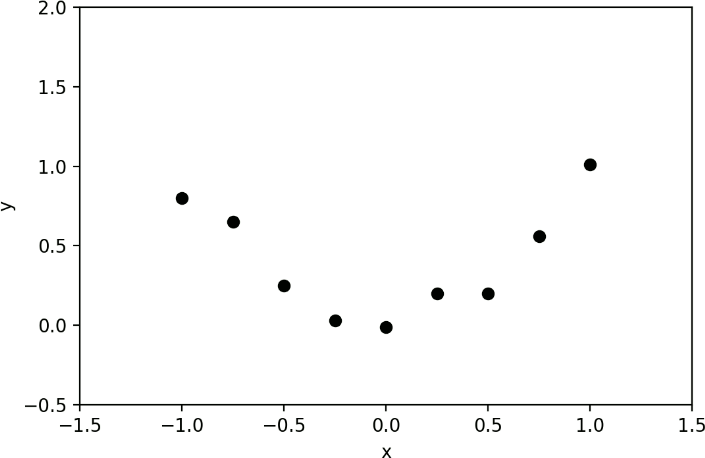
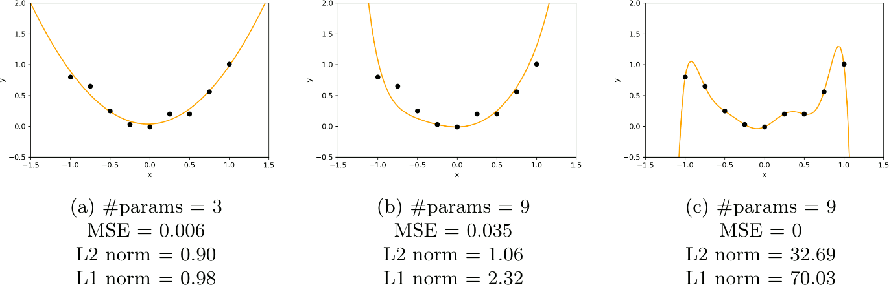
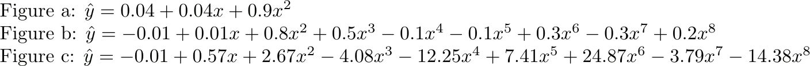
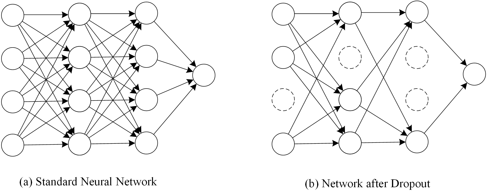
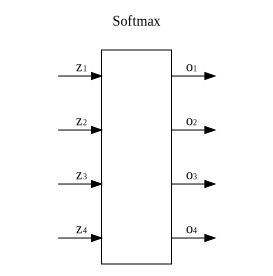

title: NPFL138, Lecture 3
class: title, langtech, cc-by-sa
style: .algorithm { background-color: #eee; padding: .5em }
# Training Neural Networks II

## Milan Straka

### March 3, 2026

---
section: NNTraining
class: section
# Neural Network Training Summary

---
# Putting It All Together

Let us have a dataset with training, validation, and test sets, each containing
examples $(→x, y)$. Depending on $y$, consider one of the following output
activation functions:
$$\begin{cases}
  \textrm{none} & \textrm{ if } y ∈ ℝ \textrm{ and we assume variance is constant everywhere},\\
  σ & \textrm{ if } y \textrm{ is a probability of a binary outcome},\\
  \softmax & \textrm{ if } y \textrm{ is a gold class index out of $K$ classes (or a full distribution)}.
\end{cases}$$

If $→x ∈ ℝ^D$, we can use a neural network with an input layer of size $D$, some
number of hidden layers with nonlinear activations, and an output layer of size
$O$ (either 1 or the number of classes $K$) with the mentioned output function.

~~~
_There are of course many functions, which could be used as output activations
instead of $σ$ and $\softmax$; however, $σ$ and $\softmax$ are almost
universally used. One of the reason is that they can be derived using the
maximum-entropy principle from a set of conditions, see the
[Machine Learning for Greenhorns (NPFL129) lecture 5 slides](https://ufal.mff.cuni.cz/~straka/courses/npfl129/2223/slides/?05).
Additionally, they are the inverses of [canonical link functions](https://en.wikipedia.org/wiki/Generalized_linear_model#Link_function)
of the Bernoulli and categorical distributions, respectively._

---
# Output Activations Refresh

- $σ$ (sigmoid; corresponding to logistic regression if there are no hidden layers)

  

  $$σ(x) ≝ \frac{1}{1 + e^{-x}}$$
  is used to model a Bernoulli distribution, i.e., the probability $φ$
  of one of the outcomes;
~~~
  -  the input of the sigmoid is called a **logit**, and it has a value of $\log \frac{φ}{1-φ}$

~~~
- $\softmax$ (corresponding to maximum entropy model if there are no hidden layers)
  $$\softmax(→x) ∝ e^{→x},~~~~~\softmax(→x)_i ≝ \frac{e^{x_i}}{∑_j e^{x_j}}$$
  is used to model probability distribution $→p$; its input is again called
  a **logit**, $\log(→p) + c$.

---
# Putting It All Together – Single-Hidden-Layer MLP


~~~
We have
$$h_i = f^{(1)}\left(∑_j x_j W^{(1)}_{j,i} + b^{(1)}_i\right)$$
where
- $⇉W^{(1)} ∈ ℝ^{D×H}$ is a matrix of **weights**,
- $→b^{(1)} ∈ ℝ^H$ is a vector of **biases**,
- $f^{(1)}$ is an activation function.

~~~
The weight matrix is also called a **kernel**.

~~~
The biases define general behaviour in case of zero/very small input.

~~~
Transformations of type $→x^\T ⇉W^{(1)} + →b$ are called **affine** instead of _linear_.

--- -----
Similarly
$$o_i = f^{(2)}\left(∑_j h_j W^{(2)}_{j,i} + b^{(2)}_i\right)$$
with
- $⇉W^{(2)} ∈ ℝ^{H×O}$ another matrix of weights,
- $→b^{(2)} ∈ ℝ^O$ another vector of biases,
- $f^{(2)}$ being an output activation function.

---
# Putting It All Together – Parameters and Training

Altogether, the $⇉W^{(1)}, ⇉W^{(2)}, →b^{(1)}$, and $→b^{(2)}$ form the
**parameters** of the model, which we denote as a vector $→θ$ in the model
description and machine learning algorithms.

~~~
In our case, the parameters have a total size of $D×H + H×O + H + O$.

~~~
To train the network, we repeatedly sample $m$ training examples and perform
a step of the SGD algorithm (or any of its adaptive variants), updating the
parameters to minimize the loss $E(→θ) = 𝔼_{(⁇→x, ⁇y)∼p̂_\textrm{data}} L(f(→x; →θ), y)$
derived by MLE:

$$θ_i ← θ_i - α\frac{∂E(→θ)}{∂θ_i},\textrm{~~or in vector notation,~~}→θ ← →θ - α∇_{→θ} E(→θ).$$

~~~
We set the hyperparameters (size of the hidden layer, hidden layer activation
function, learning rate, …) using performance on the validation set and evaluate
generalization error on the test set.

---
# Putting It All Together – Batches

- We always process data in **batches**, i.e., matrices whose rows are the batch examples.

~~~
- We represent the network in a vectorized way (tensorized would be more accurate).

~~~
  Instead of $H_{b,i} = f^{(1)}\left(∑_j X_{b,j} W^{(1)}_{j,i} + b^{(1)}_i\right)$,
  we compute
  $$\begin{aligned}
    ⇉H &= f^{(1)}\left(⇉X ⇉W^{(1)} + →b^{(1)}\right), \\
    ⇉O &= f^{(2)}\left(⇉H ⇉W^{(2)} + →b^{(2)}\right) = f^{(2)}\left(f^{(1)}\left(⇉X ⇉W^{(1)} + →b^{(1)}\right) ⇉W^{(2)} + →b^{(2)}\right). \\
  \end{aligned}$$

~~~
  The derivatives
  $$\frac{∂f^{(1)}\left(⇉X ⇉W^{(1)} + →b^{(1)}\right)}{∂⇉X},
  \frac{∂f^{(1)}\left(⇉X ⇉W^{(1)} + →b^{(1)}\right)}{∂⇉W^{(1)}}, …$$
  are then batches of matrices (called **Jacobians**) or even higher-dimensional tensors.

---
class: middle
# Putting It All Together – Computation Graph


→


---
# Putting It All Together – Designing and Training NNs

Designing and training a neural network is not a one-shot action,
but instead an iterative procedure.

~~~
- When choosing hyperparameters, it is important to verify that the model
  does not underfit and does not overfit.

~~~
- Underfitting can be checked by trying increasing model capacity or training longer,
  and observing whether the training performance increases.

~~~
- Overfitting can be tested by observing train/dev difference, or by trying
  stronger regularization and observing whether the development performance
  improves.

~~~
Regarding hyperparameters:
- We need to set the number of training epochs so that development performance
  stops increasing during training (usually later than when the training
  performance plateaus).

~~~
- Generally, we want to use large enough batch size, but such a one which does
  not slow us down too much (GPUs sometimes allow larger batches without slowing
  down training). However, because larger batch size implies less noise in the
  gradient, small batch size sometimes work as regularization (especially for
  vanilla SGD algorithm).

---
class: tablefull
# High Level Overview

|                 | Classical ('90s) | Deep Learning |
|-----------------|------------------|---------------|
|Architecture     | $\vdots\,\,\vdots\,\,\vdots$ | $\vdots\,\,\vdots\,\,\vdots\,\,\vdots\,\,\vdots\,\,\vdots\,\,\vdots\,\,\vdots\,\,\vdots\,\,\vdots$ &nbsp; CNN, RNN, Transformer, VAE, GAN, …
|Activation func. | $\tanh, σ$    | $\tanh$, ReLU, LReLU, GELU, Swish (SiLU), SwiGLU, …
|Output function  | none, $σ$     | none, $σ$, $\softmax$
|Loss function    | MSE           | NLL (or cross-entropy or KL-divergence)
|Optimization     | SGD, momentum | SGD (+ momentum), RMSProp, Adam, SGDW, AdamW, …
|Regularization   | $L^2$, $L^1$  | $L^2$, Dropout, Label smoothing, BatchNorm, LayerNorm, MixUp, WeightStandardization, …

---
section: Regularization
class: section
# Regularization

---
# Regularization

As already mentioned, **regularization** is any change in the machine learning
algorithm that is designed to reduce generalization error but not necessarily
its training error.

~~~
Regularization is usually needed only if training error and generalization error
are different. That is often not the case if we process each training example
only once. Generally the more training data, the better generalization
performance without any explicit regularization.

~~~
We now describe several basic regularization methods:
- Early stopping

- $L^2$, $L^1$ regularization

- Dataset augmentation

- Ensembling

- Dropout

- Label smoothing

---
# Regularization – Early Stopping


---
# L2 Regularization

$L^2$-regularization is one of the oldest regularization techniques, which tries
to prefer “simpler” models by endorsing models with **smaller weights**.

~~~
Concretely, **$\boldsymbol{L^2}$-regularization** (also called **Tikhonov
regularization** or **weight decay**) penalizes models with large weights by
utilizing the following error function:

$$Ẽ(→θ; 𝕏) = E(→θ; 𝕏) + \frac{λ}{2} \|→θ\|_2^2$$
for a suitable (usually very small) $λ$.

~~~
Note that the $L^2$-regularization is usually not applied to the _bias_, only to the
“proper” weights, because bias parameters usually do not influence the sharpness
of the predictions.

---
# L2 Regularization



One way to look at $L^2$-regularization is that it promotes smaller
changes of the model (the Jacobian of a single layer with respect to the
inputs depends on the weight matrix, because $\frac{∂→x^\T⇉W + →b}{∂→x} = ⇉W$).

~~~
Considering the data points on the right, we present mean squared errors
and $L^2$ norms of the weights for three linear regression models:




---
# L2 Regularization


---
# L2 Regularization as MAP

Another way to arrive at $L^2$ regularization is to utilize Bayesian inference.

~~~
With MLE we have
$$→θ_\mathrm{MLE} = \argmax\nolimits_{→θ} p(𝕏; →θ).$$

~~~
Instead, we may want to maximize **maximum a posteriori (MAP)** point estimate:
$$→θ_\mathrm{MAP} = \argmax\nolimits_{→θ} p(→θ | 𝕏).$$

~~~
Using Bayes' theorem stating that
$$p(→θ | 𝕏) = \frac{p(𝕏 | →θ) p(→θ)}{p(𝕏)},$$
we can rewrite the MAP estimate to
$$→θ_\mathrm{MAP} = \argmax\nolimits_{→θ} p(𝕏 | →θ)p(→θ).$$

---
# L2 Regularization as MAP

The $p(→θ)$ are prior probabilities of the parameter values (our _preference_).

A common choice of the preference is the _small weights preference_, where the mean is assumed to
be zero, and the variance is assumed to be $σ^2$. Given that we have no further
information, we employ the maximum entropy principle, which results in
$p(θ_i) = 𝓝(θ_i; 0, σ^2)$, so that $p(→θ) = ∏_i 𝓝(θ_i; 0, σ^2) = 𝓝(→θ; ⇉0, σ^2
⇉I).$
~~~
Then
$$\begin{aligned}
→θ_\mathrm{MAP} &= \argmax\nolimits_{→θ} p(𝕏; →θ)p(→θ) \\
                &= \argmax\nolimits_{→θ} \Big[\Big(∏\nolimits_{i=1}^m p(→x^{(i)}; →θ)\Big) p(→θ) \Big] \\
                &= \argmin\nolimits_{→θ} \Big[\Big(∑\nolimits_{i=1}^m -\log p(→x^{(i)}; →θ)\Big) - \log p(→θ) \Big].
\end{aligned}$$

~~~
By substituting the probability of the Gaussian prior, we get
$$→θ_\mathrm{MAP} = \argmin_{→θ} \bigg[\Big(∑\nolimits_{i=1}^m -\log p(→x^{(i)}; →θ)\Big) {\color{gray} + \frac{\#→θ}{2} \log(2πσ^2)} + \frac{\|→θ\|_2^2}{2σ^2} \bigg].$$

---
# L2 Regularization

The resulting parameter update during SGD with $L^2$-regularization is
$$θ_i ← θ_i - α\frac{∂E}{∂θ_i} - αλθ_i,\textrm{~~or in vector notation,~~}→θ ← →θ - α∇_{→θ}E(→θ) - αλ→θ.$$

~~~
This update can be rewritten to
$$θ_i ← θ_i (1 - αλ) - α\frac{∂E}{∂θ_i},\textrm{~~or in vector notation,~~}→θ ← →θ(1 - αλ) - α∇_{→θ}E(→θ).$$

~~~
Terminologically, the update of weights in these two formulas is called _weight
decay_, because the weights are multiplied by a factor $1 - αλ < 1$, while
adding the $L^2$-norm of the parameters to the loss is called _$L^2$-regularization_.

For SGD, they are equivalent—but once you add momentum or normalization by the
estimated second moment (RMSProp, Adam), weight decay and $L^2$-regularization
are different.

---
# L2 Regularization – AdamW

It has taken more than three years to realize that using Adam with
$L^2$-regularization does not work well. At the end of 2017, **AdamW**
was proposed, which is Adam with weight decay.

## <span style="color: #d4d">Adam with $L^2$-regularization</span>, <span style="color: #2c2">AdamW</span>

<div class="algorithm">

- $→s ← →0$, $→r ← →0$, $t ← 0$
- Repeat until stopping criterion is met:
    - Sample a minibatch of $m$ training examples $(→x^{(i)}, y^{(i)})$
    - $→g ← \frac{1}{m} ∑_i ∇_{→θ} \big(L(f(→x^{(i)}; →θ), y^{(i)}) \textcolor{#d4d}{+ \frac{λ}{2}\|→θ\|^2} \big)$
    - $t ← t + 1$
    - $→s ← β_1→s + (1-β_1)→g$
    - $→r ← β_2→r + (1-β_2)→g^2$
    - $→ŝ ← →s / (1 - β_1^t)$, $→r̂ ← →r / (1 - β_2^t)$
    - $→θ ← →θ - \frac{α_t}{\sqrt{→r̂} + ε}→ŝ \textcolor{#2c2}{-α_t λ →θ}$
</div>

---
# L2 Regularization – AdamW

$$→θ ← →θ - \frac{α_t}{\sqrt{→r̂} + ε}→ŝ \textcolor{#2c2}{-α_t λ →θ}$$

In some variants of the algorithm (notably in the original AdamW paper), the
authors proposed not to use the learning rate in the weight decay (to decouple
the influence of the learning rate on the weight decay).

~~~
However, this would mean that if you utilize learning rate decay, you would need
to apply it manually also on the weight decay. So currently, the implementation
of `torch.optim.AdamW` (and others like `keras.optimizers.AdamW` and
`optax.adamw`) multiplies the (possibly decaying) learning rate and the
(constant) weight decay in the update.

---
# L1 Regularization

Similar to $L^2$-regularization, but could prefer low $L^1$ metric of parameters. We
could therefore minimize
$$Ẽ(→θ; 𝕏) = E(→θ; 𝕏) + λ \|→θ\|_1.$$

The corresponding SGD update is then
$$θ_i ← θ_i - α\frac{∂EJ}{∂θ_i} - \min\big(αλ, |θ_i|\big)\operatorname{sign}(θ_i).$$

~~~
Empirically, $L^1$-regularization does not work well with deep neural networks
and is essentially never used, as far as I know.

---
# Regularization – Dataset Augmentation

For some data, it is cheap to generate slightly modified examples.

- Image processing: translations, horizontal flips, scaling, rotations, color
  adjustments, …

~~~
  - AutoAugment, RandAugment
~~~
  - Mixup (appeared in 2017), CutMix (published in 2019)

  

~~~
- Speech recognition: noise, frequency change, …

~~~
- More difficult for discrete domains like text.

---
# Regularization – Ensembling

**Ensembling** (also called **model averaging** or in some contexts _bagging_) is a general technique
for reducing generalization error by combining several models. The models are
usually combined by averaging their outputs (either distributions or output
values in case of a regression).

~~~
The main idea behind ensembling is that if models have uncorrelated
(independent) errors, then by averaging model outputs, the errors cancel
out. If we denote the prediction of the $i^\textrm{th}$ model on a training example $(→x, y)$ as
$y_i(→x) = y + ε_i(→x)$, so that $ε_i(→x)$ is the model error on example $→x$,
the mean square error of the model is $𝔼\big[(y_i(→x) - y)^2\big] = 𝔼\big[ε_i^2(→x)\big].$

~~~
Because for uncorrelated identically distributed random variables $⁇x_i$ we have
$$\Var\left(∑ ⁇x_i\right) = ∑ \Var(⁇x_i),~~~~\Var(a ⋅ ⁇x) = a^2 \Var(⁇x),$$
~~~
we get that $\Var\big(\frac{1}{n}∑_i ⁇ε_i\big) = \frac{1}{n} \big(∑_i \frac{1}{n} \Var(⁇ε_i)\big)$, so
the errors should decrease with the increasing number of models.

---
# Regularization – Ensembling Visualization

Consider ensembling predictions generated uniformly on a planar disc:

~~~

~~~


---
# Regularization – Ensembling

There are many possibilities how to train the models to ensemble:

- For neural network models, training models with independent random
  initialization is usually enough, given that the loss has many local minima,
  so the models tend to be quite independent just when using different random
  initialization.

~~~


- Algorithms with convex loss functions usually converge to the same optimum
  independent of randomization. In that case, we can use **bagging** (bootstrap
  aggregation), where we generate different training data for each model by
  sampling with replacement.

~~~
- Average models from last hours/days of training.

~~~
However, ensembling usually has high performance requirements.

---
section: Dropout
class: section
# Dropout

---
# Regularization – Dropout

How to design good universal features?

- In reproduction, evolution is achieved using gene swapping. The genes must not
  be just good with combination with other genes, they need to be universally
  good.

~~~
Idea of **dropout** by (Srivastava et al., 2014), in preprint since 2012.

~~~
When applying dropout to a layer, we drop each neuron independently with
a probability of $p$ (usually called **dropout rate**). To the rest of the
network, the dropped neurons have value of zero.

~~~


---
# Regularization – Dropout

Dropout is performed only when training, during inference no nodes are
dropped. However, in that case we need to **scale the activations down**
by a factor of $1-p$ to account for more neurons than usual.


---
# Regularization – Dropout

In practice, the dropout is implemented by instead **scaling the activations up**
during training by a factor of $1/(1-p)$ and then **doing nothing** during
inference.


---
style: .katex-display { margin: .6em 0 }
# Regularization – Dropout as Ensembling


~~~
We can understand dropout as a layer obtaining inputs $→x$ and multiplying
them element-wise by a vector of Bernoulli random variables $⁇→z$, where
each $⁇z_i$ is 0 with a probability $p$:
$$\operatorname{dropout}(→x | ⁇→z) = →x ⊙ ⁇→z.$$

~~~
- During training, we sample $⁇→z$ randomly.

~~~
- During inference, we compute an expectation over all $⁇→z$:
  $$\begin{aligned}
  𝔼_{⁇→z} \big[→x ⊙ ⁇→z\big]
    &= p ⋅ →x ⊙ →0 + (1-p) ⋅ →x ⊙ →1 \\
    &= (1-p) ⋅ →x.\\
  \end{aligned}$$

~~~
- In order for the inference to be an identity, we can use
  $\operatorname{dropout}(→x | ⁇→z) = \frac{1}{1-p} ⋅ →x ⊙ ⁇→z$.

---
# Regularization – Dropout Implementation

The following is a simplified example implementation of `torch.nn.functional.dropout`:
```python
def dropout(inputs, p=0.5, training=True):
    def do_inference():
        return inputs

    def do_train():
        random_noise = torch.rand(inputs.shape)
        mask = (random_noise >= p).to(inputs.dtype)
        return inputs * mask / (1 - p)

    if training and p != 0.0:
        return do_train()
    else:
        return do_inference()
```

---
# Regularization – Dropout Effect


---
section: LabelSmoothing
class: section
# Label Smoothing

---
# Regularization – Label Smoothing

Problem with softmax MLE loss is that it is _never satisfied_, always pushing
the gold label probability higher (but it saturates near 1).

~~~
This behaviour can be responsible for overfitting, because the network is always
commanded to respond more strongly to the training examples, not respecting
similarity of different training examples.

~~~
Ideally, we would like a full (non-sparse) categorical distribution of classes
for training examples, but that is usually not available.

~~~
We can at least use a simple smoothing technique, called **label smoothing**, which
allocates some small probability volume $α$ uniformly for all possible classes.

~~~
In the case of classification with the gold class _gold_, the target categorical
distribution is then
$$(1-α)→1_\textit{gold} + α \frac{→1}{\textrm{number~of~classes}}.$$

---
# Regularization – Label Smoothing


---
# Regularization – Good Defaults

When you need to regularize (your model is overfitting), then a good default strategy is to:

~~~
- use data augmentation if possible;

~~~
- use dropout on all hidden dense layers (not on the output layer):
  - good starting dropout rate is 0.5 if your model has enough capacity,
  - otherwise, use 0.3-0.1 if the model is underfitting;
~~~
- use weight decay (AdamW) for convolutional networks;
~~~
- use label smoothing (start with 0.1);
~~~
- if you require best performance and have a lot of resources, also
  perform ensembling.

---
section: Convergence
class: section
# Convergence of Neural Network Training

---
# Convergence

The training process might or might not converge. Even if it does, it might
converge slowly or quickly.

~~~
A major issue of convergence of deep networks is to make sure that the gradient
with respect to all parameters is reasonable at all times, i.e., it does not
decrease or increase too much with depth or in different batches.

~~~
There are _many_ factors influencing the gradient, convergence and its speed, we
now mention three of them:
- saturating nonlinearities,
- parameter initialization strategies,
- gradient clipping.

---
class: middle
# Convergence – Saturating Non-linearities


~~~


---
# Hidden Layer Interpretation


Considering a network with a single hidden layer:
- The last part (from the hidden layer to the output layer) is a linear
  model, which can distinguish linearly separable data only.

~~~
- The part from the inputs to the hidden layer can be considered as
  automatically constructed features. The features are a linear mapping of the
  input values followed by a nonlinearity, and the Universal approximation
  theorem proves they can always be constructed to achieve as good a fit of the
  training data as is required.

~~~
However, the weights in the first layer of such a MLP must be initialized
randomly. If we used just zeros, all the constructed features (hidden layer
nodes) would behave identically and we would never distinguish them.

Using random weights corresponds to starting with random features, which allows
the SGD to make progress (improve the individual features).

---
# Convergence – Parameter Initialization

Neural networks usually need random initialization to _break symmetry_.

~~~
- Biases should be initialized to 0 (Keras, TF, Jax; for some reason not PyTorch).

~~~
- Weights are usually initialized to small random values, either with uniform or
  normal distribution.
   - The scale matters for deep networks!

~~~
   - Originally, people used $U\left[-\frac{1}{\sqrt n}, \frac{1}{\sqrt n}\right]$ distribution.
     - Still the default for `torch.nn.Linear`.

~~~
   - Xavier Glorot and Yoshua Bengio, 2010:
     _Understanding the difficulty of training deep feedforward neural networks_.

     The authors theoretically and experimentally show that a suitable way to
     initialize a $ℝ^{n×m}$ matrix is
     $$U\left[-\sqrt{\frac{6}{m+n}}, \sqrt{\frac{6}{m+n}}\right].$$

---
# Convergence – Parameter Initialization


---
# Convergence – Parameter Initialization


---
# Convergence – Gradient Clipping


---
# Convergence – Gradient Clipping


Using a given maximum norm, we may _clip_ the gradient.

~~~
$$→g ← \begin{cases}
  →g & \textrm{ if }\|→g\| ≤ c, \\
  c \frac{→g}{\|→g\|} & \textrm{ if }\|→g\| > c.
\end{cases}$$

~~~
Clipping can be performed per single weight (`torch.nn.utils.clip_grad_value_`)
or for the gradient as a whole (`torch.nn.utils.clip_grad_norm_`).

---
section: ∂Loss
class: section
# Derivative of the MLE Losses

---
# Derivative of the MSE Loss

Given the MSE loss of
$$L = \big(f(→x; →θ) - y\big)^2,$$
the derivative with respect to the model output is simply:
$$\frac{∂L}{∂f(→x; →θ)} = 2\big(f(→x; →θ) - y\big).$$

---
# Derivative of the Softmax MLE Loss



Let us have a softmax output layer with
$$o_i = \frac{e^{z_i}}{∑_j e^{z_j}}.$$

---
# Derivative of the Softmax MLE Loss

Consider now the MLE estimation. The loss for gold class index $\textit{gold}$ is then
$$L(\softmax(→z), \textit{gold}) = - \log o_\textit{gold}.$$

~~~
This is the **negative log likelihood** or **(sparse) categorical cross-entropy** loss.

~~~
The derivative of the loss with respect to $→z$ is then

~~~
$\displaystyle {\kern5em\frac{∂L}{∂z_i} = \frac{∂}{∂z_i} \left[-\log \frac{e^{z_\textit{gold}}}{∑_j e^{z_j}}\right]}
 = -\frac{∂z_\textit{gold}}{∂z_i} + \frac{∂\log(∑_j e^{z_j})}{∂z_i}$

~~~
$\displaystyle \hphantom{\kern5em\frac{∂L}{∂z_i} = \frac{∂}{∂z_i} \left[-\log \frac{e^{z_\textit{gold}}}{∑_j e^{z_j}}\right]}
 = -[\textit{gold} = i] + \frac{1}{∑_j e^{z_j}} e^{z_i}$

~~~
$\displaystyle \hphantom{\kern5em\frac{∂L}{∂z_i} = \frac{∂}{∂z_i} \left[-\log \frac{e^{z_\textit{gold}}}{∑_j e^{z_j}}\right]}
 = -[\textit{gold} = i] + o_i.$

~~~
Therefore, $\frac{∂L}{∂→z} = →o - →1_\textit{gold}$, where $→1_\textit{gold}$
is the one-hot encoding (a vector with 1 at the index $\textit{gold}$ and
0 everywhere else).

---
# Derivative of the Softmax MLE Loss


---
# Derivative of the Softmax MLE Loss

In the previous case, the gold distribution was _sparse_, with only one
target probability being 1.

~~~
In the case of general gold distribution $→g$, we have
$$L(\softmax(→z), →g) = -∑\nolimits_i g_i \log o_i.$$

This is the **(full) categorical cross-entropy** loss.

~~~
Reusing the result showing that $-\frac{∂\log o_i}{∂→z} = →o - →1_i$, we obtain
~~~
$$\frac{∂L}{∂→z} = - ∑_i g_i \frac{∂\log o_i}{∂→z} = ∑_i \big(g_i ⋅ →o - g_i ⋅ →1_i\big) = →o - →g.$$

---
# Derivative of the Sigmoid MLE Losses

For binary classification, denoting $o ≝ σ(z)$ and assuming gold label $g ∈ \{0, 1\}$,
we have that
$$L\big(σ(z), g\big) = -\log p_\textrm{model}(g | o).$$

~~~
Recalling the Bernoulli distribution probability $p(x; φ) = φ^x (1-φ)^{1-x}$, we
obtain the **binary cross-entropy** loss:

~~~
$$L\big(σ(z), g\big) = - \log \big(o^g (1-o)^{1-g}\big) = - g \log o - (1-g) \log (1-o).$$

~~~
Analogously to the $\softmax$ MLE derivatives, we get that $\frac{∂L}{∂z} = o - g$.

~~~
The result follows automatically from the fact that $σ$ can be computed
using $\softmax$ as
$$\softmax\big([0~~x]\big)_1 = \frac{e^x}{e^x + e^0} = \frac{1}{1 + e^{-x}} = σ(x).$$

---
# Derivative of Softmax MLE Loss


---
section: Metrics&Losses
class: section
# Metrics and Losses

---
# Metrics and Losses

During training and evaluation, we use two kinds of error functions:
~~~
- **loss** is a _differentiable_ function used during training,
~~~
  - NLL, MSE, Huber loss, Hinge, …
~~~
- **metric** is any (and very often non-differentiable) function used during
  evaluation,
~~~
  - any loss, accuracy, F-score, BLEU, …
~~~
  - possibly even human evaluation.

~~~
In PyTorch, the losses are available in the `torch.nn` and `torch.nn.functional`
modules.

~~~
However, no built-in metrics are provided (in contrast to for example Keras).
Therefore, we will use the metrics from the `torchmetrics` package.

---
# PyTorch Losses

The PyTorch losses offer two interfaces: an object one through the subclasses of
`torch.nn.Module`, and a functional one via methods in the
`torch.nn.functional` module. (Most modules offer their functionality also as
a stateless function.)

~~~

Considering the mean squared error, the loss object can be constructed using
```python
torch.nn.MSELoss(reduction="mean")
```
~~~
and the instances then provide a method
```python
__call__(y_pred: torch.Tensor, y_true: torch.Tensor) -> torch.Tensor
```
returning a _reduced_ loss value.

~~~
The possible `reduction`s are
- `reduction="mean"`, producing a single scalar tensor;
~~~
- `reduction="sum"`, producing again a single scalar tensor;
~~~
- `reduction="none"`, producing a tensor of the original shape.

---
# PyTorch Cross-entropy Losses

The landscape of cross-entropy losses provided by PyTorch is not particularly
well designed.

~~~
- The cross-entropy of a categorical distribution is computed by
  ```python
  class torch.nn.CrossEntropyLoss(torch.nn.Module):
    def __init__(ignore_index=-100, label_smoothing=0, reduction="mean")
  ```

~~~
  The resulting instance provides a method
  ```python
  __call__(y_pred: torch.Tensor, y_true: torch.Tensor) -> torch.Tensor
  ```
  where:
~~~
  - `y_pred` are the prediction **logits** with shape $[C]$, $[N, C]$, or $[N, C, d_1, …, d_k]$;
~~~
  - `y_true` are either:
~~~
    - the gold class indices with shape $[]$, $[N]$, $[N, d_1, …, d_k]$, or
~~~
    - the gold distribution with shape $[C]$, $[N, C]$, $[N, C, d_1, …, d_k]$.
~~~
  - when `y_true` are class indices, the ones equal to `ignore_index` are
    ignored.

---
# PyTorch Cross-entropy Losses

- A special-case of the `torch.nn.CrossEntropyLoss` is the
  ```python
  class torch.nn.NLLLoss(torch.nn.Module):
    def __init__(ignore_index=-100, reduction="mean")
    def __call__(y_pred: torch.Tensor, y_true: torch.Tensor) -> Tensor
  ```
~~~
  Compared to `torch.nn.CrossEntropyLoss`:
  - the `y_pred` must be **log-probabilities** (not logits), computable
    using for example `torch.nn.LogSoftmax` or
    `torch.nn.functional.log_softmax`;
~~~
  - the `y_true` always contains gold class indices;
~~~
  - label smoothing is not supported.

---
style: pre { margin-bottom: 6px }
# PyTorch Cross-entropy Losses

- The cross-entropy of a Bernoulli distribution can be computed by
  ```python
  class torch.nn.BCELoss(torch.nn.Module):
    def __init__(reduction="mean")
    def __call__(y_pred: torch.Tensor, y_true: torch.Tensor) -> Tensor
  ```
  where:

  - the `y_pred` must be **probabilities** (neither logits nor log-probabilities),
  - the `y_true` are the gold probabilities.

~~~
  For numerical stability, the logarithms are clamped to -100 for very
  small/zero inputs.

~~~
- Alternatively, one might use
  ```python
  class torch.nn.BCEWithLogitsLoss(torch.nn.Module):
    def __init__(reduction="mean")
    def __call__(y_pred: torch.Tensor, y_true: torch.Tensor) -> Tensor
  ```
  where the `y_pred` must be **logits** instead of probabilities.

---
# PyTorch Cross-entropy Losses

Apart from the object interface, functions computing the above losses are also
provided:
- ```python
  torch.nn.functional.mse_loss(y_pred, y_true, reduction="mean")
  ```
~~~
- ```python
  torch.nn.functional.cross_entropy(y_pred, y_true,
    ignore_index=-100, label_smoothing=0, reduction="mean")
  ```
~~~
- ```python
  torch.nn.functional.nll_loss(y_pred, y_true,
    ignore_index=-100, reduction="mean")
  ```
~~~
- ```python
  torch.nn.functional.binary_cross_entropy(y_pred, y_true,
    reduction="mean")
  ```
~~~
- ```python
  torch.nn.functional.binary_cross_entropy_with_logits(y_pred, y_true,
    reduction="mean")
  ```

---
style: pre { margin-top: 3px; margin-bottom: 0px }
# Metrics

There are two important differences between metrics and losses.
1. metrics may be non-differentiable;
~~~
1. metrics **aggregate** results over multiple batches.

~~~
The metrics in the `torchmetrics` package are subclasses of
a `torchmetrics.Metric` class:
- ```python
  class torchmetrics.Metric(torch.nn.Module):
    def update(y_pred : torch.Tensor, y_true: torch.Tensor) -> None
  ```
  updates the state of the metric by incorporating a batch of predictions and
  true outputs;
~~~
- ```python
    def compute() -> torch.Tensor
  ```
  the `compute` method returns the current value of the metric;
~~~
- ```python
    def reset() -> None
  ```
  the `reset` method clears the stored state of the metric.
~~~
- weirdly, the `forward(y_pred, y_true)` method (or calling the metric object
  directly) returns the metric of _only the passed batch_, but it also updates
  the stored metric state.

---
# Common torchmetric Metrics

The `torchmetrics` package provides 100+ PyTorch metrics. The most common ones are:
- `torchmetrics.MeanMetric` computing averaged mean;

~~~
- `torchmetrics.MeanSquaredError` computing the mean squared error;
~~~
- `torchmetrics.Accuracy(task: Literal["binary","multiclass","multilabel"])`
  is a wrapper constructing a task-specific accuracy.

---
style: pre { margin-top: 6px; margin-bottom: 0px }
# Common torchmetric Accuracy Metrics Variants
- ```python
  torchmetrics.Accuracy(task="binary", threshold=0.5, ...)
  ```
  computes accuracy of binary classification from predicted
  **probabilities**;
  - if one of the inputs is not in $[0, 1]$ range, $σ$ is applied to the batch 😱
  - originally I thought passing `threshold=0.0` would allow processing logits;
    however, the broken $σ$ application means logits cannot be processed
    reliably by this metric;
~~~
- ```python
  torchmetrics.Accuracy(task="multiclass",
    num_classes, ignore_index=None, ...)
  ```
  computes accuracy of classification into the given `num_classes`; the
  predictions can be either integral predicted classes or probabilities/logits
  that are passed through an argmax;
~~~
- ```python
  torchmetrics.Accuracy(task="multilabel",
    num_labels, threshold=0.5, ignore_index=None, ...)
  ```
  computes a multilabel classification, where the model is capable of predicting
  any number of classes, each being predicted independently as a binary classification.
