title: NPFL138, Lecture 4
class: title, langtech, cc-by-sa
style: .algorithm { background-color: #eee; padding: .5em }

# Convolutional Neural Networks

## Milan Straka

### March 10, 2026

---
class: section
# Going Deeper

---
section: Convolution
class: section
# Convolution Operation

---
# Convolution Operation

Consider data with some structure (temporal data, speech, images, …).

~~~
Unlike densely connected layers, we might want:
~~~
- local interactions only;

~~~
- shift invariance (equal response everywhere).
~~~

  

---
# 1D Convolution versus Linear Layer

---
# 2D Convolution

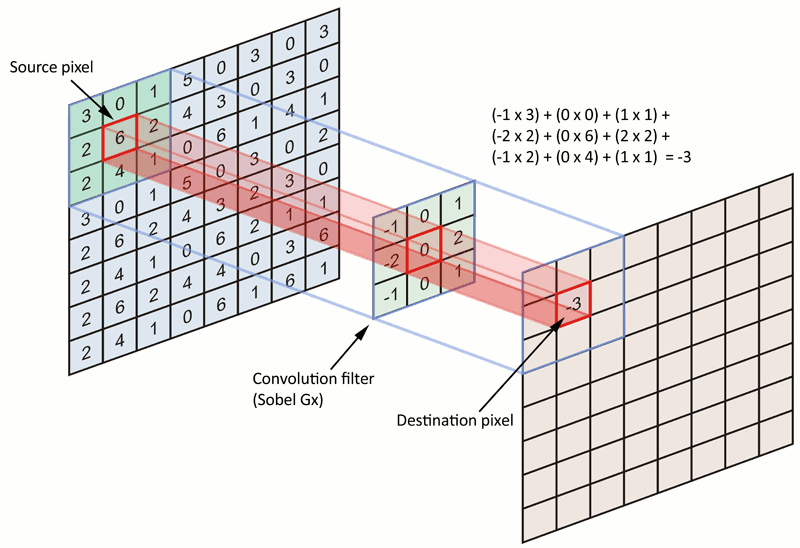

---
# 2D Convolution

---
# Convolution Operation

For functions $x$ and $w$, the _convolution_ $w * x$ is defined as
$$(w * x)(t) = ∫x(t - a)w(a)\d a.$$

~~~
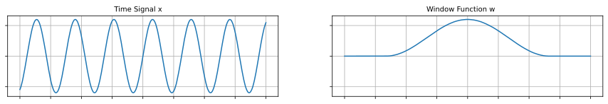

~~~
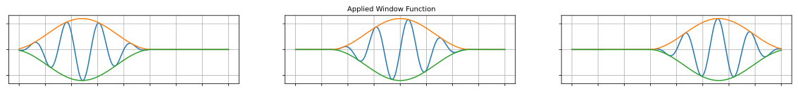

---
# Convolution Operation

For functions $x$ and $w$, the _convolution_ $w * x$ is defined as
$$(w * x)(t) = ∫x(t - a)w(a)\d a.$$

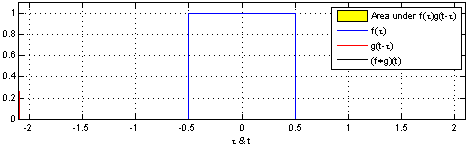

~~~
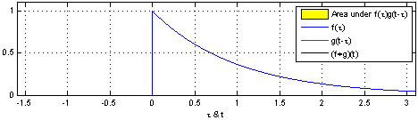

---
# Convolution Operation

For functions $x$ and $w$, the _convolution_ $w * x$ is defined as
$$(w * x)(t) = ∫x(t - a)w(a)\d a.$$

For vectors, we have
$$(→w * →x)_t = ∑\nolimits_i x_{t-i} w_i.$$

~~~
The convolution operation can be generalized to two dimensions by
$$(⇉K * ⇉I)_{i, j} = ∑\nolimits_{m, n} ⇉I_{i-m, j-n} ⇉K_{m, n}.$$

~~~
Closely related to convolution is _cross-correlation_, where $⇉K$ is flipped:
$$(⇉K \star ⇉I)_{i, j} = ∑\nolimits_{m, n} ⇉I_{i+m, j+n} ⇉K_{m, n}.$$

---
# Convolution Operation – Input Channels

The $⇉K$ is usually called a **kernel** or a **filter**.

~~~
Note that usually we have a whole vector of values for a single pixel,
the so-called **channels**.
~~~
These single pixel channel values have no longer any
spatial structure, so the kernel contains a different set of weights for every
input dimension, obtaining

$$(⇶K \star ⇶I)_{i, j} = ∑_{m, n, c} ⇶I_{i + m, j + n, c} ⇶K_{m, n, c}.$$

---
# Convolution Operation – Output Channels

Furthermore, we usually want to be able to specify the output dimensionality
similarly to for example a fully connected layer – the number of **output
channels** for every pixel.
~~~
Each output channel is then the output of an
independent convolution operation, so we can consider $⇶K$ to be
a four-dimensional tensor and the convolution is computed as

$$(⇶K \star ⇶I)_{i, j, o} = ∑_{m, n, c} ⇶I_{i + m, j + n, c} ⇶K_{m, n, c, o}.$$

---
section: CNNs
class: section
# Convolutional Neural Networks

---
# Convolution Layer

To define a complete convolution layer, we need to specify:
- the width $W$ and the height $H$ of the kernel;
~~~
- the number of output channels $O$;
~~~
- the **stride**, which determines the interval at which the input is
  sampled—computing the output for every **stride**-th pixel means that
  a stride of 2 will halve the spatial dimensions of the output.

~~~
Considering an input image with $C$ channels, the convolution layer is then
parametrized by a kernel $⇶K$ of total size $W × H × C × O$ and a bias $→b$
of size $O$, and it is computed as
$$(⇶K \star ⇶I)_{i, j, o} = ∑_{m, n, c} ⇶I_{i⋅S + m, j⋅S + n, c} ⇶K_{m, n, c, o} + b_o.$$

~~~
Note that while only local interactions are considered in the image spatial dimensions
(width and height), the input and output channels are combined in a fully connected manner.

---
class: tablewide
style: 
# Convolution Layer

There are multiple padding schemes, the most common are:
- `valid`: Only use valid pixels, which causes the result to be smaller than the input.
- `same`: Pad original image with zero pixels so that the result is exactly
  the size of the input.

~~~
Illustration of the padding schemes and different strides for a $3×3$ kernel:
- **valid** padding, stride=1: 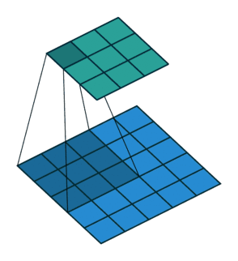
  stride=2: 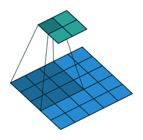
- **same** padding, stride=1: 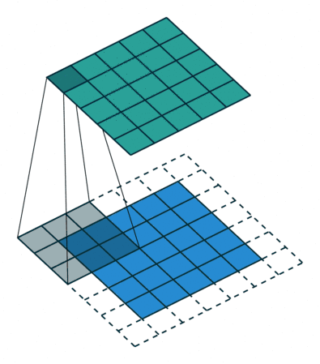
  stride=2: 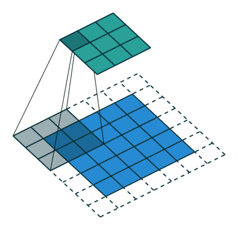

|Padding| No stride (stride=1) | Stride=2 |
|-------|:--------------------:|:--------:|
| Valid |  |  |
| Same  |   |  |

---
# Convolution Layer Representation

There are two common image formats:
- `channels_last`: The dimensions of a 3-dimensional image tensor are height,
  width, and channels; also called `HWC` for a single image and `NHWC` for
  a batch of images.

  - The format used by PIL, scipy, TensorFlow, JAX, Keras, …, faster on CPU.
~~~
- `channels_first`: The dimensions of a 3-dimensional image tensor are channel,
  height, and width; also called `CHW` for a single image and `NCHW` for
  a batch of images.
  - Used by PyTorch, originally faster on GPUs; `channels_last` is faster on new GPUs.

~~~
In PyTorch, the image shape is always `channels_first`, so `[N, C, H, W]` for a batch;
however, you can choose a `memory_format` using `tensor.to(memory_format=...)`, where
- `memory_format=torch.contiguous_format` is dense non-overlapping `NCHW`, the default;
- `memory_format=torch.channels_last` is dense non-overlapping `NHWC`;
- `memory_format=torch.channels_last_3d` is dense non-overlapping `NDHWC`.

~~~
In TensorFlow, image shape is `channels_last` with runtime choosing the faster
format.

~~~
In PyTorch, my recommendation is to always use the **torch.channels_last**
memory format.

---
# Pooling

Pooling is an operation similar to convolution, but we perform a fixed operation
instead of multiplying by a kernel.

- Max pooling (minor translation invariance)

- Average pooling

~~~
We will often use pooling together with stride larger than 1, most commonly stride 2.

---
# High-level CNN Architecture

We repeatedly use the following block:
1. The convolution operation
2. Non-linear activation (usually ReLU)
3. Pooling

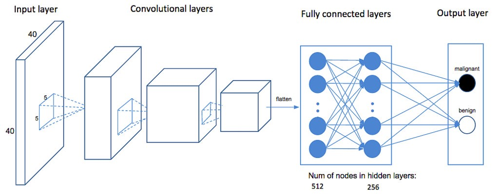

---
section: AlexNet
class: section
# AlexNet

---
# AlexNet – 2012 (16.4% ILSVRC top-5 error)

---
# AlexNet – 2012 (16.4% ILSVRC top-5 error)

Training details:
- 61M parameters, 2 GPUs for 5–6 days

~~~
- SGD with batch size 128, momentum 0.9, $L^2$ regularization strength (weight
  decay) 0.0005
~~~
  - $→v ← 0.9 ⋅ →v - α ⋅ \frac{∂L}{∂→θ} - 0.0005 ⋅ α ⋅ →θ$
  - $→θ ← →θ + →v$

~~~
- initial learning rate 0.01, manually divided by 10 when validation error rate
  stopped improving

~~~
- ReLU nonlinearities

~~~
- dropout with rate 0.5 on the fully-connected layers (except for the output layer)

~~~
- data augmentation using translations and horizontal reflections (choosing random
  $224 × 224$ patches from $256 × 256$ images)
~~~
  - during inference, 10 patches are used (four corner patches and a center
    patch, as well as their reflections)

---
# AlexNet – ReLU vs tanh

---
# LeNet – 1998

AlexNet built on already existing CNN architectures, mostly on LeNet, which
achieved 0.8% test error on MNIST.

---
class: middle
# Similarities in Primary Visual Cortex (V1) and CNNs

The primary visual cortex recognizes Gabor functions.

---
# Similarities in Primary Visual Cortex (V1) and CNNs

The 96 convolutional kernels of size $11×11×3$ learned by the first
convolutional layer of AlexNet on the $224×224×3$ input images. The top 48
kernels were learned on GPU 1 while the bottom 48 kernels were learned on GPU 2.

---
section: Deep Prior
class: section
# CNNs as Regularizers: Deep Prior

---
section: Deep Prior
# CNNs as Regularizers: Deep Prior

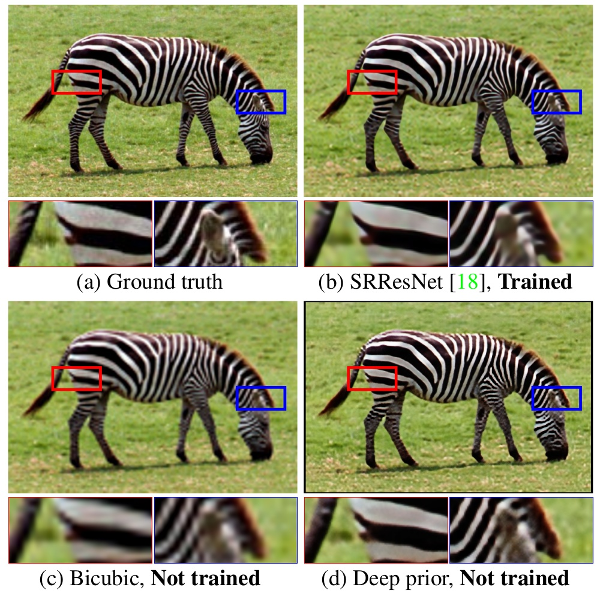

---
# CNNs as Regularizers: Deep Prior

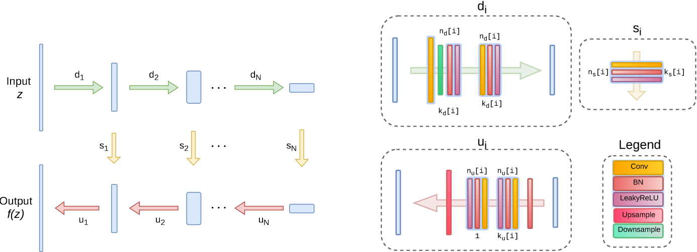

Random noise from $U[0, \frac{1}{10}]$ used on the input; in large inpainting,
meshgrid is used instead and the skip-connections are not used.

---
# CNNs as Regularizers: Deep Prior

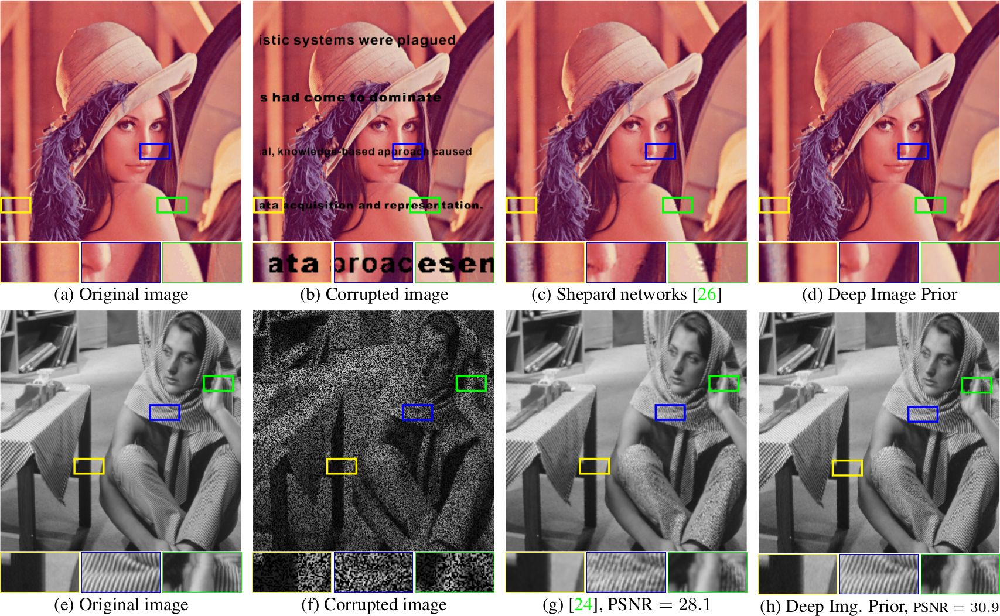

---
# CNNs as Regularizers: Deep Prior

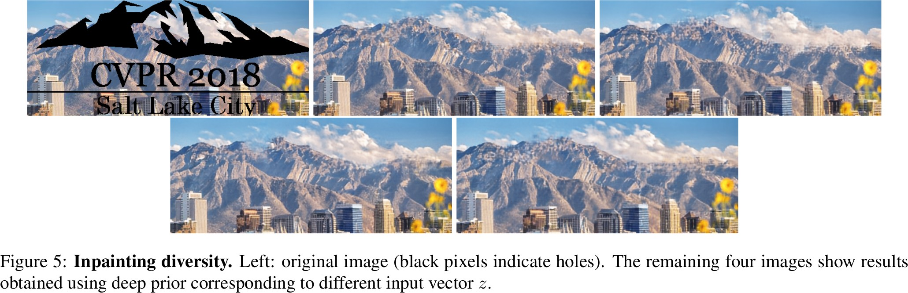

~~~
[Deep Prior paper website with supplementary material](https://dmitryulyanov.github.io/deep_image_prior)

---
section: VGG
class: section
# VGG

---
# VGG – 2014 (6.8% ILSVRC top-5 error)

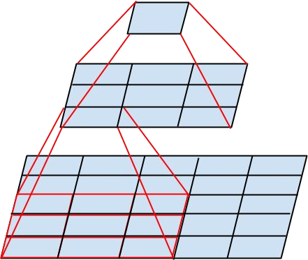

---
# VGG – 2014 (6.8% ILSVRC top-5 error)

Training detail similar to AlexNet:
- SGD with batch size ~~128~~ 256, momentum 0.9, weight decay 0.0005

- initial learning rate 0.01, manually divided by 10 when validation error rate
  stopped improving

- ReLU nonlinearities

- dropout with rate 0.5 on the fully-connected layers (except for the output layer)

- data augmentation using translations and horizontal reflections (choosing random
  224×224 patches from 256×256 images)
~~~
  - additionally, multi-scale training and evaluation is performed—during
    training, each image is resized so that its smaller size is $S$, sampled
    uniformly from $[256, 512]$
~~~
  - during test time, the image is rescaled three times so that the smaller
    size is $256, 384, 512$, respectively, and the results on the three images
    were averaged
~~~
  - inference is performed on images of possibly larger sizes – therefore,
    obtaining possibly larger than 7×7 resolution before the FC layer; the
    remaining layers are then evaluated on all 7×7 patches and the results are
    averaged

---
# VGG – 2014 (6.8% ILSVRC top-5 error)

~~~

---
# VGG – 2014 (6.8% ILSVRC top-5 error)

---
section: Inception
class: section
# Inception

---
# Inception (GoogLeNet) – 2014 (6.7% ILSVRC top-5 error)

Inception block:

---
# Inception (GoogLeNet) – 2014 (6.7% ILSVRC top-5 error)

Inception block with dimensionality reduction:

---
# Inception (GoogLeNet) – 2014 (6.7% ILSVRC top-5 error)

---
# Inception (GoogLeNet) – 2014 (6.7% ILSVRC top-5 error)

---
# Inception (GoogLeNet) – 2014 (6.7% ILSVRC top-5 error)

Training details:
- SGD with momentum 0.9

~~~
- fixed learning rate schedule of decreasing the learning rate by 4% each
  8 epochs
~~~
- during test time, the image was rescaled four times so that the smaller
  size was $256, 288, 320, 352$, respectively;

~~~
  for each image, the left, center and right square was considered, and from
  each square six crops of size $224 × 224$ were extracted (4 corners, middle
  crop and the whole scaled-down square) together with their horizontal flips,
  arriving at $4 ⋅ 3 ⋅ 6 ⋅ 2 = 144$ crops per image

~~~
- 7 independently trained models were ensembled

---
# Inception (GoogLeNet) – 2014 (6.7% ILSVRC top-5 error)

---
section: BatchNorm
class: section
# Batch Normalization

---
# Batch Normalization

**Internal covariate shift** refers to the change in the distributions
of hidden node activations due to the updates of network parameters
during training.

~~~
Let $→x = (x_1, \ldots, x_d)$ be a $d$-dimensional input. We would like to
normalize each dimension as
$$x̂_i = \frac{x_i - 𝔼[x_i]}{\sqrt{\Var[x_i]}}.$$

~~~
Furthermore, it may be advantageous to learn a suitable scale $γ_i$ and a shift $β_i$ to
produce a normalized value
$$y_i = γ_i x̂_i + β_i.$$

---
# Batch Normalization

**Batch normalization** of a mini-batch of $m$ examples $(→x^{(1)}, \ldots, →x^{(m)})$ is the following:

**Inputs**: Mini-batch $(→x^{(1)}, \ldots, →x^{(m)})$, $ε ∈ ℝ$ with default value 0.001 
**Parameters**: $→β$ initialized to $→0$, $→γ$ initialized to $→1$; both trained by the optimizer 
**Outputs**: Normalized batch $(→y^{(1)}, \ldots, →y^{(m)})$

~~~
- $→μ ← \frac{1}{m} ∑_{i = 1}^m →x^{(i)}$

~~~
- $→σ^2 ← \frac{1}{m} ∑_{i = 1}^m (→x^{(i)} - →μ)^2$
~~~
- $→x̂^{(i)} ← (→x^{(i)} - →μ) / \sqrt{→σ^2 + ε}$
~~~
- $→y^{(i)} ← →γ ⊙ →x̂^{(i)} + →β$

~~~
Batch normalization is added just before a nonlinearity $f$, and it is redundant
to add bias prior to normalization (because it would cancel out). Therefore, we replace
$f(⇉W→x + →b)$ by
$$f(\operatorname{BatchNorm}(⇉W→x)).$$

---
# Batch Normalization During Inference

During inference, $→μ$ and $→σ^2$ are fixed (so that the prediction does not depend
on other examples in a batch).

~~~
They could be precomputed after training on the whole training data, but in
practice we estimate $→μ̂$ and $→σ̂^2$ during training using an
exponential moving average.

**Additional Inputs**: momentum $τ ∈ ℝ$ with default value of 0.99 
**Additional Parameters**: $→μ̂$ initialized to $→0$, $→σ̂^2$ initialized to $→1$; both updated manually
~~~

During training, also perform:
- $→μ̂ ← τ→μ̂ + (1 - τ)→μ$
- $→σ̂^2 ← τ→σ̂^2 + (1 - τ)→σ^2$
~~~

Batch normalization is then computed during inference as:
- $→x̂^{(i)} ← (→x^{(i)} - →μ̂) / \sqrt{→σ̂^2 + ε}$
- $→y^{(i)} ← →γ ⊙ →x̂^{(i)} + →β$

---
# Batch Normalization

When a batch normalization is used on a fully connected layer, each neuron
is normalized individually across the minibatch.

~~~
However, for convolutional networks we would like the normalization to
honour convolution properties, most notably the shift invariance. We therefore
normalize each channel across not only the minibatch, but also across
all corresponding spatial/temporal locations.

---
# Inception with BatchNorm (4.8% ILSVRC top-5 error)

~~~
The BN-x5 and BN-x30 use 5 and 30 times larger initial learning rate, faster
learning rate decay, no dropout, weight decay smaller by a factor of 5,
and several more minor changes.

---
# Inception with BatchNorm (4.8% ILSVRC top-5 error)

---
# ILSVRC Image Recognition Top-5 Error Rates

~~~ ~
# ILSVRC Image Recognition Top-5 Error Rates

---
# Inception v2 and v3 – 2015 (3.6% ILSVRC top-5 error)

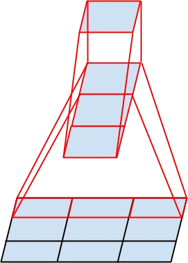

---
class: middle
# Inception v2 and v3 – 2015 (3.6% ILSVRC top-5 error)

---
# Inception v2 and v3 – 2015 (3.6% ILSVRC top-5 error)

Training details:
- RMSProp with momentum of $β=0.9$ and $ε=1.0$

  - no weight decay
~~~
- batch size of 32 for 100 epochs

~~~
- initial learning rate of 0.045, decayed by 6% every two epochs

~~~
- gradient clipping with threshold 2.0 was used to stabilize the training

~~~
- label smoothing was first used in this paper, with $α=0.1$

~~~

- input image size enlarged to $299 × 299$

---
# Inception v2 and v3 – 2015 (3.6% ILSVRC top-5 error)

~~~

~~~

---
section: Summary
class: summary
# Summary

- Convolutions can provide

  - local interactions in spatial/temporal dimensions,
  - shift invariance,
  - _much_ fewer parameters than a fully connected layer.

- Repeated $3×3$ convolutions are usually enough, no need for larger filter
  sizes.

- When pooling is performed, double the number of channels (i.e., the first
  convolution following the pooling layer will have twice as many output
  channels).

- If your network is deep enough (the last hidden neurons have a large receptive
  field), final fully connected layers are not needed, and global average pooling
  is enough.

- Batch normalization is a great regularization method for CNNs, allowing
  removal/decrease of dropout and $L^2$ regularization.

- Small weight decay (i.e., $L^2$ regularization) of usually 1e-4 is still useful
  for regularizing convolutional kernels.
