title: NPFL138, Lecture 10
class: title, langtech, cc-by-sa

# Transformer, BERT

## Milan Straka

### April 21, 2026

---
# Attention is All You Need

For some sequence processing tasks, _sequential_ processing (as performed by
recurrent neural networks) of its elements might be too restrictive.

Instead, we may want to be able to combine sequence elements independently on
their distance.

Such processing is allowed in the **Transformer** architecture, originally
proposed for neural machine translation in 2017 in _Attention is All You Need_
paper.

---
# Transformer

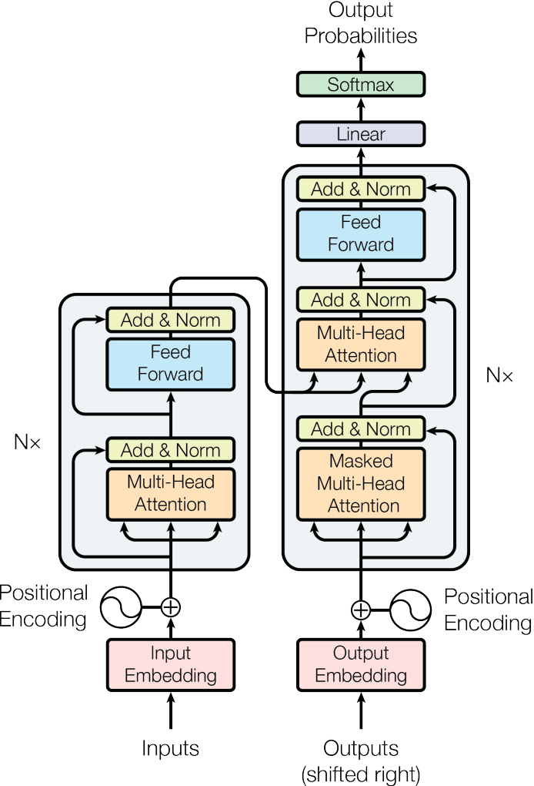

---
# Transformer

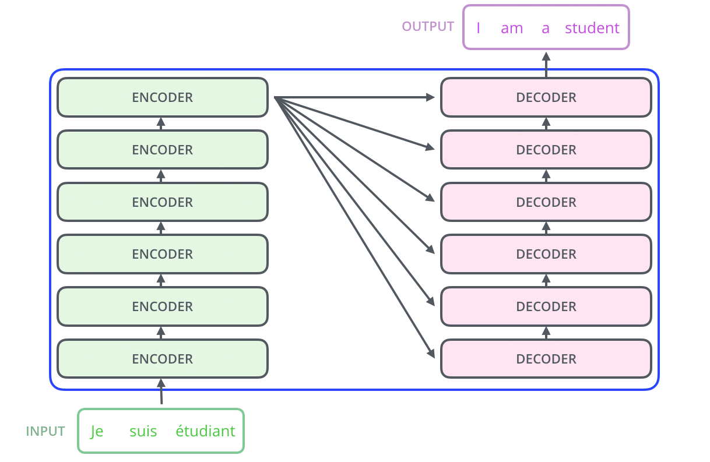

---
# Transformer

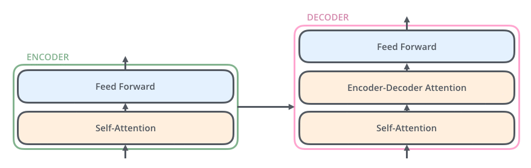

---
# Transformer

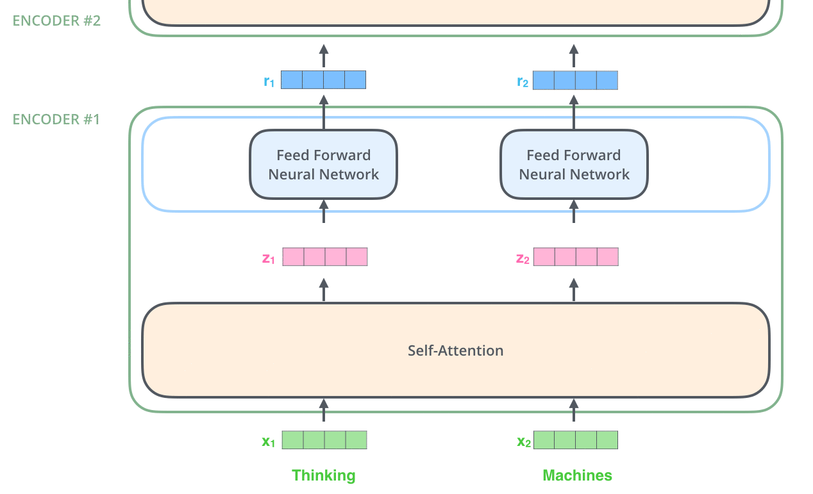

---
section: SelfAttention
class: section
# Transformer – Self-Attention

---
# Transformer – Self-Attention

Assume that we have a sequence of $n$ words represented using a matrix $⇉X ∈ ℝ^{n×d}$.

~~~
The attention module for queries $⇉Q ∈ ℝ^{n×d_k}$, keys $⇉K ∈ ℝ^{n×d_k}$ and values $⇉V ∈ ℝ^{n×d_v}$ is defined as:
~~~
$$\textrm{Attention}(⇉Q, ⇉K, ⇉V) = \softmax\left(\frac{⇉Q ⇉K^\top}{\sqrt{d_k}}\right)⇉V.$$

~~~
The queries, keys and values are computed from the input word representations $⇉X$
using a linear transformation as
$$\begin{aligned}
  ⇉Q &= ⇉X ⇉W^Q \\
  ⇉K &= ⇉X ⇉W^K \\
  ⇉V &= ⇉X ⇉W^V \\
\end{aligned}$$
for trainable weight matrices $⇉W^Q, ⇉W^K ∈ ℝ^{d×d_k}$ and $⇉W^V ∈ ℝ^{d×d_v}$.

---
# Transformer – Self-Attention

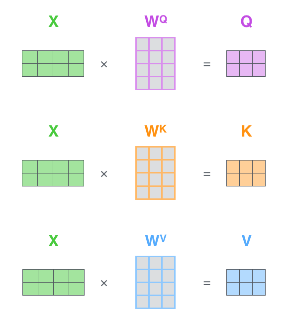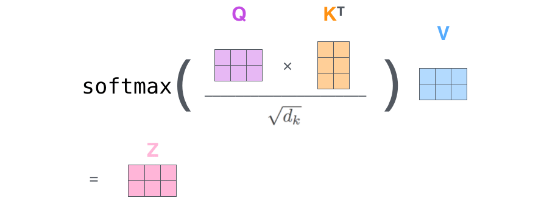

---
section: MultiheadSelfAttention
# Transformer – Multihead Attention

Multihead attention is used in practice. Instead of using one huge attention, we
split queries, keys and values to several groups (similar to how ResNeXt works),
compute the attention in each of the groups separately, concatenate the
results and multiply them by a matrix $⇉W^O$.

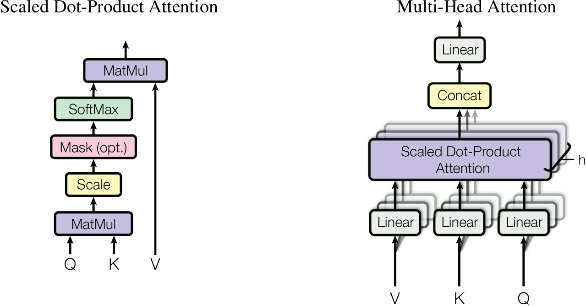

---
# Transformer – Multihead Attention

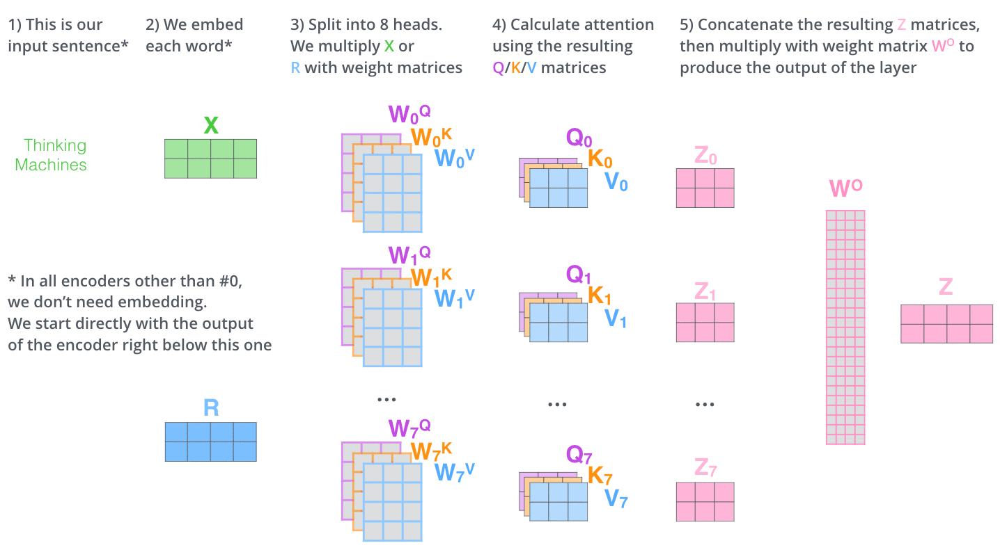
---
# Transformer – Multihead Attention

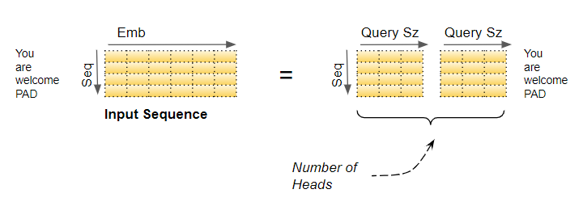

When multihead attention is used, we first generate query/key/value vectors of
the same dimension, and then split them into smaller pieces. Therefore,
multihead attention does not increase complexity (much) and is analogous to
ResNeXt/GroupNorm.

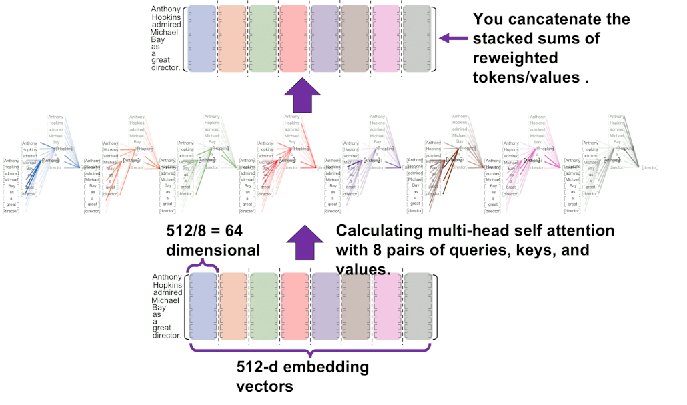

---
# Why Attention

---
section: FFN
class: section
# Transformer – Feed Forward Networks

---
# Transformer – Feed Forward Networks

## Feed Forward Networks

The self-attention is complemented with FFN layers, which is a fully connected
ReLU layer with four times as many hidden units as inputs, followed by another
fully connected layer without activation.

---
# Transformer – Post-LN Configuration including Residuals

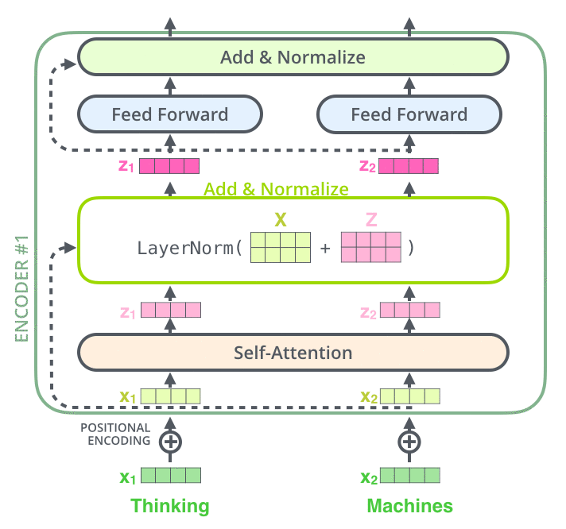

---
# Transformer – Pre-LN Configuration

---
# Transformer – Decoder

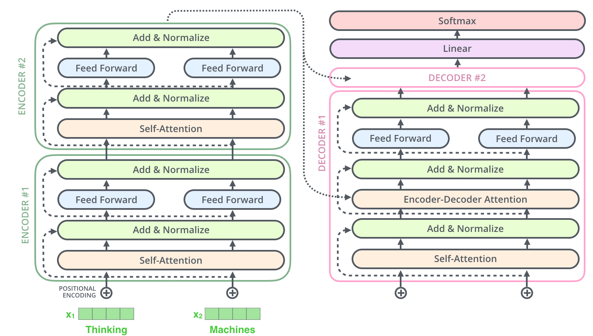

---
# Transformer – Decoder

## Masked Self-Attention

During decoding, the self-attention must attend only to earlier positions in the
output sequence.

~~~
This is achieved by **masking** future positions, i.e., zeroing their weights out,
which is usually implemented by setting them to $-∞$ before the $\softmax$ calculation.

~~~

## Encoder-Decoder Attention

In the encoder-decoder attentions, the _queries_ comes from the decoder, while the
_keys_ and the _values_ originate from the encoder.

---
section: PositionalEmbedddings
class: section
# Transformer – Positional Embeddings

---
# Transformer – Positional Embeddings

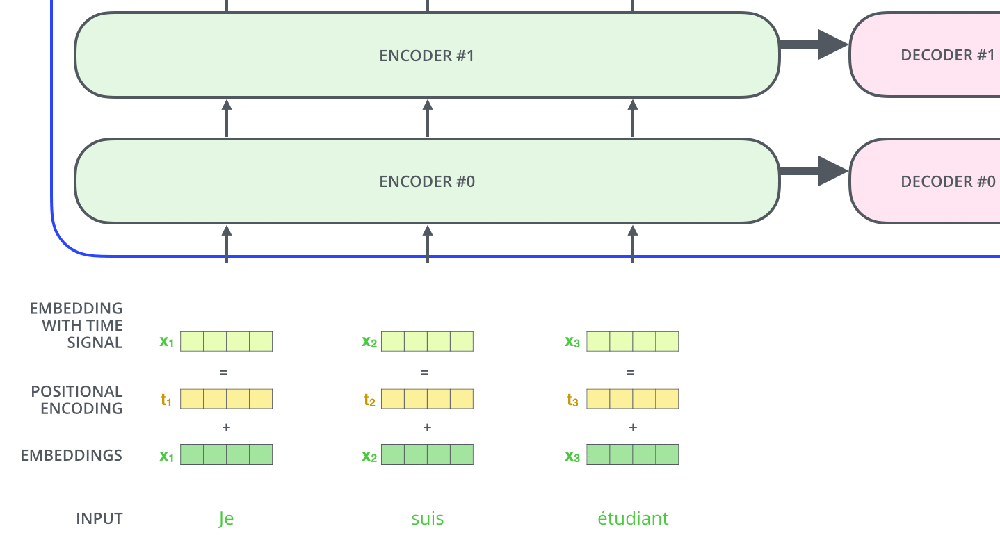

---
# Transformer – Positional Embeddings

## Positional Embeddings

We need to encode positional information (which was implicit in RNNs).

~~~
- Learned embeddings for every position.

~~~
- Sinusoids of different frequencies:
  $$\small\begin{aligned}
    \textrm{PE}_{(\textit{pos}, 2i)} & = \sin\left(\textit{pos} / 10000^{2i/d}\right) \\
    \textrm{PE}_{(\textit{pos}, 2i + 1)} & = \cos\left(\textit{pos} / 10000^{2i/d}\right)
  \end{aligned}$$

~~~
  This choice of functions should allow the model to attend to relative
  positions, since for any fixed $k$, $\textrm{PE}_{\textit{pos} + k}$ is
  a linear function of $\textrm{PE}_\textit{pos}$, because
  $$\small\begin{aligned}
    \textrm{PE}_{(\textit{pos}+k, 2i)}
      &= \sin\left((\textit{pos}+k) / 10000^{2i/d}\right) \\
      &= \sin\left(\textit{pos} / 10000^{2i/d}\right) ⋅ \cos\left(k / 10000^{2i/d}\right) + \cos\left(\textit{pos} / 10000^{2i/d}\right) ⋅ \sin\left(k / 10000^{2i/d}\right) \\
      &= \textit{offset}_{(k,2i)} ⋅ \textrm{PE}_{(\textit{pos}, 2i)} + \textit{offset}_{(k, 2i+1)} ⋅ \textrm{PE}_{(\textit{pos}, 2i + 1)}.
  \end{aligned}$$

---
# Transformer – Positional Embeddings

## Positional Embeddings

### Sinusoids of different frequencies

In the original description of positional embeddings (the one used on the
previous slide), the sines and cosines are interleaved, so for $d=6$, the
positional embeddings would look like:

$$\small\textrm{PE}_\textit{pos} = \Big(\textstyle
  \sin\big(\frac{\textit{pos}}{10000^0}\big), \cos\big(\frac{\textit{pos}}{10000^0}\big),
  \sin\big(\frac{\textit{pos}}{10000^{1/3}}\big), \cos\big(\frac{\textit{pos}}{10000^{1/3}}\big),
  \sin\big(\frac{\textit{pos}}{10000^{2/3}}\big), \cos\big(\frac{\textit{pos}}{10000^{2/3}}\big)
\Big).$$

~~~
However, in practice, most implementations concatenate first all the sines and
only then all the cosines:

$$\small\widehat{\textrm{PE}}_\textit{pos} = \Big(\textstyle
  \sin\big(\frac{\textit{pos}}{10000^0}\big), \sin\big(\frac{\textit{pos}}{10000^{1/3}}\big), \sin\big(\frac{\textit{pos}}{10000^{2/3}}\big),
  \cos\big(\frac{\textit{pos}}{10000^0}\big), \cos\big(\frac{\textit{pos}}{10000^{1/3}}\big), \cos\big(\frac{\textit{pos}}{10000^{2/3}}\big)
\Big).$$

This is also how we visualize the positional embeddings on the following slides.

---
# Transformer – Positional Embeddings

---
# Transformer – Positional Embeddings

---
# Transformer – Positional Embeddings

---
section: Training
class: section
# Transformer – Training

---
# Transformer – Training

## Regularization

The network is regularized by:
- dropout of input embeddings,
~~~
- dropout of each sub-layer, just before it is added to the residual
  connection (and then normalized),
~~~
- label smoothing.

~~~
Default dropout rate and also label smoothing weight is 0.1.

~~~
## Parallel Execution
Because of the _masked attention_, training can be performed in parallel.

~~~
However, inference is still sequential.

---
# Transformer – Training

## Optimizer

Adam optimizer (with $β_2=0.98$, smaller than the default value of $0.999$)
is used during training, with the learning rate decreasing proportionally to
inverse square root of the step number.

~~~
## Warmup
Furthermore, during the first
$\textit{warmup\_steps}$ updates, the learning rate is increased linearly from
zero to its target value.

$$\textit{learning\_rate} = \frac{1}{\sqrt{d_\textrm{model}}} \min\left(\frac{1}{\sqrt{\textit{step\_num}}}, \frac{\textit{step\_num}}{\textit{warmup\_steps}} ⋅ \frac{1}{\sqrt{\textit{warmup\_steps}}}\right).$$

~~~
In the original paper, 4000 warmup steps were proposed.

~~~
Note that the goal of warmup is mostly to prevent divergence early in training;
the Pre-LN configuration usually trains well even without warmup.

---
# Transformers Results

Subwords were constructed using BPE with a shared vocabulary of about 37k tokens.

---
# Transformers Ablations on En→De newtest2014 Dev

The PPL is _perplexity per wordpiece_, where perplexity is $e^{H(P)}$,
i.e., $e^\textit{loss}$ in our case.

---
section: ELMo
class: section
# Embeddings from Language Models (ELMo)

---
# ELMo

At the end of 2017, a new type of _deep contextualized_ word representations was
proposed by Peters et al., called ELMo, **E**mbeddings from **L**anguage
**Mo**dels.

~~~
The ELMo embeddings were based on a two-layer pre-trained LSTM language model,
where a language model predicts following word based on a sentence prefix.
~~~
Specifically, two such models were used, one for the forward direction and the
other one for the backward direction.
~~~

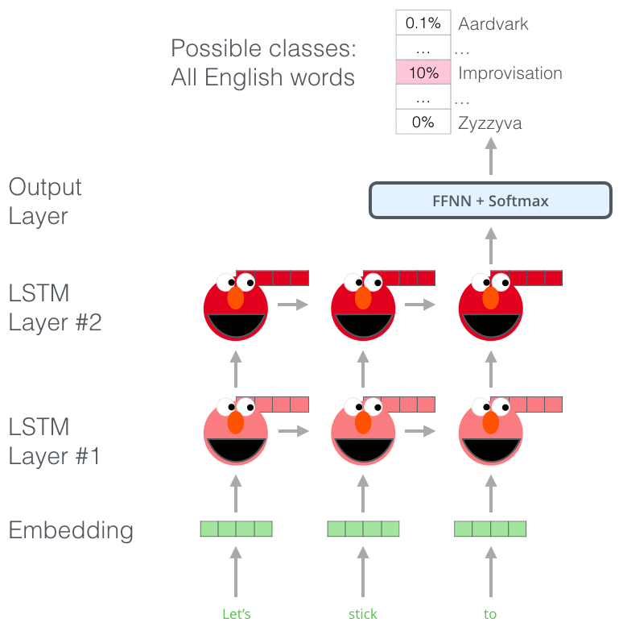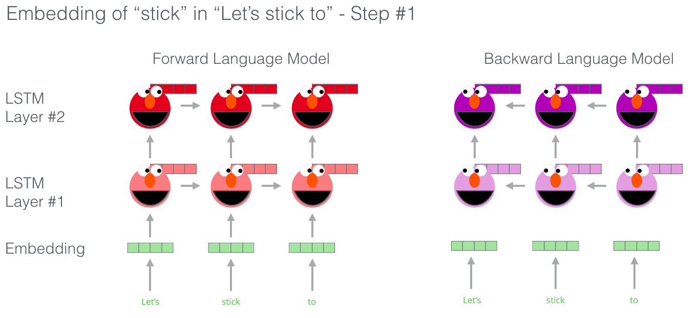

---
# ELMo

To compute an embedding of a word in a sentence, the concatenation of the two
language model's hidden states is used.

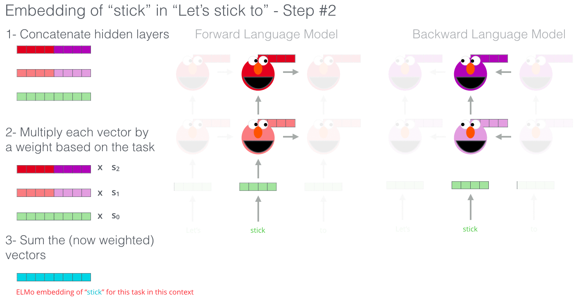

~~~
To be exact, the authors propose to take a (trainable) weighted combination of
the input embeddings and outputs on the first and second LSTM layers.

---
# ELMo Results

Pre-trained ELMo embeddings substantially improved several NLP tasks.

---
section: BERT
class: section
# BERT

---
# BERT

A year later after ELMo, at the end of 2018, a new model called
BERT (standing for **B**idirectional **E**ncoder **R**epresentations from **T**ransformers)
was proposed. It is nowadays one of the most dominating approaches for pre-training word
embeddings and for paragraph and document representations.

~~~

---
# BERT

The BERT model computes contextualized representations using a bidirectional
Transformer architecture.

---
# BERT

The baseline BERT base model consists of 12 Transformer layers:
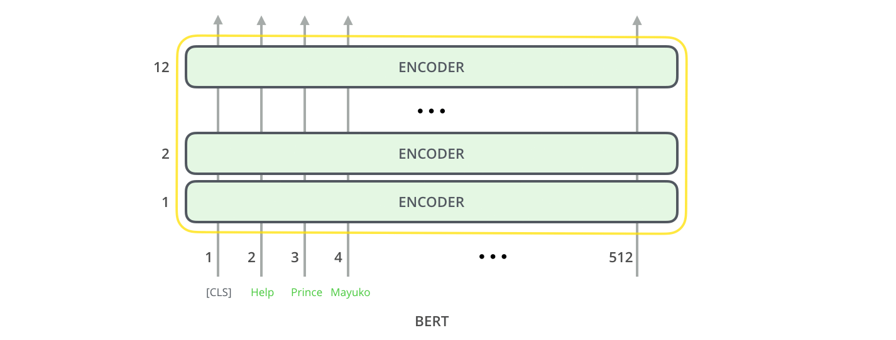

~~~
The bidirectionality is important, but it makes training difficult.

---
# BERT Input

The input of the BERT model is a sequence of subwords, namely their identifiers.
This input represents two so-called _sentences_, but they are in fact
pieces of text with hundreds of subwords (512 maximum in total). The first token
is a special `CLS` token and every sentence is ended by a `SEP` token.

~~~
Every subword representation is a sum of:
- trainable subword embeddings,
~~~
- trainable positional embeddings (not the sinusoidal embeddings, but I do not
  know why),
~~~
- trainable segment embeddings, which indicate if a token belongs to a sentence
  `A` (inclusively up to its `SEP` token) or to sentence `B`.

---
# BERT Pretraining

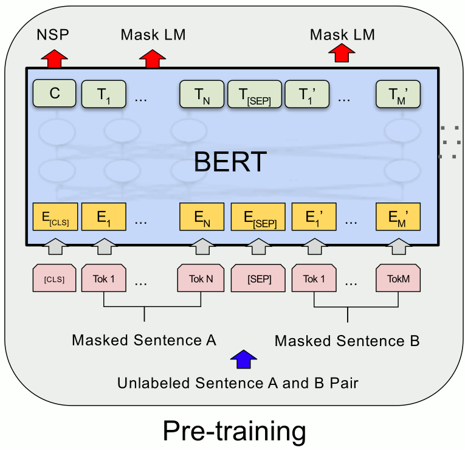

The BERT model is pretrained using two objectives:
- **masked language model** – 15% of the input words are **masked**, and the model
  tries to predict them (using a head consisting of a fully connected layer with softmax
  activation);

~~~
  - 80% of them are replaced by a special `MASK` token;
~~~
  - 10% of them are replaced by a random word;
~~~
  - 10% of them are left intact.

~~~
- **next sentence prediction** – the model tries to predict whether the second
  _sentence_ followed the first one in the raw corpus (using a head that
  on top of the `CLS` output adds a fully connected layer with tanh activation
  (_pooler_),
  followed by a softmax-activated fully connected layer with two outputs).

~~~
  - 50% of the time the second sentence is the actual next sentence;
~~~
  - 50% of the time the second sentence is a random sentence from the corpus.

---
# BERT Pretraining

For pre-training, English BookCorpus (800M words) and Wikipedia (2,500M words)
are used, with a 30k WordPieces vocabulary.

~~~
Batch size is 256 sequences, each 512 subwords, giving 128k tokens per batch.
Adam with learning rate 1e-4 is used, with linear learning rate warmup for the
first 10k steps, followed by a linear learning rate decay to 0. Standard
momentum parameters are used, and $L^2$ weight decay of 0.01 is utilized.

~~~
Dropout of 0.1 on all layers is used, and GELU activation is used instead of
ReLU.

~~~
Furthermore, because longer sequences are quadratically more expensive, first
90% of the pre-training is performed on sequences of length 128, and only the
last 10% use sequences of length 512.

~~~
Two variants are considered:
- BERT _base_ with 12 layers, 12 attention heads and hidden size 768 (110M parameters),
~~~
- BERT _large_ with 24 layers, 16 attention heads and hidden size 1024 (340M parameters).

---
# BERT – GELU

ReLU multiplies the input by zero or one, depending on its value.

~~~
Dropout stochastically multiplies the input by zero or one.

~~~

Both these functionalities are merged in Gaussian error linear units (GELUs),
where the input value is multiplied by $m ∼ \operatorname{Bernoulli}(Φ(x))$,
where $Φ(x) = P(x' ≤ x)$ for $x' ∼ 𝓝(0, 1)$ is the cumulative density function
of the standard normal distribution.

~~~
The GELUs compute the expectation of this value, i.e.,
$$\operatorname{GELU}(x) = x ⋅ Φ(x) + 0 ⋅ \big(1 - Φ(x)\big) = x Φ(x).$$

~~~
GELUs can be approximated using (no need to remember this):
$$0.5x \left(1 + \tanh\left[\sqrt{2/π}(x + 0.044715 x^3)\right]\right)\textrm{~~or~~}x σ(1.702x).$$

---
# BERT – Finetuning

The pre-trained BERT model can be finetuned on a range of tasks:

- **sentence element representation**

  - PoS tagging
  - named entity recognition
  - …

~~~
- **sentence representation**

  - text classification

~~~
- **sentence relation representation**

  - textual entailment, aka natural language inference (the second sentence is
    _implied by/contradicts/has no relation to_ the first sentence)
  - textual similarity
  - paraphrase detection

---
# BERT – Results

For finetuning, dropout 0.1 is used, usually very small number of epochs (2-4) suffice,
and a good learning rate is usually one of 5e-5, 3e-5, 2e-5.

~~~

---
class: middle
# BERT – Results

---
class: middle
# BERT – Ablations

