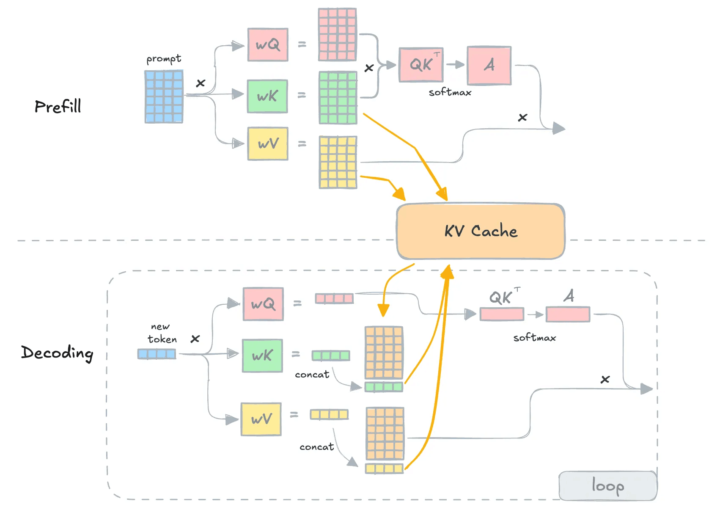
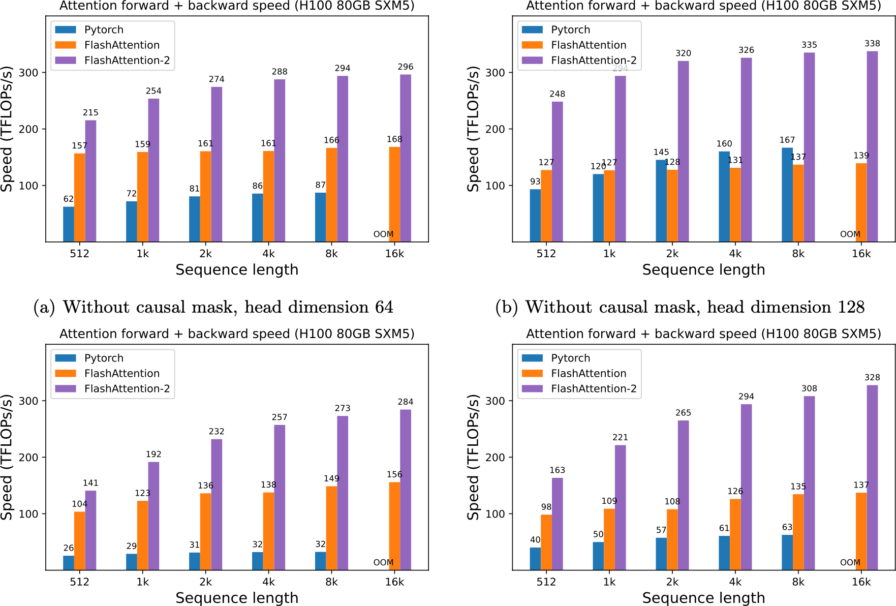
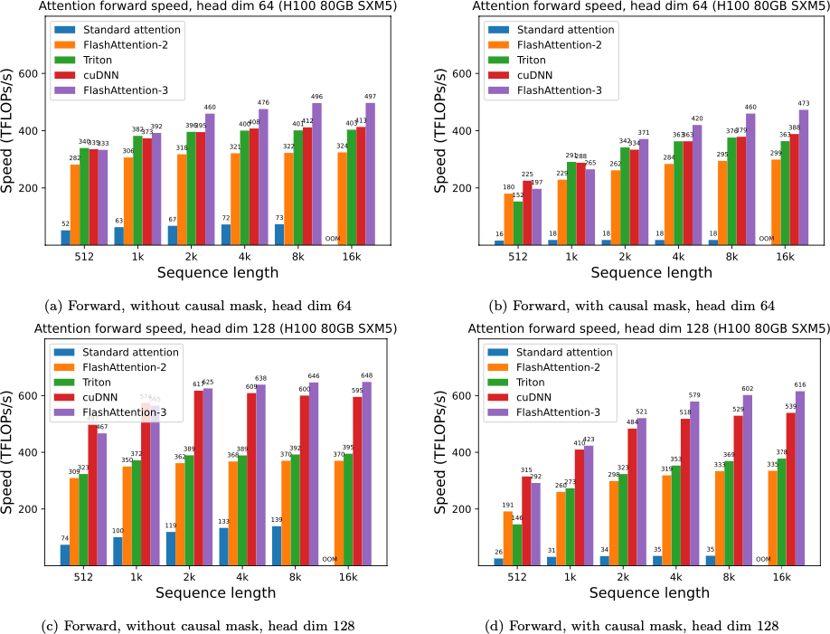
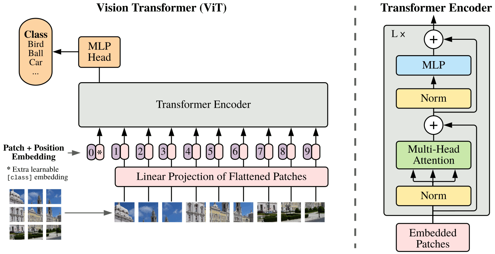

title: NPFL138, Lecture 11
class: title, langtech, cc-by-sa

# RoBERTa, LLMs, VIT, Deep Reinforcement Learning

## Milan Straka

### April 28, 2026

---
section: RoBERTa
class: section
# RoBERTa (Robustly Optimized BERT)

---
# RoBERTa – NSP

The _next sentence prediction_ was originally hypothesized to be an important
factor during training of the BERT model, as indicated by ablation experiments.
However, later experiments indicated removing it might improve results.

~~~
The RoBERTa authors therefore performed the following experiments:

- SEGMENT-PAIR: pair of segments with at most 512 tokens in total;
~~~
- SENTENCE-PAIR: pair of _natural sentences_, usually significantly
  shorter than 512 tokens;
~~~
- FULL-SENTENCES: just one segment on input with 512 tokens, can cross document
  boundary;
~~~
- DOC-SENTENCES: just one segment on input with 512 tokens, cannot cross
  document boundary.

---
# RoBERTa – Larger Batches

BERT is trained for 1M steps with a learning rate of 1e-4.

~~~
The RoBERTa authors also considered larger batches (with linearly larger
learning rate).

---
# RoBERTa

The RoBERTa model, **R**obustly **o**ptimized **BERT** **a**pproach, is trained
with dynamic masking, FULL-SENTENCES without NSP, large 8k minibatches
and byte-level BPE with 50k subwords.

---
# RoBERTa Results

---
section: mBERT
class: section
# Multilingual BERT

---
# Multilingual BERT

The Multilingual BERT is pre-trained on 102-104 largest Wikipedias, including the
Czech one.

~~~
There are two versions, the _cased_ one has WordPieces including case,
and the _uncased_ one with subwords all in lower case and _without diacritics_.

~~~
Even if only very small percentage of input sentences were Czech, it works
surprisingly well for Czech NLP.

~~~
Furthermore, without any explicit supervision, mBERT is able to represent the
input languages in a _shared_ space, allowing cross-lingual transfer.

---
# Cross-lingual Transfer with Multilingual BERT

Consider a _reading comprehension_ task, where for a given paragraph and
a question an answer needs to be located in the paragraph.

Then training the model in English and then directly running it on a different
language works comparably to translating the data to English and then back.

---
class: tablewide
style: table { line-height: 1 }
# Best Multilingual Encoders

Currently available multilingual (100+ languages) encoder models, evaluated on
XNLI dataset (Multi-Genre NLI on 15 languages; models trained on English,
evaluated on other languages)

| Model | Parameters | XNLI (Avg) |
|:------|-----------:|-----------:|
| mbert-base        |  178M | 65.4 |
| xlm-roberta-base  |  270M | 76.2 |
| xlm-roberta-large |  550M | 80.9 |
| xlm-roberta-xl    | 3500M | 82.3 |
| xlm-roberta-xxl   | 10700M| 83.1 |
| rembert           |  562M | 73.6 |
| mt5-base          |  264M | 75.4 |
| mt5-large         |  538M | 81.1 |
| mt5-xl            | 1953M | 82.9 |
| mt5-xxl           | 5393M | 84.5 |

---
section: LLMs
class: section
# (Transformer-based) Large Language Models

---
style: li p { margin-bottom: 0.3em }
# Transformer-based Large Language Models

The Transformer-based language models have demonstrated remarkable performance,
especially when data is available in abundance.

~~~
## Historical Large Language Models

- GPT: Transformer decoder-only model, 2018, ~150M parameters

~~~
- GPT-2: Transformer decoder-only model, 2019, ~1.5B parameters
~~~
- GPT-3: Transformer decoder-only model, May 2020, ~175B parameters
~~~
- GPT-4: Transformer decoder-only model, March 2023, ???; $100M
~~~
- Gopher: Transformer decoder-only model, Dec 2021, ~280B parameters
~~~
- XGLM: multilingual Transformer decoder-only model, Dec 2021, ~7.5B parameters
  - 30 languages from 16 language families
~~~
- Megatron-Turing NLP: Transformer decoder-only model, Jan 2022, ~530B parameters
  - trained using 2240 A100
~~~
- PaLM: Transformer decoder-only model, Apr 2022, ~580B parameters
  - trained using 6144 TPUv4; 22% training data non-English

---
# Improvements in Modern Large Language Models

# KV Cache

---
# Improvements in Modern Large Language Models

# Multi-Query Attention, Grouped-Query Attention

---
# Improvements in Modern Large Language Models

# FlashAttention

---
# Improvements in Modern Large Language Models

# FlashAttention 1 and 2 Benchmarks

---
# Improvements in Modern Large Language Models

# FlashAttention 2 and 3 Benchmarks

---
# Improvements in Modern Large Language Models

# Mixture of Experts

---
# Improvements in Modern Large Language Models

# Mixture of Experts

---
# Improvements in Modern Large Language Models

# Rotary Positional Embeddings

Instead of _absolute_ positional embeddings, **relative** positional embeddings
have been repeatedly proposed in literature. Such relative positional embeddings
are applied to the query-key similarity $→q_m^\T→k_n$ and depend only on the
difference $m-n$, not on $m$ or $n$.

~~~
One such variant are **rotary positional embeddings** (RoPE), which have become
de-facto standard positional embeddings in large language models.

~~~
They do not require trainable parameters, they scale remarkably well to context
windows of 128k+ tokens, and models trained using RoPE can be finetuned on much
larger sequences in just a fraction of original compute.

---
# Improvements in Modern Large Language Models

# Rotary Positional Embeddings

First assume queries and keys are just 2D vector, which we interpret as
complex numbers. The idea of RoPE is to multiply a query $q_m$ by $e^{imθ}$
and a key $k_n$ by $e^{inθ}$. Then the cosine of the angle of these two vectors
is
$$\operatorname{Re}[q_m k_n^* e^{i(m-n)θ}].$$

~~~

In reality, we do not compute with complex numbers, but use a 2D rotation
matrix:
$$\begin{gathered}
  \begin{pmatrix} \cos{mθ}& -\sin{mθ} \\ \sin{mθ}&\cos{mθ} \\ \end{pmatrix} →q_m,\\
  \begin{pmatrix} \cos{nθ}& -\sin{nθ} \\ \sin{nθ}&\cos{nθ} \\ \end{pmatrix} →k_n.
\end{gathered}$$

---
# Improvements in Modern Large Language Models

# Rotary Positional Embeddings

To extend the idea to $d$-dimensional embeddings, we consider them
$d/2$-dimensional complex vector and apply the 2D transformation to
each dimension with $θ_i = 1/10\,000^{2i/d}$ separately.

~~~
$$
  \begin{pmatrix}
    \cos{mθ_1}& -\sin{mθ_1}&0&0&\cdots&0&0 \\
    \sin{mθ_1}&\cos{mθ_1}&0&0&\cdots&0&0 \\
    0&0&\cos{mθ_2}& -\sin{mθ_2}&\cdots&0&0 \\
    0&0&\sin{mθ_2}&\cos{mθ_2}&\cdots&0&0 \\
    \vdots&\vdots&\vdots&\vdots&\ddots&\vdots&\vdots \\
    0&0&0&0&\cdots&\cos{mθ_{d/2}}& -\sin{mθ_{d/2}} \\
    0&0&0&0&\cdots&\sin{mθ_{d/2}}&\cos{mθ_{d/2}} \\
  \end{pmatrix} →q_m
$$

---
# Improvements in Modern Large Language Models

# Rotary Positional Embeddings

To extend the idea to $d$-dimensional embeddings, we consider them
$d/2$-dimensional complex vector and apply the 2D transformation to
each dimension with $θ_i = 1/10\,000^{2i/d}$ separately.

In reality we do not compute the matrix multiplication as written; instead, we
use:

$$
  \begin{pmatrix} q_{m,1}\\ q_{m,2}\\ q_{m,3}\\ q_{m,4}\\ \vdots\\ q_{m,d-1}\\ q_{m,d} \end{pmatrix}
    ⊙
  \begin{pmatrix} \cos{mθ_1}\\ \cos{mθ_1}\\ \cos{mθ_2}\\ \cos{mθ_2}\\ \vdots\\ \cos{mθ_{d/2}}\\ \cos{mθ_{d/2}} \end{pmatrix}
  +
  \begin{pmatrix} -q_{m,2}\\ q_{m,1}\\ -q_{m,4}\\ q_{m,3}\\ \vdots\\ -q_{m,d}\\ q_{m,d-1} \end{pmatrix}
  ⊙
  \begin{pmatrix} \sin{mθ_1}\\ \sin{mθ_1}\\ \sin{mθ_2}\\ \sin{mθ_2}\\ \vdots\\ \sin{mθ_{d/2}}\\ \sin{mθ_{d/2}} \end{pmatrix}.
$$

---
# Modern Large Language Models

There are nowadays many large language models of various sizes, some of them
open-source:
- Llama 1, 2, 3, 4: by Meta, publicly available

~~~
- Mistral, Mixtral: by Mistral AI (founded in France), some models available
~~~
- Claude 1, 2, 3, 3.5, …, 4.7: by Anthropic
~~~
- Gemma and Gemini: by Alphabet; previously PaLM and LaMDA
~~~
- BLOOM, OPT, Falcon, Olmo,  …

See the Large Language Models course https://ufal.mff.cuni.cz/courses/npfl140 if
you want to know more.

---
# Pre-trained Encoder-Decoder Models

Various pre-trained encoder-decoder models are available:

- BART, 2019, ~200M parameters
~~~
- T5, Oct 2019, up to ~11B parameters
~~~
  - REALM, Feb 2020, ~330M, uses explicit retrieval from a large knowledge base
  
~~~
- mT5, Oct 2020, ~100 languages, up to ~13B parameters
  - sizes small (300M), base (582M), large (1.23B), xl (3.74B), xxl (12.9B)
~~~
- ByT5, May 2021, byte-based, ~100 languages, same sizes as mT5

---
style: li p { margin-bottom: 0.3em }
# Instruction Following aka Chatbots

The large language models can be finetuned for conversational interactions,
which is called **instruction finetuning**.

The original approach was to use the so-called Reinforcement Learning from Human Feedback (RLHF); lately, other
approaches like DPO have appeared.

~~~
- ChatGPT: OpenAI; together with DeepMind the creator of RLHF

~~~
- Gemini: Alphabet
~~~
- Llama, Muse Spark: Meta AI
~~~
- Claude 4.7 Sonnet: Anthropic
~~~
- DeepSeek, Kimi, Grok, Qwen, …
~~~
- GLM 5.1: currently the best open-source model (as of April 27, 2026,
  according to https://arena.ai/leaderboard)

---
section: ViT
class: section
# Visual Transformer

---
# Image Recognition with Transformers

In Oct 2020, an influential paper
> _An Image is Worth 16x16 Words: Transformers for Image Recognition at Scale_

proposed processing of images using ViT a variant of the Transformers
architecture (**Vi**sual **T**ransformer, a Pre-LN Transformer with GELU activations):

~~~
- trainable 1D positional embeddings are added to linear projection of
  fixed-size patches;

~~~
- the MLP is exactly FFN (expansion factor 4, GELU);

~~~
- when finetuning on larger images, positional embeddings are first linearly
  interpolated from the original to the new resolution.

---
# Image Recognition with Transformers

~~~
The ViT architecture surpasses convolutional models like EfficientNet when
pre-trained on very large data (~300M images); however, training only on
ImageNet1k delivered worse results (77.9% top-1  accuracy).

---
# Image Recognition with Transformers

Trainable 1D positional embeddings are used.

~~~
The authors consider also 2D positional embeddings, which are
a concatenation of trainable 1D positional embeddings for each
dimension, but the results are very comparable.

~~~
## DeiT
An improved training with a variety of augmentation (DeiT architecture, Dec
2020) resulted in performance close to EfficientNet when trained only
on ImageNet1k data (83.1% vs 84.7% top-1 accuracy).

~~~
_DeiT III: Revenge of the ViT_ (Apr 2022) has presented simplified training
procedure, achieving results analogous to EfficientNetV2 on ImageNet1k (85.2% vs
85.7% top-1 accuracy) and ImageNet21k (87.2% vs 87.3% top-1 accuracy).

---
# Image Recognition with Transformers

When data is limited (_“only” 1M images_), an efficient approach to train a ViT
is a BERT-like masking, which was proposed in Nov 2021 paper
> _Masked Autoencoders Are Scalable Vision Learners_.

~~~

~~~
This MAE architecture reaches 86.9% top-1 accuracy on ImageNet1k-only training
on images of size 224, and 87.8\% on images of size 448.

---
# Image Recognition with Transformers

As of April 2025, the current second best model on ImageNet is BASIC-L trained with
Lion optimizer. The image encoder in BASIC-L is CoAtNet-7, an architecture
combining MBConv in first stages and relative pre-activated 2D self-attention in
later stages, with GELU activations everywhere. The image encoder has 2.4B
parameters, it is trained on 6.6B noisy image-text pairs using a batch size
of 65536 images in ~7k TPUv4/days, and achieves 91.1% top-1 accuracy.

It also achieves 88.3% zero-shot accuracy on ImageNet, i.e., when no ImageNet
training data is used for training nor finetuning.

~~~
The current best model OmniVec pre-trains a model processing multiple modalities
(images, depth maps, videos, 3D point clouds, audio, text) using
domain-specific Transformer-based encoders and then processed by shared
Transformer layers. Masked pretraining similar to MAE is employed (reaching
88.6% on ImageNet), and the model can be finetuned on individual datasets
afterwards (92.4% top-1 ImageNet accuracy).

---
# Object Detection with Transformers

---
# Object Detection with Transformers

- During training, we pair the predictions and gold objects (padded with
  “`no object`”s to the same length) using a maximum-weight bipartite
  matching algorithm – the Hungarian algorithm. The matching is based
  on both the classification and regression losses.

~~~
- The encoder uses fixed sine positional encodings added to every self-attention
  layer. The $x$ and $y$ axes are encoded independently and concatenated.

  

---
section: RL
class: section
# Reinforcement Learning

---
# Reinforcement Learning

_Develop goal-seeking agent trained using reward signal._

~~~
**Reinforcement learning** is a machine learning paradigm, different from
_supervised_ and _unsupervised learning_.

~~~

The essence of reinforcement learning is to learn from _interactions_ with the
environment to maximize a numeric _reward_ signal.
~~~

The learner is not told which actions to take, and the actions may affect not
just the immediate reward, but also all following rewards.

---
# Reinforcement Learning Successes

- Human-level video game playing (_DQN_) – 2013 (2015 Nature), Mnih. et al, Deepmind.

~~~
  - After 7 years of development, the _Agent57_ beats humans on all 57
    Atari 2600 games, achieving a mean score of 4766% compared to human players.

~~~

- _AlphaGo_ beat 9-dan professional player Lee Sedol in Go in Mar 2016.
~~~
  - After two years of development, _AlphaZero_ achieved best performance
    in Go, chess, shogi, being trained using self-play only.
  

~~~
- Impressive performance in Dota2, Capture the flag FPS, StarCraft II, …

---
style: ul { margin-bottom: 0 }
# Reinforcement Learning Successes

- Neural Architecture Search – since 2017

~~~
  - automatically designing CNN image recognition networks
    surpassing state-of-the-art performance (_NasNet_, _EfficientNet_, _EfficientNetV2_, …)
  - also used for other architectures, activation functions, optimizers, …

  
~~~

- Controlling cooling in Google datacenters directly by AI (2018)
  - reaching 30% cost reduction
~~~
- Improving efficiency of VP9 codec (2022; 4% in bandwidth with no loss in
  quality)

---
style: ul { margin-bottom: 0 }
# Reinforcement Learning Successes

- Designing the layout of TPU chips (AlphaChip; since 2021, opensourced)

~~~
- Discovering faster algorithms for matrix multiplication (AlphaTensor, Oct 2022),
  sorting (AlphaDev, June 2023)
~~~
- Searching for solutions of mathematical problems (FunSearch, Dec 2023)
~~~
- Generally, RL can be used to Optimize nondifferentiable losses
~~~
  - Improving translation quality in 2016
~~~
  

  - Reinforcement learning from human feedback (_RLHF_) is used
    to train chatbots (ChatGPT, …)
~~~
  - Improving reasoning of LLMs (DeepSeek R1)
~~~
  - Proving math theorems (AlphaGeometry 2)

---
section: Bandits
class: section
# Multi-armed Bandits

---
# Multi-armed Bandits

~~~

---
class: middle
# Multi-armed Bandits

---
# Multi-armed Bandits

We start by selecting an action $A_1$ (the index of the arm to use), and we
obtain a reward $R_1$. We then repeat the process by selecting an action $A_2$,
obtaining $R_2$, selecting $A_3$, …, with the indices denoting the time step
when the actions and rewards occurred.

~~~
Let $q_*(a)$ be the real **value** of an action $a$:
$$q_*(a) = 𝔼[R_t | A_t = a].$$

~~~
Assuming our goal is to maximize the sum of rewards $\sum_i R_i$, the optimal
strategy is to repeatedly perform the action with the largest value $q_*(a)$.

---
# Multi-armed Bandits

However, we do not know the real action values $q_*(a) = 𝔼[R_t | A_t = a]$.

~~~
Therefore, we will try to estimate them, denoting $Q_t(a)$ our estimated value
of action $a$ at time $t$ (before taking the trial $t$).

~~~
A natural way to estimate $Q_t(a)$ is to average the observed rewards:
$$Q_t(a) ≝ \frac{\textrm{sum of rewards when action }a\textrm{ is taken}}{\textrm{number of times action }a\textrm{ was taken}}.$$

~~~
Utilizing our estimates $Q_t(a)$, we define the **greedy action** $A_t$ as
$$A_t ≝ \argmax_a Q_t(a).$$

~~~
When our estimates are accurate enough, the optimal strategy is to repeatedly
perform the greedy action.

---
style: .katex-display { margin: .5em 0 }
class: dbend
# Law of Large Numbers

Let $X_1, X_2, …, X_n$ be independent and identically distributed (iid) random
variables with finite mean $𝔼\big[X_i\big] = μ < ∞$, and let
$$X̄_n = \frac{1}{n}\sum_{i=1}^n X_i.$$

~~~
## Weak Law of Large Numbers

The average $X̄_n$ converges in probability to $μ$:
$$X̄_n \stackrel{p}{\rightarrow} μ \textrm{~~when~~} n → ∞\textrm{,~~i.e.,~~}\lim_{n → ∞} P\big(|X̄_n - μ|<ε\big) = 1.$$

~~~
## Strong Law of Large Numbers

The average $X̄_n$ converges to $μ$ almost surely:
$$X̄_n \stackrel{a.s.}{\longrightarrow} μ \textrm{~~when~~} n → ∞\textrm{,~~i.e.,~~}P\Big(\lim_{n → ∞} X̄_n = μ\Big) = 1.$$

---
# Exploitation versus Exploration

Choosing a greedy action is **exploitation** of current estimates. We however also
need to **explore** the space of actions to improve our estimates.

~~~
To make sure our estimates converge to the true values, we need to sample every
action unlimited number of times.

~~~
An _$ε$-greedy_ method follows the greedy action with probability $1-ε$, and
chooses a uniformly random action with probability $ε$.

---
# $ε$-greedy Method

Considering the 10-armed bandit problem:

- we generate 2000 random instances

  - each $q_*(a)$ is sampled from $𝓝(0, 1)$

~~~
- for every instance, we run 1000 steps of the $ε$-greedy method
  - we consider $ε$ of 0, 0.01, 0.1

~~~
- we plot the averaged results over the 2000 instances

---
section: MDP
class: section
# Markov Decision Process

---
# Markov Decision Process

~~~~
# Markov Decision Process

A **Markov decision process** (MDP) is a quadruple $(𝓢, 𝓐, p, γ)$,
where:
- $𝓢$ is a set of states,
~~~
- $𝓐$ is a set of actions,
~~~
- $p(S_{t+1} = s', R_{t+1} = r | S_t = s, A_t = a)$ is a probability that
  action $a ∈ 𝓐$ will lead from state $s ∈ 𝓢$ to $s' ∈ 𝓢$, producing a **reward** $r ∈ ℝ$,
~~~
- $γ ∈ [0, 1]$ is a **discount factor** (we always use $γ=1$ and finite episodes in this course).

~~~
Let a **return** $G_t$ be $G_t ≝ ∑_{k=0}^∞ γ^k R_{t + 1 + k}$. The goal is to optimize $𝔼[G_0]$.

---
# Episodic and Continuing Tasks

If the agent-environment interaction naturally breaks into independent
subsequences, usually called **episodes**, we talk about **episodic tasks**.
Each episode then ends in a special **terminal state**, followed by a reset
to a starting state (either always the same, or sampled from a distribution
of starting states).

~~~
In episodic tasks, it is often the case that every episode ends in at most
$H$ steps. These **finite-horizon tasks** then can use discount factor $γ=1$,
because the return $G ≝ ∑_{t=0}^H γ^t R_{t + 1}$ is well defined.

~~~
If the agent-environment interaction goes on and on without a limit, we instead
talk about **continuing tasks**. In this case, the discount factor $γ$ needs
to be sharply smaller than 1.

---
# Policy

A **policy** $π$ computes a distribution of actions in a given state, i.e.,
$π(a | s)$ corresponds to a probability of performing an action $a$ in state
$s$.

~~~
We will model a policy using a neural network with parameters $→θ$:
$$π(a | s; →θ).$$

~~~
If the number of actions is finite, we consider the policy to be a categorical
distribution and utilize the $\softmax$ output activation as in supervised
classification.

---
# (State-)Value Function and Action-Value Function

To evaluate a quality of a policy, we define **value function** $v_π(s)$, or
**state-value function**, as
$$\begin{aligned}
  v_π(s) & ≝ 𝔼_π\big[G_t \big| S_t = s\big] = 𝔼_π\left[∑\nolimits_{k=0}^∞ γ^k R_{t+k+1} \middle| S_t=s\right] \\
         & = 𝔼_{A_t ∼ π(s)} 𝔼_{S_{t+1},R_{t+1} ∼ p(s,A_t)} \big[R_{t+1} + γv_π(S_{t+1})\big] \\
         & = 𝔼_{A_t ∼ π(s)} 𝔼_{S_{t+1},R_{t+1} ∼ p(s,A_t)} \big[R_{t+1}
           + γ 𝔼_{A_{t+1} ∼ π(S_{t+1})} 𝔼_{S_{t+2},R_{t+2} ∼ p(S_{t+1},A_{t+1})} \big[R_{t+2} + … \big]\big]
\end{aligned}$$

~~~
An **action-value function** for a policy $π$ is defined analogously as
$$q_π(s, a) ≝ 𝔼_π\big[G_t \big| S_t = s, A_t = a\big] = 𝔼_π\left[∑\nolimits_{k=0}^∞ γ^k R_{t+k+1} \middle| S_t=s, A_t = a\right].$$

~~~
The value function and the state-value function can be easily expressed using one another:
$$\begin{aligned}
  v_π(s) &= 𝔼_{a∼π}\big[q_π(s, a)\big], \\
  q_π(s, a) &= 𝔼_{s', r ∼ p}\big[r + γv_π(s')\big]. \\
\end{aligned}$$

---
# (State-)Value Function and Action-Value Function

Consider the following simple gridworld environment:
- the cells corresponding to states
- four actions _north_, _east_, _south_, _west_ available from all states
- reward -1 when action would take an agent off the grid (no movement in that
  case)
- reward +10 and +5 in the two special cells below, with the next state
  always the indicated one independently on the action; reward 0 otherwise
- discount $γ = 0.9$

---
style: .katex-display { margin: .7em 0 }
# Optimal Value Functions

**Optimal state-value function** is defined as
$$v_*(s) ≝ \max_π v_π(s),$$
~~~
and **optimal action-value function** is defined analogously as
$$q_*(s, a) ≝ \max_π q_π(s, a).$$

~~~
Any policy $π_*$ with $v_{π_*} = v_*$ is called an **optimal policy**. Such policy
can be defined as $π_*(s) ≝ \argmax_a q_*(s, a) = \argmax_a 𝔼\big[R_{t+1} + γv_*(S_{t+1}) | S_t = s, A_t = a\big]$.
When multiple actions maximize $q_*(s, a)$, the optimal policy can
stochastically choose any of them.

~~~
## Existence
In finite-horizon tasks or if $γ < 1$, there always exists a unique optimal
state-value function, a unique optimal action-value function, and a (not necessarily
unique) optimal policy for a given MDP with a finite number of states and
a finite number of actions.

---
section: REINFORCE
class: section
# The REINFORCE Algorithm

---
# Policy Gradient Methods

We train the policy
$$π(a | s; →θ)$$
by maximizing the expected return $v_π(s)$.

~~~
To that account, we need to compute its **gradient** $∇_{→θ} v_π(s)$.

---
# Policy Gradient Theorem

Assume that $𝓢$ and $𝓐$ are finite, $γ=1$, and that maximum episode length $H$ is also finite.

Let $π(a | s; →θ)$ be a parametrized policy. We denote the initial state
distribution as $h(s)$ and the on-policy distribution under $π$ as $μ(s)$.
Let also $J(→θ) ≝ 𝔼_{s∼h} v_π(s)$.

~~~
Then
$$∇_{→θ} v_π(s) ∝ ∑_{s'∈𝓢} P(s → … → s'|π) ∑_{a ∈ 𝓐} q_π(s', a) ∇_{→θ} π(a | s'; →θ)$$
~~~
and
$$∇_{→θ} J(→θ) ∝ ∑_{s∈𝓢} μ(s) ∑_{a ∈ 𝓐} q_π(s, a) ∇_{→θ} π(a | s; →θ),$$

~~~
where $P(s → … → s'|π)$ is the probability of being in state $s'$ when
considering trajectories starting in $s$ and following $π$.

---
# Proof of Policy Gradient Theorem

$\displaystyle ∇v_π(s) = ∇ \Big[ ∑\nolimits_a π(a|s; →θ) q_π(s, a) \Big]$

~~~
$\displaystyle \phantom{∇v_π(s)} = ∑\nolimits_a \Big[ q_π(s, a) ∇ π(a|s; →θ) + π(a|s; →θ) ∇ q_π(s, a) \Big]$

~~~
$\displaystyle \phantom{∇v_π(s)} = ∑\nolimits_a \Big[ q_π(s, a) ∇ π(a|s; →θ) + π(a|s; →θ) ∇ \big(∑\nolimits_{s', r} p(s', r|s, a)(r + v_π(s'))\big) \Big]$

~~~
$\displaystyle \phantom{∇v_π(s)} = ∑\nolimits_a \Big[ q_π(s, a) ∇ π(a|s; →θ) + π(a|s; →θ) \big(∑\nolimits_{s'} p(s'|s, a) ∇ v_π(s')\big) \Big]$

~~~
_We now expand $v_π(s')$._

~~~
$\displaystyle \phantom{∇v_π(s)} = ∑\nolimits_a \Big[ q_π(s, a) ∇ π(a|s; →θ) + π(a|s; →θ) \Big(∑\nolimits_{s'} p(s'|s, a)\Big(\\
                \quad\qquad\qquad ∑\nolimits_{a'} \Big[ q_π(s', a') ∇ π(a'|s'; →θ) + π(a'|s'; →θ) \big(∑\nolimits_{s''} p(s''|s', a') ∇ v_π(s'')\big) \Big] \Big) \Big) \Big]$

~~~
_Continuing to expand all $v_π(s'')$, we obtain the following:_

$\displaystyle ∇v_π(s) = ∑\nolimits_{s'∈𝓢} ∑\nolimits_{k=0}^H P(s → s'\textrm{~in~}k\textrm{~steps~}|π) ∑\nolimits_{a ∈ 𝓐} q_π(s', a) ∇_{→θ} π(a | s'; →θ).$

---
# Proof of Policy Gradient Theorem

The first part of the proof is therefore finished when we use that
$$∑_{k=0}^∞ P(s → s'\textrm{~in~}k\textrm{~steps~}|π) ∝ P(s → … → s'|π).$$

~~~
For the second part, we now know that
$$∇_{→θ} J(→θ) = 𝔼_{s ∼ h} ∇_{→θ} v_π(s) ∝ 𝔼_{s ∼ h} ∑_{s'∈𝓢} P(s → … → s'|π) ∑_{a ∈ 𝓐} q_π(s', a) ∇_{→θ} π(a | s'; →θ),$$
~~~
therefore using the fact that $μ(s') = 𝔼_{s ∼ h} P(s → … → s'|π)$ we get
$$∇_{→θ} J(→θ) ∝ ∑_{s∈𝓢} μ(s) ∑_{a ∈ 𝓐} q_π(s, a) ∇_{→θ} π(a | s; →θ).$$

~~~
Finally, note that the theorem can be proven with infinite $𝓢$ and $𝓐$; and
also for infinite episodes when discount factor $γ<1$.

---
# REINFORCE Algorithm

The REINFORCE algorithm (Williams, 1992) directly uses the policy gradient
theorem, minimizing $-J(→θ) ≝ -𝔼_{s∼h} v_π(s)$. The loss gradient is then
$$∇_{→θ} -J(→θ) ∝ -∑_{s∈𝓢} μ(s) ∑_{a ∈ 𝓐} q_π(s, a) ∇_{→θ} π(a | s; →θ) = -𝔼_{s ∼ μ} ∑_{a ∈ 𝓐} q_π(s, a) ∇_{→θ} π(a | s; →θ).$$

~~~
However, the sum over all actions is problematic. Instead, we rewrite it to an
expectation, which we can estimate by sampling:
$$∇_{→θ} -J(→θ) ∝ 𝔼_{s ∼ μ} 𝔼_{a ∼ π} q_π(s, a) ∇_{→θ} -\log π(a | s; →θ),$$
~~~
where we used the fact that
$$∇_{→θ} \log π(a | s; →θ) = \frac{1}{π(a | s; →θ)} ∇_{→θ} π(a | s; →θ).$$

---
# REINFORCE Algorithm

REINFORCE therefore minimizes the loss $-J(→θ)$ with gradient
$$𝔼_{s ∼ μ} 𝔼_{a ∼ π} q_π(s, a) ∇_{→θ} -\log π(a | s; →θ),$$
where we estimate the $q_π(s, a)$ by a single sample.

~~~
Note that the loss is just a weighted variant of negative log-likelihood (NLL),
where the sampled actions play the role of gold labels and are weighted according
to their return.

~~~

---
# REINFORCE Algorithm Example Performance

---
section: Baseline
class: section
# REINFORCE with Baseline

---
# REINFORCE with Baseline

The returns can be arbitrary: better-than-average and worse-than-average
returns cannot be recognized from the absolute value of the return.

~~~
Fortunately, we can generalize the policy gradient theorem using a baseline $b(s)$
to
$$∇_{→θ} J(→θ) ∝ ∑_{s∈𝓢} μ(s) ∑_{a ∈ 𝓐} \big(q_π(s, a) - \boldsymbol{b(s)}\big) ∇_{→θ} π(a | s; →θ).$$

~~~
The baseline $b(s)$ can be a function or even a random variable, as long as it
does not depend on $a$, because
$$∑_a b(s) ∇_{→θ} π(a | s; →θ) = b(s) ∑_a ∇_{→θ} π(a | s; →θ) = b(s) ∇_{→θ} ∑_a π(a | s; →θ) = b(s) ∇_{→θ} 1 = 0.$$

---
# REINFORCE with Baseline

A good choice for $b(s)$ is $v_π(s)$, which can be shown to minimize the
variance of the gradient estimator in some sense (see L. Weaver and N. Tao,
_The Optimal Reward Baseline for Gradient-Based Reinforcement Learning_,
https://arxiv.org/abs/1301.2315, for details).
Such baseline reminds centering of returns, given that
$$v_π(s) = 𝔼_{a ∼ π} q_π(s, a).$$

~~~
Then, better-than-average returns are positive and worse-than-average returns
are negative.

~~~
Of course, we need a way to estimate the $v_π(s)$ baseline. The usual approach
is to approximate it by another neural network model. That model is trained
using mean square error of the predicted and observed returns.

---
# REINFORCE with Baseline

In REINFORCE with baseline, we train:
1. the _policy network_ using the REINFORCE algorithm, and
~~~
2. the _value network_ by minimizing the mean squared error.

---
# REINFORCE with Baseline Example Performance

---
section: NAS
class: section
# Neural Architecture Search

---
# Neural Architecture Search: NASNet, 2017

- We can design neural network architectures using reinforcement learning.

~~~
- The designed network is encoded as a sequence of elements, and is generated
  using an **RNN controller**, which is trained using the REINFORCE with baseline
  algorithm.

~~~
- For every generated sequence, the corresponding network is trained on CIFAR-10
  and the development accuracy is used as a return.

---
# Neural Architecture Search: NASNet, 2017

The overall architecture of the designed network is fixed and only the Normal
Cells and Reduction Cells are generated by the controller.

---
# Neural Architecture Search: NASNet, 2017

- Each cell is composed of $B$ blocks ($B=5$ is used in NASNet).
~~~
- Each block is designed by a RNN controller generating 5 parameters.

- Every block is designed by a RNN controller generating individual operations.

---
# Neural Architecture Search: NASNet, 2017

The final Normal Cell and Reduction Cell chosen from 20k architectures
(500GPUs, 4days).

---
# EfficientNet Search

EfficientNet changes the search in three ways.

~~~
- Computational requirements are part of the return. Notably, the goal is to
  find an architecture $m$ maximizing
  $$\operatorname{DevelopmentAccuracy}(m) ⋅ \left(\frac{\textrm{TargetFLOPS=400M}}{\operatorname{FLOPS}(m)}\right)^{0.07},$$
~~~
  where the constant $0.07$ balances the accuracy and FLOPS (_the constant comes
  from an empirical observation that doubling the FLOPS brings about 5% relative
  accuracy gain, and $1.05 = 2^β$_ gives $β ≈ 0.0704$).

~~~
- It uses a different search space allowing to control kernel sizes and
  channels in different parts of the architecture (compared to using the same
  cell everywhere as in NASNet).

~~~
- Training directly on ImageNet, but only for 5 epochs.

~~~
In total, 8k model architectures are sampled, and PPO algorithm is used
instead of the REINFORCE with baseline.

---
# EfficientNet Search

The overall architecture consists of 7 blocks, each described by 6 parameters
– 42 parameters in total, compared to 50 parameters of the NASNet search space.

---
# EfficientNet-B0 Baseline Network

---
# What Next

If you find deep reinforcement learning interesting, I have a whole course
dedicated to it: **NPFL139 – Deep Reinforcement Learning**.

~~~
- It covers a range of reinforcement learning algorithms, from the basic
  ones to more advanced algorithms utilizing deep neural networks.

~~~
- Summer semester, 3/2 C+Ex, 8 e-credits, similar structure as Deep learning.

~~~
- An elective (povinně volitelný) course in the programs:
  - Artificial Intelligence,
  - Language Technologies and Computational Linguistics.
