title: NPFL138, Lecture 13
class: title, langtech, cc-by-sa

# Diffusion Models, Flow Matching

## Milan Straka

### May 12, 2026

---
section: GenerativeModels
# Generative Models

There are several approaches how to represent a probability distribution
$P(⁇→x)$.
~~~
**Likelihood-based models** represent the probability density function directly,
often using an unnormalized probabilistic model (also called energy-based model;
i.e., specifying a non-zero _score_ or _density_ or _logits_):
$$P_{→θ}(⁇→x) = \frac{e^{f_{→θ}(⁇→x)}}{Z_{→θ}}.$$

~~~
However, estimating the normalization constant $Z_{→θ} = ∫e^{f_{→θ}(⁇→x)}\d⁇→x$ is
often intractable.

~~~
- We can compute $Z_{→θ}$ by restricting the model architecture (sequence
  modeling, invertible networks in normalizing flows);
~~~
- we can only approximate it (using for example variational inference as in
  VAE);
~~~
- we can use **implicit generative models**, which avoid representing likelihood
  (like GANs).

---
section: Diffusion
class: section
# Diffusion Models

---
# Diffusion Models: Overview of the Overall Process

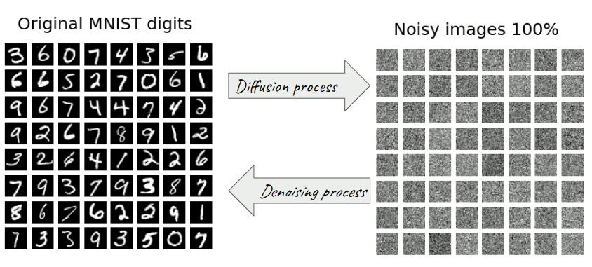

---
# Diffusion Models – Diffusion Process, Reverse Process

Given a data point $⁇→x_0$ from a real data distribution $q(⁇→x)$, we define
a $T$-step _diffusion process_ (or the _forward process_) which gradually adds
Gaussian noise to the input image:

$$q(⁇→x_{1:T}|⁇→x_0) = ∏\nolimits_{t=1}^\T q(⁇→x_t|⁇→x_{t-1}).$$

~~~
Our goal is to reverse the forward process $q(⁇→x_t|⁇→x_{t-1})$, i.e., generate an
image by starting with $⁇→x_T ∼ 𝓝(→0, ⇉I)$ and then performing the forward
process in reverse.
~~~
We therefore learn a model $p_{→θ}(⁇→x_{t-1}|⁇→x_t)$ to approximate the reverse
of $q(⁇→x_t|⁇→x_{t-1})$, and obtain a _reverse process_:
$$p_{→θ}(⁇→x_{0:T}) = p(⁇→x_T) ∏\nolimits_{t=1}^\T p_{→θ}(⁇→x_{t-1}|⁇→x_t).$$

---
# Diffusion Models – Model Overview

The $p_{→θ}(⁇→x_{t-1}|⁇→x_t)$ is commonly modelled using a U-Net architecture
with skip connections.

~~~
### Training

During training, we randomly sample a time step $t$, and perform an update
of the parameters $→θ$ in order for $p_{→θ}(⁇→x_{t-1}|⁇→x_t)$ to
better approximate the reverse of $q(⁇→x_t|⁇→x_{t-1})$.

~~~
### Sampling

In order to sample an image, we start by sampling $⁇→x_T ∼ 𝓝(→0, ⇉I)$,
and then perform $T$ steps of the reverse process by sampling
$⁇→x_{t-1} ∼ p_{→θ}(⁇→x_{t-1}|⁇→x_t)$ for $t$ from $T$ down to 1.

---
section: $𝓝$
style: .katex-display { margin: .7em 0 }
# Normal Distribution Reminder

Normal (or Gaussian) distribution is a continuous distribution parametrized by
a mean $μ$ and variance $σ^2$:

$$𝓝(x; μ, σ^2) = \sqrt{\frac{1}{2πσ^2}} \exp \left(-\frac{(x - μ)^2}{2σ^2}\right)$$

~~~
For a $D$-dimensional vector $→x$, the multivariate Gaussian distribution takes
the form
$$𝓝(→x; →μ, ⇉Σ) ≝ \frac{1}{\sqrt{(2π)^D |⇉Σ|}} \exp \left(-\frac{1}{2}(→x-→μ)^\T ⇉Σ^{-1} (→x-→μ) \right).$$

~~~
The biggest difference compared to the single-dimensional case is the _covariance
matrix_ $⇉Σ$, which is (in the non-degenerate case, which is the only one
considered here) a _symmetric positive-definite matrix_ of size $D × D$.

~~~
However, in this lecture we will only consider _isotropic_ distribution, where $⇉Σ = σ^2⇉I$:
$$𝓝(→x; →μ, σ^2⇉I) = ∏\nolimits_i 𝓝(x_i; μ_i, σ^2).$$

---
# Normal Distribution Reminder

- A normally-distributed random variable $⁇→x ∼ 𝓝(→μ, σ^2⇉I)$ can be written using
  the reparametrization trick also as
  $$⁇→x = →μ + σ ⁇→e,\textrm{~~where~~}⁇→e ∼ 𝓝(→0, ⇉I).$$

~~~
- The sum of two independent normally-distributed random variables $⁇→x_1 ∼ 𝓝(→μ_1, σ_1^2⇉I)$
  and $⁇→x_2 ∼ 𝓝(→μ_2, σ_2^2⇉I)$ has normal distribution $⁇𝓝\big(→μ_1 + →μ_2, (σ_1^2 + σ_2^2)⇉I\big)$.

~~~
  Therefore, if we have two standard normal random variables $⁇→e_1, ⁇→e_2 ∼ 𝓝(→0, ⇉I)$, then
  $$σ_1 ⁇→e_1 + σ_2 ⁇→e_2 = \sqrt{σ_1^2 + σ_2^2} ⁇→e$$
  for a standard normal random variable $⁇→e ∼ 𝓝(→0, ⇉I)$.

---
section: DDPM
# DDPM – The Forward Process

We now describe _Denoising Diffusion Probabilistic Models (DDPM)_.

~~~

Given a data point $⁇→x_0$ from a real data distribution $q(⁇→x)$, we define
a $T$-step _diffusion process_ (or the _forward process_) which gradually adds
Gaussian noise according to some variance schedule $β_1, …, β_T$:

$\displaystyle \kern11em{}\mathllap{q(⁇→x_{1:T}|⁇→x_0)} = ∏_{t=1}^\T q(⁇→x_t|⁇→x_{t-1}),$

~~~
$\displaystyle \kern11em{}\mathllap{q(⁇→x_t|⁇→x_{t-1})} = 𝓝(⁇→x_t; \sqrt{1 - β_t} ⁇→x_{t-1}, β_t ⇉I),$

~~~
$\displaystyle \kern11em{}\mathllap{} = \sqrt{1 - β_t} ⁇→x_{t-1} + \sqrt{β_t} ⁇→e\textrm{~~for~~}⁇→e∼𝓝(→0, ⇉I).$

~~~
More noise gets gradually added to the original image $⁇→x_0$, converging to
pure Gaussian noise.

---
# DDPM – The Forward Process

Let $α_t = 1-β_t$ and $ᾱ_t = ∏_{i=1}^t α_i$.
~~~
Then we have

$\displaystyle\kern3em{}\mathllap{⁇→x_t} = \sqrt{α_t} \textcolor{blue}{⁇→x_{t-1}} + \sqrt{1-α_t}⁇→e_t$

~~~
$\displaystyle\kern3em{} = \sqrt{α_t} \textcolor{blue}{\big(\sqrt{α_{t-1}} ⁇→x_{t-2} + \sqrt{1-α_{t-1}}⁇→e_{t-1}\big)} + \sqrt{1-α_t}⁇→e_t$

~~~
$\displaystyle\kern3em{} = \sqrt{α_t α_{t-1}} ⁇→x_{t-2} + \sqrt{α_t(1-α_{t-1}) + (1-α_t)}⁇→ē_{t-1}$

~~~
$\displaystyle\kern3em{} = \sqrt{α_t α_{t-1}} ⁇→x_{t-2} + \sqrt{1 - α_t α_{t-1}}⁇→ē_{t-1}$

~~~
$\displaystyle\kern3em{} = \sqrt{α_t α_{t-1} α_{t-2}} ⁇→x_{t-3} + \sqrt{1 - α_t α_{t-1} α_{t-2}}⁇→ē_{t-2}$

~~~
$\displaystyle\kern3em{} = …$

~~~
$\displaystyle\kern3em{} = \sqrt{ᾱ_t} ⁇→x_0 + \sqrt{1-ᾱ_t}⁇→ē_0$

for standard normal random variables $⁇→e_i$ and $⁇→ē_i$.

~~~
In other words, we have shown that $q(⁇→x_t | ⁇→x_0) = 𝓝\big(\sqrt{ᾱ_t}⁇→x_0, (1-ᾱ_t)⇉I\big)$.

~~~
Therefore, if $ᾱ_t → 0$ as $t → ∞$, the $⁇→x_t$ converges to $𝓝(→0, ⇉I)$ as $t → ∞$.

---
# DDPM – The Forward Process

---
# DDPM – Noise Schedule

Originally, linearly increasing sequence of noise variances
$β_1=0.0001, …, β_T=0.04$ was used.

~~~
However, the resulting sequence $ᾱ_t$ was not ideal (nearly the whole second
half of the diffusion process was mostly just random noise), so later a cosine
schedule was proposed:
$$ᾱ_t = \frac{1}{2}\Big(\cos(t/T ⋅ π)+1\Big).$$

~~~
In practice, we want to avoid both the values of 0 and 1, and keep $α_t$ in $[ε, 1-ε]$ range.

---
# DDPM – Noise Schedule

We assume the images $⁇→x_0$ have zero mean and unit variance (we normalize them
to achieve that).
~~~
Then every
$$q(⁇→x_t|⁇→x_0) = \textcolor{red}{\sqrt{ᾱ_t}} ⁇→x_0 + \textcolor{blue}{\sqrt{1-ᾱ_t}}⁇→e$$
has also zero mean and unit variance.

~~~
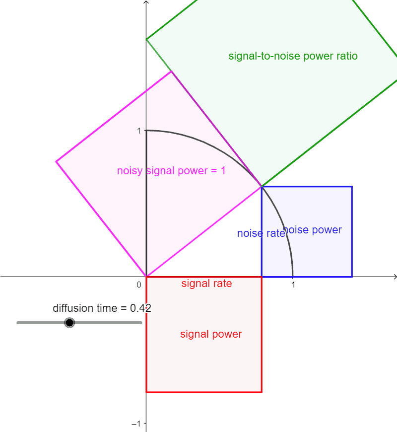

The $\textcolor{red}{\sqrt{ᾱ_t}}$ and $\textcolor{blue}{\sqrt{1-ᾱ_t}}$ can be
considered as the _signal rate_ and the _noise rate_.

~~~
Because $\textcolor{red}{\sqrt{ᾱ_t}}^2 + \textcolor{blue}{\sqrt{1-ᾱ_t}}^2 = 1$,
the signal rate and the noise rate form a circular arc. The proposed cosine
schedule
$$\begin{aligned}
  \textcolor{red}{\sqrt{ᾱ_t}} &= \cos(t/T ⋅ π/2), \\
  \textcolor{blue}{\sqrt{1-ᾱ_t}} &= \sin(t/T ⋅ π/2),
\end{aligned}$$
corresponds to an uniform movement on this arc.

---
# DDPM – The Reverse Process

In order to be able to generate images, we therefore learn a model
$p_{→θ}(⁇→x_{t-1}|⁇→x_t)$ to approximate the reverse of $q(⁇→x_t|⁇→x_{t-1})$.

~~~
When $β_t$ is small, this reverse is nearly Gaussian, so we represent $p_{→θ}$
as
$$p_{→θ}(⁇→x_{t-1}|⁇→x_t) = 𝓝\big(⁇→x_{t-1}; →μ_{→θ}(⁇→x_t, t), σ_t^2⇉I\big)$$
for some fixed sequence of $σ_1, …, σ_T$.

~~~
The whole reverse process is then
$$p_{→θ}(⁇→x_{0:T}) = p(⁇→x_T) ∏\nolimits_{t=1}^\T p_{→θ}(⁇→x_{t-1}|⁇→x_t).$$

---
# DDPM – Loss

We now want to derive the loss. First note that the reverse of $q(⁇→x_t|⁇→x_{t-1})$
is actually tractable when conditioning on $⁇→x_0$:

$\displaystyle\kern9em{}\mathllap{q(⁇→x_{t-1}|⁇→x_t, ⁇→x_0)} = 𝓝\big(⁇→x_{t-1}; \textcolor{blue}{→μ̃_t(⁇→x_t, ⁇→x_0)}, \textcolor{green}{β̃_t}⇉I\big),$

~~~
$\displaystyle\kern9em{}\mathllap{\textcolor{blue}{→μ̃_t(⁇→x_t, ⁇→x_0)}} = \frac{\sqrt{ᾱ_{t-1}}β_t}{1-ᾱ_t}⁇→x_0 + \frac{\sqrt{α_t}(1-ᾱ_{t-1})}{1-ᾱ_t}⁇→x_t,$

~~~
$\displaystyle\kern9em{}\mathllap{\textcolor{green}{β̃_t}} = \frac{1-ᾱ_{t-1}}{1-ᾱ_t}β_t.$

~~~
We present the proof on the next slide for completeness.

---
class: dbend
# Forward Process Reverse Derivation

Starting with the Bayes' rule, we get

$\displaystyle\kern7em{}\mathllap{q(⁇→x_{t-1}|⁇→x_t, ⁇→x_0)} = \textcolor{purple}{q(⁇→x_t | ⁇→x_{t-1}, ⁇→x_0)} \frac{\textcolor{darkcyan}{q(⁇→x_{t-1} | ⁇→x_0)}}{\textcolor{red}{q(⁇→x_t | ⁇→x_0)}}$

~~~
$\displaystyle\kern2em{} ∝ \exp\Big(-\frac{1}{2}\Big(\textcolor{purple}{\frac{(⁇→x_t - \sqrt{α_t}⁇→x_{t-1})^2}{β_t}} + \textcolor{darkcyan}{\frac{(⁇→x_{t-1} - \sqrt{ᾱ_{t-1}}⁇→x_0)^2}{1-ᾱ_{t-1}}} - \textcolor{red}{\frac{(⁇→x_t - \sqrt{ᾱ_t}⁇→x_0)^2}{1-ᾱ_t}}\Big)\Big)$

~~~
$\displaystyle\kern2em{} = \exp\Big(-\frac{1}{2}\Big(\tfrac{⁇→x_t^2 - 2\sqrt{α_t}⁇→x_t\textcolor{orange}{⁇→x_{t-1}} + α_t\textcolor{magenta}{⁇→x_{t-1}^2}}{β_t} + \tfrac{\textcolor{magenta}{⁇→x_{t-1}^2} - 2\sqrt{ᾱ_{t-1}}\textcolor{orange}{⁇→x_{t-1}}⁇→x_0 + ᾱ_{t-1}⁇→x_0^2}{1-ᾱ_{t-1}} + …\Big)\Big)$

~~~
$\displaystyle\kern2em{} = \exp\Big(-\frac{1}{2}\Big(\big(\tfrac{α_t}{β_t} + \tfrac{1}{1-ᾱ_{t-1}}\big)\textcolor{magenta}{⁇→x_{t-1}^2} - 2\big(\tfrac{\sqrt{α_t}}{β_t}⁇→x_t + \tfrac{\sqrt{ᾱ_{t-1}}}{1-ᾱ_{t-1}}⁇→x_0\big)\textcolor{orange}{⁇→x_{t-1}} + …\Big)\Big)$

~~~
From this formulation, we can derive that $q(⁇→x_{t-1}|⁇→x_t, ⁇→x_0) = 𝓝\big(⁇→x_{t-1}; \textcolor{blue}{→μ̃_t(⁇→x_t, ⁇→x_0)}, \textcolor{green}{β̃_t}⇉I\big)$ for

~~~
$\displaystyle\kern5em{}\mathllap{\textcolor{green}{β̃_t}} = 1/\big(\tfrac{α_t}{β_t} + \tfrac{1}{1-ᾱ_{t-1}}\big) = 1/\big(\tfrac{α_t(1-ᾱ_{t-1})+β_t}{β_t(1-ᾱ_{t-1})}\big) = 1/\big(\tfrac{α_t+β_t-ᾱ_t}{β_t(1-ᾱ_{t-1})}\big) = \frac{1-ᾱ_{t-1}}{1-ᾱ_t}β_t,$

~~~
$\displaystyle\kern5em{}\mathllap{\textcolor{blue}{→μ̃_t(⁇→x_t, ⁇→x_0)}} = \big(\tfrac{\sqrt{α_t}}{β_t}⁇→x_t + \tfrac{\sqrt{ᾱ_{t-1}}}{1-ᾱ_{t-1}}⁇→x_0\big) \textcolor{green}{\tfrac{1-ᾱ_{t-1}}{1-ᾱ_t}β_t} = \frac{\sqrt{ᾱ_{t-1}}β_t}{1-ᾱ_t}⁇→x_0 + \frac{\sqrt{α_t}(1-ᾱ_{t-1})}{1-ᾱ_t}⁇→x_t.$

---
style: .katex-display { margin: .9em 0 }
# DDPM – Loss

The full derivation of the loss is available in the Bonus Content of this
presentation. The resulting loss is

$$L_t = 𝔼\bigg[\frac{1}{2\|σ_t⇉I\|^2}\Big\| →μ̃_t(⁇→x_t, ⁇→x_0) - →μ_{→θ}(⁇→x_t, t) \Big\|^2\bigg].$$

~~~
Denoting $⁇→x_t = \sqrt{ᾱ_t} ⁇→x_0 + \sqrt{1-ᾱ_t}⁇→e_t$, it is possible to
change the model to predict $→ε_{→θ}(⁇→x_t, t) = (→x_t - \sqrt{ᾱ_t} ⁇→x_0) / \sqrt{1-ᾱ_t}$ instead of $→μ_{→θ}(⁇→x_t, t)$.
~~~
The loss then becomes

$$L_t = 𝔼\bigg[\frac{(1-α_t)^2}{2α_t(1-ᾱ_t)\|σ_t⇉I\|^2}\Big\| ⁇→e_t - →ε_{→θ}\big(\sqrt{ᾱ_t} ⁇→x_0 + \sqrt{1-ᾱ_t}⁇→e_t, t\big) \Big\|^2\bigg].$$

~~~
The authors found that training without the weighting term performs better, so
the final loss is
$$L_t^\textrm{simple} = 𝔼_{t∈\{1..T\},⁇→x_0,⁇→e_t}\Big[\big\| ⁇→e_t - →ε_{→θ}\big(\sqrt{ᾱ_t} ⁇→x_0 + \sqrt{1-ᾱ_t}⁇→e_t, t\big) \big\|^2\Big].$$

~~~
Note that both losses have the same optimum if we used independent $→ε_{→θ_t}$ for every $t$.

---
# DDPM – Training and Sampling Algorithms

~~~
In practice, instead of discrete, $t$ may be continuous in the $[0, 1]$ range.
~~~
Note that sampling using the proposed algorithm is slow because it is common to use $T=1000$
steps during sampling.

~~~
The value of $σ_t^2$ is chosen to be either $β_t$ or $β̃_t$, or any value
in between (it can be proven that these values correspond to upper and lower
bounds on the reverse process entropy).

~~~
Both of these issues are alleviated by using a different sampling algorithm
DDIM, which runs in several tens of steps and does not use $σ_t^2$.

---
section: FlowMatching
class: section
# Flow Matching

---
# Flow Matching

In the past years (since 2022), the dominant approach for generating images has
been based on **diffusion models** (used by Stable Diffusion, DALL-E, …).

~~~
The diffusion models are deeply connected to **score-based generative models**,
which were developed independently, but are just a different perspective on the
same model family.

~~~
Recently, **conditional flow matching** was proposed as a generalization of both
these approaches, and that is the method we now describe in detail.

---
# Generative Modeling

The general framework of generative modeling assumes we have samples $→x^{(1)},
→x^{(2)}, …, →x^{(N)}$ from the data generating distribution $p_\textrm{data}$,
and the main challenges we should overcome are:
~~~
- provide fast sampling,
~~~
- generate high-quality samples,
~~~
- properly cover the density of $p_\textrm{data}$.

~~~ ~~~~
- provide fast sampling (diffusion models were originally not great here),
- generate high-quality samples (VAE struggles with this goal),
- properly cover the density of $p_\textrm{data}$ (the main issue of GANs).

~~~
Modern approach to generative modeling is to start with a simple base
distribution $p_0$, usually a standard Gaussian $𝓝(→0, ⇉I)$, and learn
a mapping that transforms that distribution into $p_\textrm{data}$.

~~~
Sampling then can be performed by sampling from $p_0$ and performing the
transformation.

---
# Generating Images From Standard Normal Base Distribution

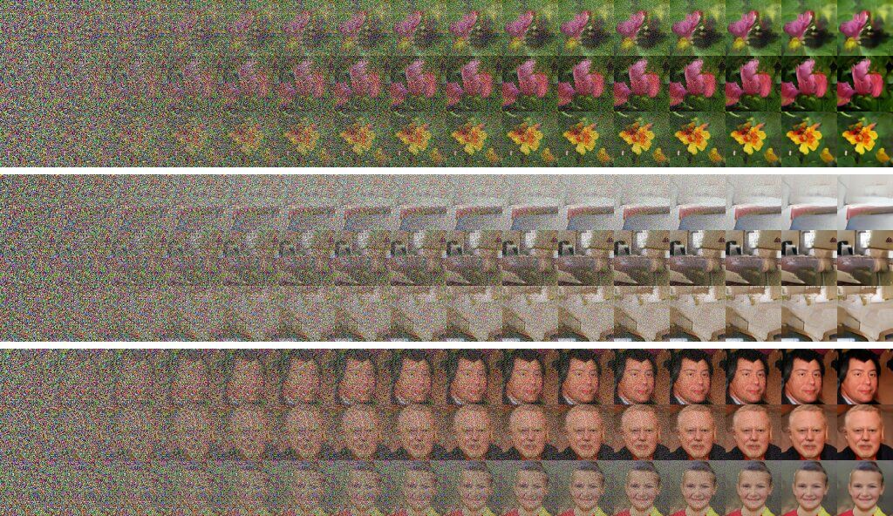

---
style: .katex-display { margin: 0 0 }
# Flow Matching

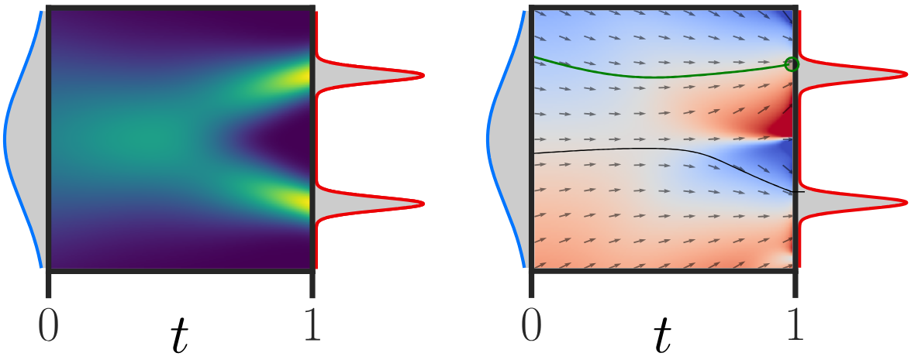

The important concepts used by flow matching are:

~~~
- the **probability density path** $p \colon [0, 1] × ℝ^d → ℝ_{>0}$, which is
  a time-dependent probability density function, i.e., $∫ p_t(→x) \d →x = 1$;
~~~

  - this probability density path should transform the prior $p_0$ into
    $p_1=p_\textrm{data}$
~~~
- a **time-dependent vector field** $u \colon [0, 1] × ℝ^d → ℝ^d$, which can be
  used to construct a **flow** $φ \colon [0, 1] × ℝ^d → ℝ^d$ via an ordinary differential
  equation:
  $$\tfrac{d}{dt} φ_t(→x) = u_t(φ_t(→x)),~~~~φ_0(→x) = →x.$$

---
style: .katex-display { margin: .7em 0 }
# Flow Matching

Note that the solution of the flow ODE
$$\tfrac{d}{dt} φ_t(→x) = u_t(φ_t(→x)),~~~~φ_0(→x) = →x$$
is unique when $u_t$ is Lipschitz continuous in $→x$ and
continuous in $t$ (Picard–Lindelöf theorem).

~~~

Recall that in a residual network, we update the current value by adding the
result of a residual block
$$→h_{t+1} = →h_t + f(→h_t; →θ_t),$$
~~~
which we can also write as
$$→h_{t+1} - →h_t = f(→h_t; →θ_t),$$
where we can interpret the residual block as a “discrete derivative”.

~~~
Therefore, the flow can be considered to be a continuous generalization of
residual networks.

---
# Flow Matching: Transport Equation

A vector field $u_t$ is said to **generate** a probability density path $p_t$
if the _transport equation_ holds:
$$\tfrac{d}{dt} p_t(→x) = -\operatorname{div}\big(p_t(→x) u_t(→x)\big),$$

~~~

where the **divergence** $\operatorname{div}(→z) ≝ ∑_i \tfrac{∂ z_i}{∂x_i}$
is a vector operator that operates on a vector field, producing for every
point a scalar value, the field's _source_ at that point (a positive
value means a point is a source; negative if it is a sink).

~~~
The $p_t(→x) u_t(→x)$ is a _flux_, the probability mass passing through
every point of the space (in the direction of the vector field).

---
style: .katex-display { margin: .5em 0 }
# Flow Matching: Basic Objective

Assume we have a base distribution $p_0$, usually $𝓝(→0, ⇉I)$, and samples
$→x^{(i)}$ of the data generating distribution $p_1 = p_\textrm{data}$.
~~~
Given a target probability density path $p_t$ and a corresponding vector
field $u_t$ generating $p_t$, the _flow matching (FM) objective_ is
$$𝓛_\textrm{FM}(→θ) ≝ 𝔼_{t, →x∼p_t(→x)} \|v_t(→x; →θ) - u_t(→x)\|^2.$$

~~~
However, we need to overcome that we have no prior knowledge on how the $p_t$
and $u_t$ should look like given that there are many possible probability
density paths $p_t$, and that for an arbitrary $p_t$, we usually do not have
access to the closed form of its generating vector field $u_t$.

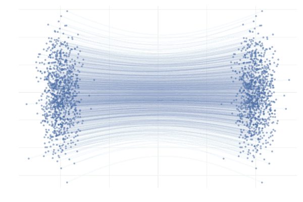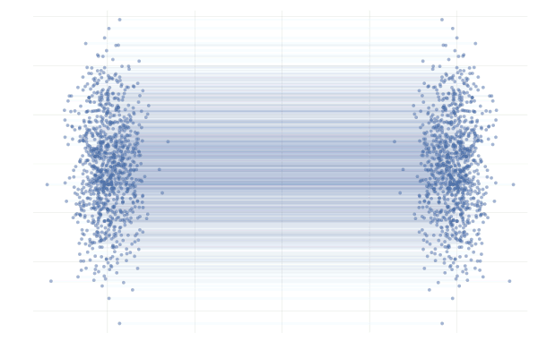

---
style: .katex-display { margin: 0em 0 }
# Flow Matching: Basic Overview

Once we solve the remaining issues with the flow matching objective,
we train a NN model $v_t(→x; →θ)$ by predicting (matching) the vector field
$u_t(→x)$.
~~~
Usually, the U-Net architecture with skip connections is used to model $v_t$.

~~~
### Training

During training, we minimize an objective corresponding to flow matching
$$𝓛_\textrm{FM}(→θ) ≝ 𝔼_{t, →x∼p_t(→x)} \|v_t(→x; →θ) - u_t(→x)\|^2,$$
i.e., by performing a regression on the vector predicted by the model $v_t$.

~~~
### Sampling

In order to generate an image, we start by sampling $⁇→x_0 ∼ p_0$, and then
perform numerical integration by the Euler method using $T$ steps by
$$→x_{t+\frac{1}{T}} ← →x_t + \tfrac{1}{T} v_t(→x_t; →θ).$$

~~~
More involved methods like the midpoint or Runge-Kutta can also be used.

---
section: ConditionalFM
class: section
# Conditional Flow Matching

---
style: .katex-display { margin: .7em 0 }
# Conditional and Marginal Probability Paths

Instead of directly defining the probability density path, we can construct it
as a mixture of simpler probability paths. Together with the fact that
we do not have direct access to the data generating distribution $p_1
= p_\textrm{data}$ apart from its samples, we turn to **conditional
probability paths** $p_t(→x | →x_1)$, which we design so that
~~~
- $p_0(→x | →x_t) = p_0(→x)$,
~~~
- $p_1(→x | →x_1)$ is tightly concentrated around $→x_1$, for example by using
  a normal distribution with a small variance $σ^2_\textrm{min}>0$:
  $$p_1(→x | →x_1) = 𝓝(→x | →x_1, σ^2_\textrm{min}⇉I).$$

~~~
We can then define the _marginal probability path_ as
$$p_t(→x) ≝ 𝔼_{→x_1 ∼ p_\textrm{data}} \big[p_t(→x | →x_1)\big] \textcolor{gray}{= ∫p_t(→x | →x_1) p_\textrm{data}(→x_1) \d →x_1}.$$

~~~
Because we defined the conditional probability paths to concentrate tightly
around $→x_1$, the marginal probability $p_1(→x) ≈ p_\textrm{data}$.

---
style: .katex-display { margin: .7em 0 }
# Conditional and Marginal Vector Fields

Analogously to how we defined the marginal probability path using the conditional
probability paths, it is also possible to define the _marginal vector field_
(the vector field of the marginal probability path) using the _conditional
vector fields_ $u_t(→x | →x_1)$ (the vector fields of the conditional
probability paths):

$$u_t(→x) ≝ 𝔼_{→x_1 ∼ p_\textrm{data}} \bigg[u_t(→x | →x_1) \frac{p_t(→x | →x_1)}{p_t(→x)}\bigg] \textcolor{gray}{= ∫u_t(→x | →x_1) \frac{p_t(→x | →x_1)p_\textrm{data}(→x)}{p_t(→x)} \d →x_1}.$$

~~~
Such a marginal vector field actually generates the marginal probability path.

~~~
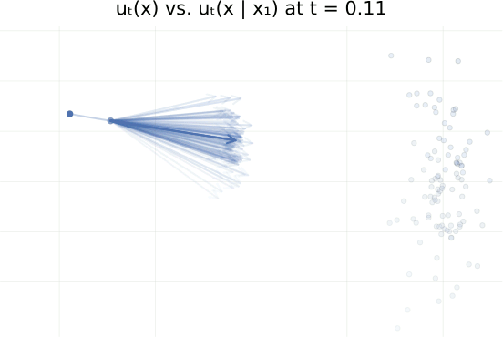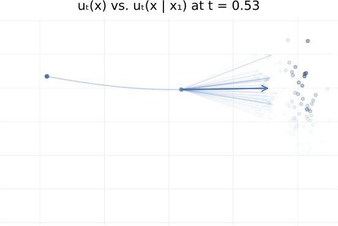

---
style: .katex-display { margin: .7em 0 }
# Conditional and Marginal Vector Fields

To verify that the marginal vector field generates the marginal probability
path, we need to check that $p_t$ and $u_t$ satisfy the transport equation:

$\displaystyle \kern7em{}\mathllap{\tfrac{d}{dt} p_t(→x)} = 𝔼_{→x_1 ∼ p_\textrm{data}}\Big[\tfrac{d}{dt} p_t(→x | →x_1)\Big]$

~~~
$\displaystyle \kern7em{} = 𝔼_{→x_1 ∼ p_\textrm{data}}\Big[-\operatorname{div}\big(u_t(→x | →x_1) p_t(→x | →x_1)\big)\Big]$

~~~
$\displaystyle \kern7em{} = -\operatorname{div}\Big(𝔼_{→x_1 ∼ p_\textrm{data}}\big[u_t(→x | →x_1) p_t(→x | →x_1)\big]\Big)$

~~~
$\displaystyle \kern7em{} = -\operatorname{div}\Big(\underbrace{𝔼_{→x_1 ∼ p_\textrm{data}}\big[u_t(→x | →x_1) p_t(→x | →x_1)\textcolor{blue}{/p_t(→x)}\big]}_{\textrm{definition~of~}u_t(→x)}\textcolor{blue}{p_t(→x)}\Big)$

~~~
$\displaystyle \kern7em{} = -\operatorname{div}\big(u_t(→x)p_t(→x)\big).$

~~~
Note that swapping a derivative and an integral requires various smoothness
conditions; we assume all our objects “nice enough”.

---
# Conditional Flow Matching

Even with the definition of the marginal vector field, obtaining an unbiased
estimate of the flow matching objective

$$𝓛_\textrm{FM}(→θ) ≝ 𝔼_{t, →x∼p_t(→x)} \|v_t(→x; →θ) - u_t(→x)\|^2$$

is still intractable (the integrals in
the definition of the conditional probability path/vector field are
intractable).

~~~
However, we can use the following simplified _conditional flow matching (CFM)
objective_:

$$𝓛_\textrm{CFM}(→θ) ≝ 𝔼_{t, →x_1 ∼ p_\textrm{data}, →x ∼ p_t(→x|→x_1)} \|v_t(→x; →θ) - u_t(→x | →x_1)\|^2.$$

~~~
This objective allows unbiased estimates, given that only the conditional variants
of $p_t$ and $u_t$ are needed.

~~~
Importantly, while this objective $𝓛_\textrm{CFM}$ is different from the
original flow matching objective $𝓛_\textrm{FM}$, it has the same gradients with
respect to $→θ$.

---
class: dbend
style: .katex-display { margin: .65em 0 }
# Conditional Flow Matching

$$\begin{aligned}
  𝓛_\textrm{FM}(→θ) &≝ 𝔼_{t,→x∼p_t(→x)} \|v_t(→x; →θ) - u_t(→x)\|^2 \\
  𝓛_\textrm{CFM}(→θ) &≝ 𝔼_{t, →x_1 ∼ p_\textrm{data}, →x ∼ p_t(→x|→x_1)} \|v_t(→x; →θ) - u_t(→x | →x_1)\|^2 \\
\end{aligned}$$

To show that the gradients $∇_{→θ}$ of $𝓛_\textrm{FM}$ and $𝓛_\textrm{CFM}$ are
the same, we start with:

~~~
$$\begin{aligned}
  \|v_t(→x; →θ) - u_t(→x)\|^2 &= (v_t(→x; →θ) - u_t(→x))^\T(v_t(→x; →θ) - u_t(→x)) \\
                              &= \|v_t(→x; →θ)\|^2 - 2 v_t(→x; →θ)^\T u_t(→x) + \|u_t(→x)\|^2 \\
  \|v_t(→x; →θ) - u_t(→x | →x_1)\|^2 &= \|v_t(→x; →θ)\|^2 - 2 v_t(→x; →θ)^\T u_t(→x | →x_1) + \|u_t(→x | →x_1)\|^2
\end{aligned}$$

~~~
First, we note that $u_t$ is independent of $→θ$.
~~~
Second, because
$$p_t(→x) ≝ 𝔼_{→x_1 ∼ p_\textrm{data}} \big[p_t(→x | →x_1)\big],$$
~~~
we get that
$$𝔼_{→x∼p_t(→x)} \|v_t(→x; →θ)\|^2 = 𝔼_{→x_1 ∼ p_\textrm{data}, →x ∼ p_t(→x|→x_1)} \|v_t(→x; →θ)\|^2.$$

---
class: dbend
style: .katex-display { margin: .65em 0 }
# Conditional Flow Matching

$$\begin{aligned}
  𝓛_\textrm{FM}(→θ) &≝ 𝔼_{t, →x∼p_t(→x)} \|v_t(→x; →θ) - u_t(→x)\|^2 \\
  𝓛_\textrm{CFM}(→θ) &≝ 𝔼_{t, →x_1 ∼ p_\textrm{data}, →x ∼ p_t(→x|→x_1)} \|v_t(→x; →θ) - u_t(→x | →x_1)\|^2 \\
\end{aligned}$$

Finally, to handle the middle (dot-product) term from the expansion of the squares,
using

$$u_t(→x) ≝ 𝔼_{→x_1 ∼ p_\textrm{data}} \bigg[u_t(→x | →x_1) \frac{p_t(→x | →x_1)}{p_t(→x)}\bigg]$$

~~~
we get that
$$\begin{aligned}
  𝔼_{→x∼p_t(→x)} \big[v_t(→x; →θ)^\T u_t(→x)\big] &= 𝔼_{→x_1 ∼ p_\textrm{data},→x∼p_t(→x)} \big[v_t(→x; →θ)^\T \big(u_t(→x | →x_1) p_t(→x | →x_1) / p_t(→x)\big) \big] \\
                                               &= 𝔼_{→x_1 ∼ p_\textrm{data}, →x ∼ p_t(→x|→x_1)} \big[v_t(→x; →θ)^\T u_t(→x | →x_1) \big]. \\
\end{aligned}$$

---
# Construction of the Conditional Probability Paths

We now define the conditional probability paths that we will use. We consider
normal distributions with time-dependent mean $μ_t(→x_1)$ and variance
$σ^2_t(→x_1)$:

$$p_t(→x | →x_1) ≝ 𝓝\big(→x | μ_t(→x_1), σ^2_t(→x_1)⇉I\big).$$

~~~
We require
- $μ_0(→x_1) = 0$ and $σ^2_0(→x_1) = 1$ so that $p_0(→x | →x_1) = p_0(→x)$, and

~~~
- $μ_t(→x_1) = →x_1$ and $σ^2_1(→x_1) = σ^2_\textrm{min}$ so that $p_1(→x
  | →x_1)$ is concentrated around $→x_1$.

~~~
While there are infinitely many vector fields generating these probability
paths, we use the simplest one, corresponding to the flow (dependent on $→x_1$)
$$φ_t(→x) = σ_t(→x_1) →x + μ_t(→x_1),$$

which is an affine transformation mapping standard normal distribution to
a normal distribution with mean $μ_t(→x_1)$ and variance $σ^2_t(→x_1)$.

---
style: .katex-display { margin: .9em 0 }
# Construction of the Conditional Vector Field

We now derive the conditional vector field $u_t(→x | →x_1)$ so that its flow is the
defined
$$φ_t(→x) = σ_t(→x_1) →x + μ_t(→x_1).$$

~~~
Recalling the flow ODE $\tfrac{d}{dt} φ_t(→x) = u_t(φ_t(→x))$, it could be used
to defined $u_t$, but unfortunately for $φ_t(→x)$, not for arbitrary $→x$.

~~~
However, the affine map $φ_t$ has an analytical inverse (assuming $σ_t(→x_1) > 0$)
$$\textcolor{blue}{φ^{-1}_t(→z)} = \textcolor{blue}{\frac{→z - μ_t(→x_1)}{σ_t(→x_1)}}.$$

~~~
Therefore, when we consider $→z = φ_t(→x)$, we get $u_t(→z | →x_1) = \textcolor{darkred}{φ'_t(\textcolor{blue}{φ^{-1}_t(→z)})}$.

~~~
Using the derivative $\textcolor{darkred}{φ'_t(→x | →x_1)} = \textcolor{darkred}{σ'_t(→x_1) →x + μ'_t(→x_1)}$,
we obtain that

~~~
$$u_t(→z | →x_1) = \frac{\textcolor{darkred}{σ'_t(→x_1)}}{\textcolor{blue}{σ_t(→x_1)}}\big(\textcolor{blue}{→z - μ_t(→x_1)}\big) + \textcolor{darkred}{μ'_t(→x_1)}.$$

---
# Construction of the Conditional Vector Field

The authors propose to use conditional paths with mean and variance changing
linearly in $t$:
$$μ_t(→x_1) ≝ t→x_1,~~~σ_t(→x_1) ≝ 1 - (1-σ_\textrm{min})t.$$

~~~
Therefore, the corresponding flow and vector field are
$$\begin{gathered}
  φ_t(→x) = (1 - (1-σ_\textrm{min})t) →x + t→x_1,\textcolor{gray}{\small~~~~such~a~flow~is~called~Optimal~Transport\kern-5em{}}\\
  u_t(→x | →x_1) = \frac{-(1-σ_\textrm{min})}{1 - (1-σ_\textrm{min})t}\big(→x - t→x_1\big) + →x_1 = \frac{→x_1-(1-σ_\textrm{min})→x}{1 - (1-σ_\textrm{min})t}.
\end{gathered}$$

~~~
Finally, recalling the general form $𝓛_\textrm{CFM}(→θ) ≝ 𝔼_{t, →x_1 ∼ p_\textrm{data}, →x ∼ p_t(→x|→x_1)} \|v_t(→x; →θ) - u_t(→x | →x_1)\|^2$,
~~~
for our specific case of OT flow we obtain
$$𝓛_\textrm{CFM}(→θ) ≝ 𝔼_{t, →x_1 ∼ p_\textrm{data}, →x_0 ∼ p_0} \big\|v_t\big(φ_t(→x_0); →θ\big) - \big(→x_1-(1-σ_\textrm{min})→x_0\big)\big\|^2.$$

---
# Conditional Probability Paths and Marginal Probability Paths

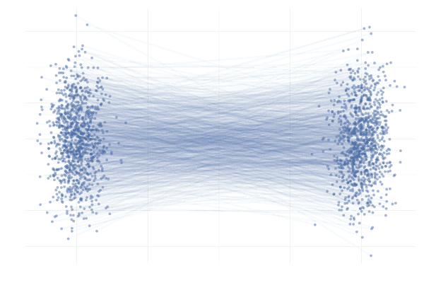

~~~
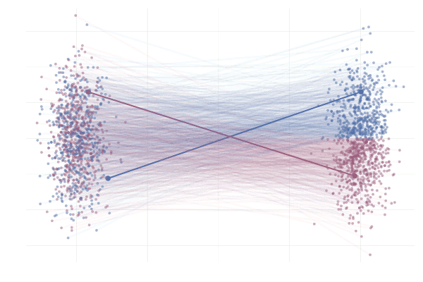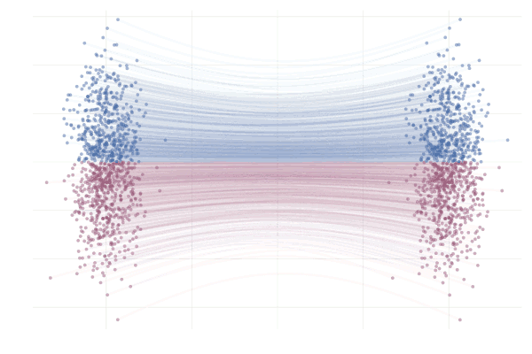

---
# Conditional Probability Paths and Marginal Probability Paths

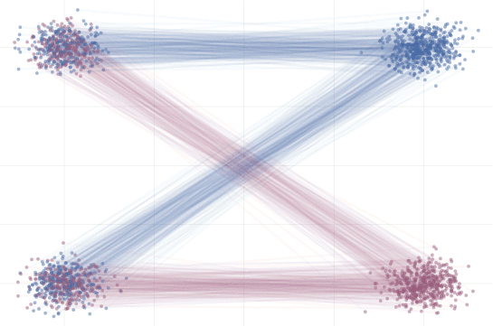

~~~
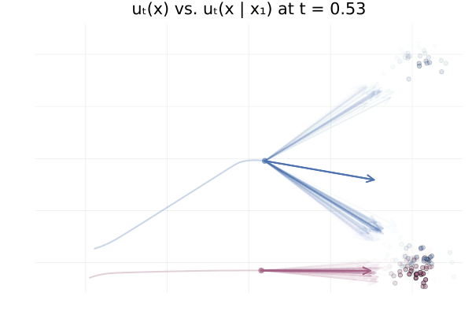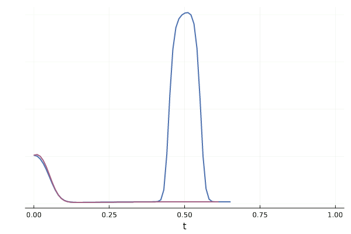

---
style: .katex-display { margin: 0 0 }
# Conditional Flow Matching Algorithm

Let $v_t(→x; →θ)$ be a U-Net-like neural network model predicting the vector
field.

~~~
### Training

During training, we minimize CFM objective by SGD/Adam:
$$𝓛_\textrm{CFM}(→θ) ≝ 𝔼_{t, →x_1 ∼ p_\textrm{data}, →x_0 ∼ p_0} \big\|v_t\big(φ_t(→x_0); →θ\big) - \big(→x_1-(1-σ_\textrm{min})→x_0\big)\big\|^2.$$

~~~
Specifically, we generate batches of training data $⇉X ∼ p_\textrm{data}$ as
usual, for each batch example we also generate $t ∼ U[0, 1]$ and $→x_0 ∼ 𝓝(→0,
⇉I)$, and we minimize the mean squared error
$$\|v_t\big(φ_t(→x_0); →θ\big) - \big(→x_1-(1-σ_\textrm{min})→x_0\big)\big\|^2.$$

~~~
### Sampling

In order to generate an image, we start by sampling $⁇→x_0 ∼ p_0$, and then
perform numerical integration by the Euler method using $T$ steps by
$$→x_{t+\frac{1}{T}} ← →x_t + \tfrac{1}{T} v_t(→x_t; →θ).$$

---
# Further Reading About Flow Matching

- An introduction to Flow Matching
  https://mlg.eng.cam.ac.uk/blog/2024/01/20/flow-matching.html#fn:mini-batch-ot-deterministic-vs-stochastic

- A Visual Dive into Conditional Flow Matching
  https://dl.heeere.com/conditional-flow-matching/blog/conditional-flow-matching/

- Diffusion Meets Flow Matching: Two Sides of the Same Coin
  https://diffusionflow.github.io/

---
# Architectures of Diffusion Models, Suitable Also for FM

Vector field $v_t(→x; →θ)$ can be predicted by U-Net architecture with
pre-activated ResNet blocks.

~~~
- The current continuous time step is represented using the
  Transformer sinusoidal embeddings and added “in the middle” of every residual
  block (after the first convolution).

~~~
- Additionally, on several lower-resolution levels, a self-attention
  block (an adaptation of the Transformer self-attention, which considers
  the 2D grid of features as a sequence of feature vectors) is commonly used.
  Because the complexity is asymptotically the image width to the power of
  four, only the lower-resolution levels are used for this self-attention.

  

---
# Diffusion Models Architecture – ImaGen

~~~

---
# Diffusion Models Architecture – ImaGen

~~~

~~~
There are of course many possible variants; furthermore, Visual Transformer
can be used instead of the U-Net architecture.

---
# Conditional Models, Classifier-Free Guidance

In many cases we want the generative model to be conditional.
~~~
We have already seen how to condition it on the current time step. Additionally,
we might consider also conditioning on
- an image (e.g., for super-resolution): the image is then resized and
  concatenated with the input noised image (and optionally in other places,
  like after every resolution change);

~~~
- a text: the usual approach is to encode the text using some pre-trained
  encoder, and then to introduce an “image-text” attention layer (usually
  after the self-attention layers).

~~~
To make the effect of conditioning stronger during sampling, we might
also employ _classifier-free guidance_:
~~~
- During training, we sometimes train $v_t(→x, y; →θ)$ with the conditioning $y$,
  and sometimes we train $v_t(→x, \varnothing; →θ)$ without the conditioning.
~~~
- During sampling, we pronounce the effect of the conditioning by taking
  the unconditioned vector field and adding the difference between conditioned and
  unconditioned vector field _weighted by the weight_ $w$ (values like $w=5$ or
  $w=7.5$ are mentioned in papers):
  $$v_t(→x, \varnothing; →θ) + w\big(v_t(→x, y; →θ) - v_t(→x_t, \varnothing; →θ)\big).$$

---
# Samples from Model Trained on the Practicals

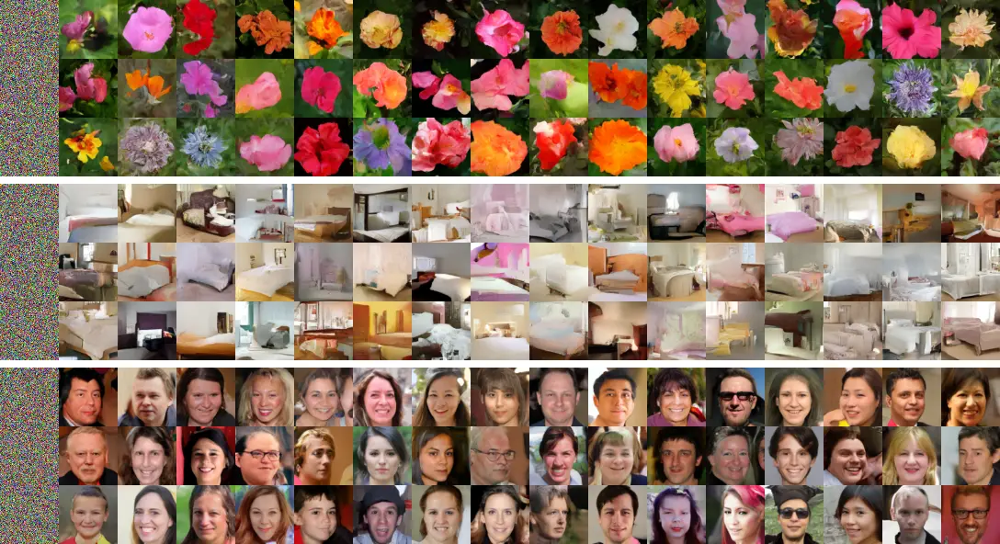

---
# Samples from Conditional Model Trained on the Practicals

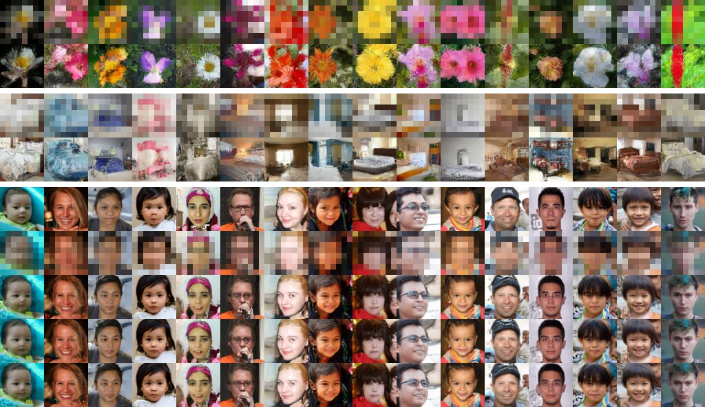

---
section: SD
# Stable Diffusion – Semantic and Perceptual Compression

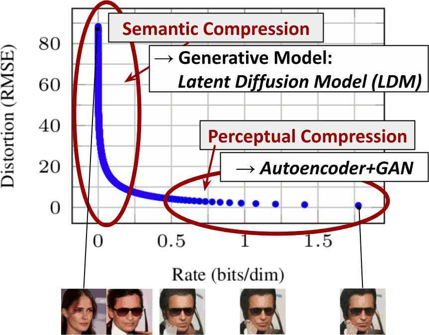

---
# Stable Diffusion – Architecture

---
# Stable Diffusion Papers

- (SD) Robin Rombach, Andreas Blattmann, Dominik Lorenz, Patrick Esser, Björn
  Ommer: **High-Resolution Image Synthesis with Latent Diffusion Models**
  https://arxiv.org/abs/2112.10752

- (SDXL) Dustin Podell, Zion English, Kyle Lacey, Andreas Blattmann, Tim
  Dockhorn, Jonas Müller, Joe Penna, Robin Rombach: **SDXL: Improving Latent
  Diffusion Models for High-Resolution Image Synthesis**
  https://arxiv.org/abs/2307.01952

- (SD3) Patrick Esser, Sumith Kulal, Andreas Blattmann, Rahim Entezari, Jonas
  Müller, Harry Saini, Yam Levi, Dominik Lorenz, Axel Sauer, Frederic Boesel,
  Dustin Podell, Tim Dockhorn, Zion English, Kyle Lacey, Alex Goodwin, Yannik
  Marek, Robin Rombach: **Scaling Rectified Flow Transformers for
  High-Resolution Image Synthesis** https://arxiv.org/abs/2403.03206 

- (SD3-Turbo) Axel Sauer, Frederic Boesel, Tim Dockhorn, Andreas Blattmann,
  Patrick Esser, Robin Rombach: **Fast High-Resolution Image Synthesis with
  Latent Adversarial Diffusion Distillation** https://arxiv.org/pdf/2403.12015

---
section: Bonus
class: section
# Bonus Content DDPM Loss

---
# DDPM – Deriving Loss using Jensen's Inequality

$\displaystyle -𝔼_{q(⁇→x_0)}\big[\log p_{→θ}(⁇→x_0)\big] = -𝔼_{q(⁇→x_0)}\big[\log 𝔼_{p_{→θ}(⁇→x_{1:T})}[p_{→θ}(⁇→x_0|→x_{1:T})]\big]$

~~~
$\displaystyle \kern2em{} = -𝔼_{q(⁇→x_0)}\Big[\log 𝔼_{q(⁇→x_{1:T}|⁇→x_0)}\Big[\tfrac{p_{→θ}(⁇→x_{0:T})}{q(⁇→x_{1:T}|⁇→x_0)}\Big]\Big]$

~~~
$\displaystyle \kern2em{} ≤ -𝔼_{q(⁇→x_{0:T})}\Big[\log \tfrac{p_{→θ}(⁇→x_{0:T})}{q(⁇→x_{1:T}|⁇→x_0)}\Big] = 𝔼_{q(⁇→x_{0:T})}\Big[\log \tfrac{q(⁇→x_{1:T}|⁇→x_0)}{p_{→θ}(⁇→x_{0:T})}\Big]$

~~~
$\displaystyle \kern2em{} = 𝔼_{q(⁇→x_{0:T})}\Big[-\log p_{→θ}(⁇→x_T) + ∑\nolimits_{t=2}^\T\log \tfrac{q(⁇→x_t|⁇→x_{t-1})}{p_{→θ}(⁇→x_{t-1}|⁇→x_t)} + \log \tfrac{q(⁇→x_1|⁇→x_0)}{p_{→θ}(⁇→x_0|⁇→x_1)}\Big]$

~~~
$\displaystyle \kern2em{} = 𝔼_{q(⁇→x_{0:T})}\Big[-\log p_{→θ}(⁇→x_T) + ∑\nolimits_{t=2}^\T\log \Big(\tfrac{q(⁇→x_{t-1}|⁇→x_t,⁇→x_0)}{p_{→θ}(⁇→x_{t-1}|⁇→x_t)}\tfrac{q(⁇→x_t|⁇→x_0)}{q(⁇→x_{t-1}|⁇→x_0)}\Big) + \log \tfrac{q(⁇→x_1|⁇→x_0)}{p_{→θ}(⁇→x_0|⁇→x_1)}\Big]$

~~~
$\displaystyle \kern2em{} = 𝔼_{q(⁇→x_{0:T})}\Big[-\log p_{→θ}(⁇→x_T) + ∑\nolimits_{t=2}^\T\log \tfrac{q(⁇→x_{t-1}|⁇→x_t,⁇→x_0)}{p_{→θ}(⁇→x_{t-1}|⁇→x_t)} + \log \tfrac{q(⁇→x_T|⁇→x_0)}{q(⁇→x_1|⁇→x_0)} + \log \tfrac{q(⁇→x_1|⁇→x_0)}{p_{→θ}(⁇→x_0|⁇→x_1)}\Big]$

~~~
$\displaystyle \kern2em{} = 𝔼_{q(⁇→x_{0:T})}\Big[\log \tfrac{q(⁇→x_T|⁇→x_0)}{p_{→θ}(⁇→x_T)} + ∑\nolimits_{t=2}^\T\log \tfrac{q(⁇→x_{t-1}|⁇→x_t,⁇→x_0)}{p_{→θ}(⁇→x_{t-1}|⁇→x_t)} -\log p_{→θ}(⁇→x_0|⁇→x_1)\Big]$

~~~
$\displaystyle \kern2em{} = 𝔼_{q(⁇→x_{0:T})}\Big[\underbrace{\scriptsize D_\textrm{KL}(q(⁇→x_T|⁇→x_0) \| p_{→θ}(⁇→x_T))}_{L_T} + ∑\nolimits_{t=2}^\T\underbrace{\scriptsize D_\textrm{KL}(q(⁇→x_{t-1}|⁇→x_t,⁇→x_0) \| p_{→θ}(⁇→x_{t-1}|⁇→x_t)}_{L_t} \underbrace{-\log p_{→θ}(⁇→x_0|⁇→x_1)}_{L_0}\Big]$

---
# DDPM – Deriving Loss using Jensen's Inequality

The whole loss is therefore composed of the following components:

~~~
- $L_T = D_\textrm{KL}\big(q(⁇→x_T|⁇→x_0) \| p_{→θ}(⁇→x_T)\big)$ is constant
  with respect to $→θ$ and can be ignored,

~~~
- $L_t = D_\textrm{KL}\big(q(⁇→x_{t-1}|⁇→x_t,⁇→x_0) \| p_{→θ}(⁇→x_{t-1}|⁇→x_t)\big)$
  is KL divergence between two Gaussians, so it can be computed explicitly as

  $$L_t = 𝔼\bigg[\frac{1}{2\|σ_t⇉I\|^2}\Big\| →μ̃_t(⁇→x_t, ⁇→x_0) - →μ_{→θ}(⁇→x_t, t) \Big\|^2\bigg],$$
~~~
- $L_0 = -\log p_{→θ}(⁇→x_0|⁇→x_1)$ can be used to generate discrete $⁇→x_0$
  from the continuous $⁇→x_1$; we will ignore it in the slides for simplicity.

---
# DDPM – Reparametrizing Model Prediction

Recall that $q(⁇→x_{t-1}|⁇→x_t, ⁇→x_0) = 𝓝\big(⁇→x_{t-1}; \textcolor{blue}{→μ̃_t(⁇→x_t, ⁇→x_0)}, \textcolor{green}{β̃_t}⇉I\big)$ for

$\displaystyle\kern5em{}\mathllap{\textcolor{blue}{→μ̃_t(⁇→x_t, ⁇→x_0)}} = \frac{\sqrt{ᾱ_{t-1}}β_t}{1-ᾱ_t}⁇→x_0 + \frac{\sqrt{α_t}(1-ᾱ_{t-1})}{1-ᾱ_t}⁇→x_t,$

$\displaystyle\kern5em{}\mathllap{\textcolor{green}{β̃_t}} = \frac{1-ᾱ_{t-1}}{1-ᾱ_t}β_t.$

~~~
Because $⁇→x_t = \sqrt{ᾱ_t} ⁇→x_0 + \sqrt{1-ᾱ_t}⁇→e_t$, we get $⁇→x_0 = \textcolor{red}{\frac{1}{\sqrt{ᾱ_t}}\big(⁇→x_t - \sqrt{1-ᾱ_t}⁇→e_t\big)}$.

~~~
Substituting $⁇→x_0$ to $→μ̃_t$, we get

$\displaystyle\kern5em{}\mathllap{\textcolor{blue}{→μ̃_t(⁇→x_t, ⁇→x_0)}} = \frac{\sqrt{ᾱ_{t-1}}β_t}{1-ᾱ_t}\textcolor{red}{\frac{1}{\sqrt{ᾱ_t}}\Big(⁇→x_t - \sqrt{1-ᾱ_t}⁇→e_t\Big)} + \frac{\sqrt{α_t}(1-ᾱ_{t-1})}{1-ᾱ_t}⁇→x_t$

~~~
$\displaystyle\kern5em{} = \Big(\frac{\sqrt{ᾱ_{t-1}}β_t}{1-ᾱ_t}\frac{1}{\sqrt{ᾱ_t}} + \frac{\sqrt{α_t}(1-ᾱ_{t-1})}{1-ᾱ_t}\Big)⁇→x_t - \Big(\frac{\sqrt{ᾱ_{t-1}}β_t}{1-ᾱ_t}\frac{\sqrt{1-ᾱ_t}}{\sqrt{ᾱ_t}}\Big)⁇→e_t$

~~~
$\displaystyle\kern5em{} = \frac{β_t + α_t(1-ᾱ_{t-1})}{(1-ᾱ_t)\sqrt{α_t}}⁇→x_t - \Big(\frac{β_t}{\sqrt{1-ᾱ_t}\sqrt{α_t}}\Big)⁇→e_t = \textcolor{blue}{\frac{1}{\sqrt{α_t}}\Big(⁇→x_t - \frac{1-α_t}{\sqrt{1-ᾱ_t}}⁇→e_t\Big)}.$

---
# DDPM – Reparametrizing Model Prediction

We change our model to predict $→ε_{→θ}(⁇→x_t, t)$ instead of
$→μ_{→θ}(⁇→x_t, t)$.
~~~
The loss $L_t$ then becomes

$\displaystyle\kern3em{}\mathllap{L_t} = 𝔼\bigg[\frac{1}{2\|σ_t⇉I\|^2}\Big\| \textcolor{blue}{→μ̃_t(⁇→x_t, ⁇→x_0)} - \textcolor{green}{→μ_{→θ}(⁇→x_t, t)} \Big\|^2\bigg]$

~~~
$\displaystyle\kern3em{} = 𝔼\bigg[\frac{1}{2\|σ_t⇉I\|^2}\Big\| \textcolor{blue}{\frac{1}{\sqrt{α_t}}\Big(⁇→x_t - \frac{1-α_t}{\sqrt{1-ᾱ_t}}⁇→e_t\Big)} - \textcolor{green}{\frac{1}{\sqrt{α_t}}\Big(⁇→x_t - \frac{1-α_t}{\sqrt{1-ᾱ_t}}→ε_{→θ}(⁇→x_t, t)\Big)} \Big\|^2\bigg]$

~~~
$\displaystyle\kern3em{} = 𝔼\bigg[\frac{(1-α_t)^2}{2α_t(1-ᾱ_t)\|σ_t⇉I\|^2}\Big\| ⁇→e_t - →ε_{→θ}(⁇→x_t, t) \Big\|^2\bigg]$

~~~
$\displaystyle\kern3em{} = 𝔼\bigg[\frac{(1-α_t)^2}{2α_t(1-ᾱ_t)\|σ_t⇉I\|^2}\Big\| ⁇→e_t - →ε_{→θ}\big(\sqrt{ᾱ_t} ⁇→x_0 + \sqrt{1-ᾱ_t}⁇→e_t, t\big) \Big\|^2\bigg].$

~~~
The authors found that training without the weighting term performs better, so
the final loss is
$$L_t^\textrm{simple} = 𝔼_{t∈\{1..T\},⁇→x_0,⁇→e_t}\Big[\big\| ⁇→e_t - →ε_{→θ}\big(\sqrt{ᾱ_t} ⁇→x_0 + \sqrt{1-ᾱ_t}⁇→e_t, t\big) \big\|^2\Big].$$

~~~
Note that both losses have the same optimum if we used independent $→ε_{→θ_t}$ for every $t$.

---
class: section
# Bonus Content DDIM Sampling

---
# Denoising Diffusion Implicit Models

We now describe _Denoising Diffusion Implicit Models (DDIM)_, which utilize
a different forward process.

~~~
This forward process is designed to:
- allow faster sampling,

~~~
- have the same “marginals” $q(⁇→x_t | ⁇→x_0) = 𝓝\big(\sqrt{ᾱ_t}⁇→x_0, (1-ᾱ_t)⇉I\big)$.

~~~
The second condition will allow us to use the same loss as in DDPM; therefore,
the training algorithm is exactly identical do DDPM, only the sampling algorithm
is different.

~~~
Note that in the slides, only a special case of DDIM is described; the original
paper describes a more general forward process. However, the special case
presented here is almost exclusively used.

---
# Denoising Diffusion Implicit Models – The Forward Process

The forward process of DDIM can be described using

$$q_0(⁇→x_{1:T}|⁇→x_0) = q_0(⁇→x_T | ⁇→x_0) ∏\nolimits_{t=2}^\T q_0(⁇→x_{t-1}|⁇→x_t, ⁇→x_0),$$

where

~~~
- $q_0(⁇→x_T | ⁇→x_0) = 𝓝\big(\sqrt{ᾱ_T}⁇→x_0, (1-ᾱ_T)⇉I\big)$,

~~~
- $q_0(⁇→x_{t-1} | ⁇→x_t, ⁇→x_0) = 𝓝\Big(\sqrt{ᾱ_{t-1}}⁇→x_0 + \sqrt{1-ᾱ_{t-1}}\big(\textcolor{green}{\tfrac{⁇→x_t - \sqrt{ᾱ_t}⁇→x_0}{\sqrt{1-ᾱ_t}}}\big), 0⋅⇉I\Big)$.

~~~
With these definitions, we can prove by induction that $q_0(⁇→x_t | ⁇→x_0) = 𝓝\big(\sqrt{ᾱ_t}⁇→x_0, (1-ᾱ_t)⇉I\big)$:

~~~
$\displaystyle\kern3em{}\mathllap{⁇→x_{t-1}} = \sqrt{ᾱ_{t-1}}⁇→x_0 + \sqrt{1-ᾱ_{t-1}}\big(\tfrac{\textcolor{blue}{⁇→x_t} - \sqrt{ᾱ_t}⁇→x_0}{\sqrt{1-ᾱ_t}}\big)$

~~~
$\displaystyle\kern3em{} = \sqrt{ᾱ_{t-1}}⁇→x_0 + \sqrt{1-ᾱ_{t-1}}\big(\tfrac{\textcolor{blue}{\sqrt{ᾱ_t}⁇→x_0 + \sqrt{1-ᾱ_t}⁇→e_t} - \sqrt{ᾱ_t}⁇→x_0}{\sqrt{1-ᾱ_t}}\big) = \sqrt{ᾱ_{t-1}}⁇→x_0 + \sqrt{1-ᾱ_{t-1}}\textcolor{green}{⁇→e_t}$.

~~~
The real “forward” $q_0(⁇→x_t | ⁇→x_{t-1}, ⁇→x_0)$ can be expressed using Bayes'
theorem using the above definition, but we do not actually need it.

---
# Denoising Diffusion Implicit Models – The Reverse Process

The definition of $q_0(⁇→x_{t-1} | ⁇→x_t, ⁇→x_0)$ provides us also with
a sampling algorithm; after sampling the initial noise $⁇→x_T ∼ 𝓝(→0, ⇉I)$,
we perform the following for $t$ from $T$ down to 1:
$$\begin{aligned}
→x_{t-1} 
  &= \sqrt{ᾱ_{t-1}}\textcolor{blue}{⁇→x_0} + \sqrt{1-ᾱ_{t-1}}→ε_{→θ}(→x_t, t) \\
  &= \sqrt{ᾱ_{t-1}}\Big(\textcolor{blue}{\tfrac{→x_t-\sqrt{1-ᾱ_t}→ε_{→θ}(→x_t, t)}{\sqrt{ᾱ_t}}}\Big) + \sqrt{1-ᾱ_{t-1}}→ε_{→θ}(→x_t, t).
\end{aligned}$$

~~~
An important property of $q_0$ is that it can also model several
steps at once:

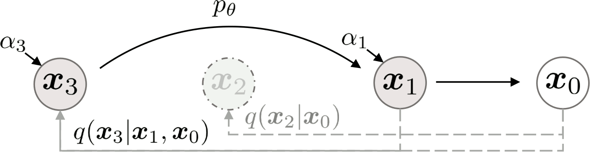

$$q_0(⁇→x_{t'} | ⁇→x_t, ⁇→x_0) = 𝓝\big(\sqrt{ᾱ_{t'}}⁇→x_0 + \sqrt{1-ᾱ_{t'}}\big(\tfrac{⁇→x_t - \sqrt{ᾱ_t}⁇→x_0}{\sqrt{1-ᾱ_t}}\big), ⇉0\big).$$

---
# Denoising Diffusion Implicit Models – Accelerated Sampling

We base our accelerated sampling algorithm on the “multistep” $q_0(⁇→x_{t'} | ⁇→x_t, ⁇→x_0)$.

~~~
Let $t_S=T, t_{S-1}, …, t_1$ be a subsequence of the process steps (usually,
a uniform subsequence of $T, …, 1$ is used), and let $t_0=0$.
~~~
Starting from initial noise $⁇→x_T ∼ 𝓝(→0, ⇉I)$, we perform $S$ sampling
steps for $i$ from $S$ down to 1:

$$→x_{t_{i-1}} ← \sqrt{ᾱ_{t_{i-1}}}\Big(\underbrace{\tfrac{→x_{t_i}-\sqrt{1-ᾱ_{t_i}}→ε_{→θ}(→x_{t_i}, t_i)}{\sqrt{ᾱ_{t_i}}}}_{→x_0\textrm{~estimate}}\Big) + \sqrt{1-ᾱ_{t_{i-1}}}→ε_{→θ}(→x_{t_i}, t_i).$$

~~~
The sampling procedure can be described in words as follows:
- using the current time step $t_i$, we compute the estimated
  noise $→ε_{→θ}(→x_{t_i}, t_i)$;
~~~
- by utilizing the current signal rate $\sqrt{ᾱ_{t_i}}$ and noise
  rate $\sqrt{1-ᾱ_{t_i}}$, we estimate $⁇→x_0$;
~~~
- we obtain $→x_{t_{i-1}}$ by combining the estimated signal $⁇→x_0$ and
  noise $→ε_{→θ}(→x_{t_i}, t_i)$ using the signal and noise rates of the time
  step $t_{i-1}$.

---
style: .katex-display { margin: .4em 0 }
# Denoising Diffusion Implicit Models – Accelerated Sampling

For comparison, we show both the original $\textcolor{#2c2}{\textrm{DDPM}}$ and the new
$\textcolor{#d4d}{\textrm{DDIM}}$ sampling algorithms:

~~~
- sample $→x_T$ from $𝓝(→0, →I)$

~~~
- let $t_S=T, t_{S-1}, …, t_1=1$ be a subsequence of the process steps
  - $\textcolor{#2c2}{\textrm{DDPM}}$: the original sequence $\textcolor{#2c2}{T, …, 1}$ is usually used
  - $\textcolor{#d4d}{\textrm{DDIM}}$: $S$ regularly-spaced steps $\textcolor{#d4d}{T, \frac{S-1}{S}T, \frac{S-2}{S}T, …, 1}$ are usually used
  - additionally, we define $t_0 = 0$

~~~
- for $i=S, …, 1$:
  $$\begin{aligned}
  \textcolor{#2c2}{\textrm{DDPM}}:\kern2em &
    →x_{t_{i-1}} ← \textcolor{#2c2}{\sqrt{\tfrac{1}{α_{t_i}}}} \bigg(→x_{t_i} - \textcolor{#2c2}{\tfrac{1-α_{t_i}}{\sqrt{1-ᾱ_{t_i}}}}→ε_{→θ}(→x_{t_i}, t_i) \bigg) \textcolor{#2c2}{+ σ_t →z_t}\\
  \textcolor{#d4d}{\textrm{DDIM}}:\kern2em &
    →x_{t_{i-1}} ← \textcolor{#d4d}{\sqrt{ᾱ_{t_{i-1}}}} \bigg(\underbrace{\tfrac{→x_{t_i} - \textcolor{#d4d}{\sqrt{1-ᾱ_{t_i}}}→ε_{→θ}(→x_{t_i}, t_i)}{\textcolor{#d4d}{\sqrt{ᾱ_{t_i}}}}}_{→x_0\textrm{~estimate}} \bigg) + \textcolor{#d4d}{\sqrt{1-ᾱ_{t_{i-1}}}→ε_{→θ}(→x_{t_i}, t_i)} \\
  \end{aligned}$$

~~~
- return $→x_0$

---
# DDIM – Accelerated Sampling Examples

---
class: section
# Bonus Content Score Matching

---
# Score Matching

Recall that loglikelihood-based models explicit represent the density
function, commonly using an unnormalized probabilistic model
$$p_{→θ}(⁇→x) = \frac{e^{f_{→θ}(⁇→x)}}{Z_{→θ}},$$
and it is troublesome to ensure the tractability of the normalization constant
$Z_{→θ}$.

~~~
One way how to avoid the normalization is to avoid the explicit density
$p_{→θ}(⁇x)$, and represent a **score function** instead, where the score
function is the gradient of the log density:
$$s_{→θ}(⁇→x) = ∇_{⁇→x} \log p_{→θ}(⁇→x),$$

~~~
because
$$s_{→θ}(⁇→x) = ∇_{⁇→x} \log p_{→θ}(⁇→x) = ∇_{⁇→x} \log \frac{e^{f_{→θ}(⁇→x)}}{Z_{→θ}} = ∇_{⁇→x} f_{→θ}(⁇→x) - \underbrace{∇_{⁇→x} \log Z_{→θ}}_0 = ∇_{⁇→x} f_{→θ}(⁇→x).$$

---
# Langevin Dynamics

When we have a score function $∇_{⁇→x} \log p_{→θ}(⁇→x)$, we can use it to
perform sampling from the distribution $p_{→θ}(⁇→x)$ by using **Langevin
dynamics**, which is an algorithm akin to SGD, but performing sampling
instead of optimum finding.
~~~
Starting with $⁇→x_0$, we iteratively set
$$⁇→x_{i+1} ← ⁇→x_i + ε∇_{⁇→x_i} \log p_{→θ}(⁇→x_i) + \sqrt{2ε}\,⁇→z_i,\textrm{~~where~~}→z_i ∼ 𝓝(→0, ⇉I).$$

~~~
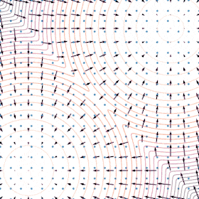

When $ε → 0$ and $K → ∞$, $⁇→x_K$ obtained by the Langevin dynamics
converges to a sample from the distribution $p_{→θ}(⁇→x)$.

---
# Score-Based Generative Modeling

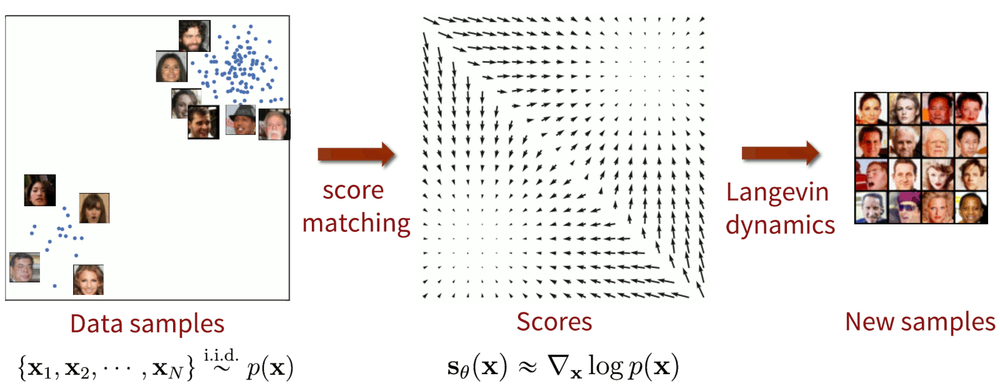

---
# Noise Conditional Score Network

However, estimating the score function from data is inaccurate
in low-density regions.

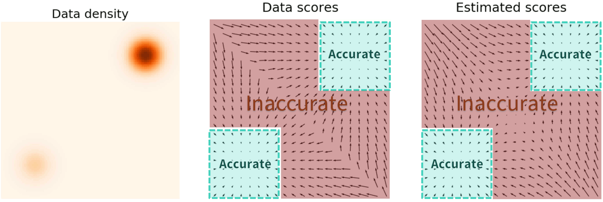

~~~
In order to accurately estimate the score function in low-density
regions, we perturb the data distribution by isotropic Gaussian noise
with various noise rates $σ_t$:
$$q_{σ_t}(⁇→x̃) ≝ 𝔼_{⁇→x ∼ p(⁇→x)} \big[𝓝(⁇→x̃; ⁇→x, {σ_t}^2 ⇉I)\big],$$
~~~
where the noise distribution $q_{σ_t}(⁇→x̃|⁇→x) = 𝓝(⁇→x̃;⁇→x, σ_t^2 ⇉I)$
as analogous to the forward process in the diffusion models.

---
style: .katex-display { margin: .8em 0 }
# Noise Conditional Score Network

To train the score function $→s_{→θ}(⁇→x, σ_t) = ∇_{⁇→x} \log q_{σ_t}(⁇→x)$, we need to minimize
the following objective:
$$𝔼_{t, ⁇→x̃ ∼ q_{σ_t}}\Big[\big\|→s_{→θ}(⁇→x̃, σ_t) - ∇_{⁇→x̃} \log q_{σ_t}(⁇→x̃)\big\|^2\Big].$$

~~~
It can be shown (see _P. Vincent: A connection between score matching and
denoising autoencoders_) that it is equivalent to minimize the _denoising score
matching_ objective:
$$𝔼_{t, ⁇→x ∼ p(⁇→x), ⁇→x̃ ∼ q_{σ_t}(⁇→x̃|⁇→x)}\Big[\big\|→s_{→θ}(⁇→x̃, σ_t) - ∇_{→x̃} \log q_{σ_t}(⁇→x̃|⁇→x)\big\|^2\Big].$$

~~~
In our case, $∇_{⁇→x̃} \log q_{σ_t}(⁇→x̃|⁇→x) = ∇_{⁇→x̃} \frac{-\|⁇→x̃-⁇→x\|^2}{2σ_t^2} = -\frac{⁇→x̃-⁇→x}{σ_t^2}$.
~~~
Because $⁇→x̃ = ⁇→x + σ_t ⁇→e$ for standard normal random variable $⁇→e ∼ 𝓝(→0,
⇉I)$, we can rewrite the objective to

$$𝔼_{t, ⁇→x ∼ p(⁇→x), ⁇→e ∼ 𝓝(→0, ⇉I)}\Big[\big\|→s_{→θ}(⁇→x+σ_t ⁇→e, σ_t) - \frac{-⁇→e}{σ_t}\big\|^2\Big],$$

so the score function basically estimates the noise given a noised image.

---
# Noise Conditional Score Network

Once we have trained the score function for various noise rates $σ_t$, we can
sample using annealed Langevin dynamics, where we utilize using gradually
smaller noise rates $σ_t$.

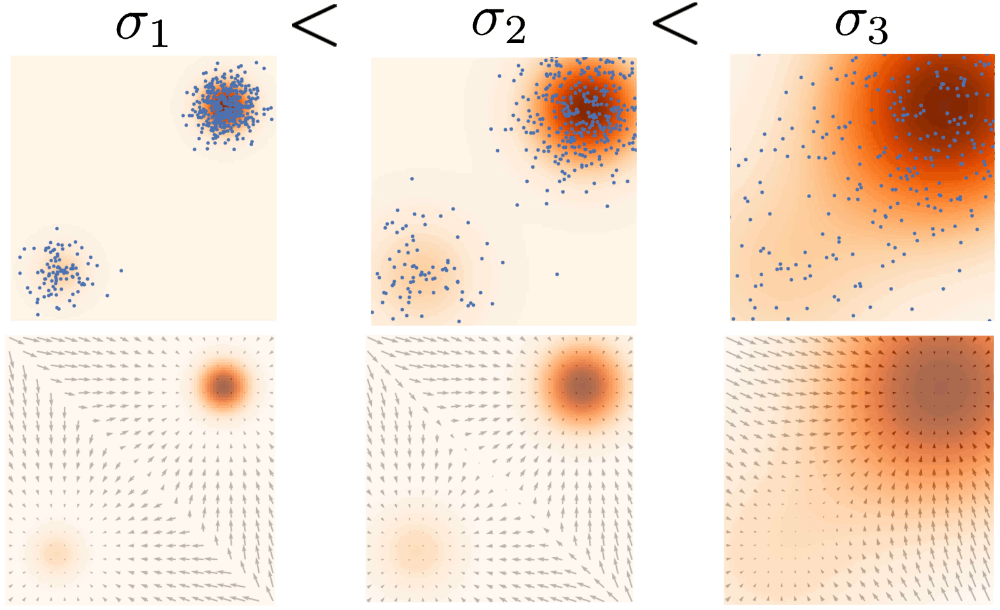

~~~
Such a procedure is reminiscent to the reverse diffusion process sampling.

---
class: section
# Bonus Content Further Reading

---
# Development of Diffusion Models

- Yang Song, Stefano Ermon: **Generative Modeling by Estimating Gradients of the
  Data Distribution** https://arxiv.org/abs/1907.05600

- Jonathan Ho, Ajay Jain, Pieter Abbeel: **Denoising Diffusion Probabilistic
  Models** https://arxiv.org/abs/2006.11239

- Jiaming Song, Chenlin Meng, Stefano Ermon: **Denoising Diffusion Implicit
  Models** https://arxiv.org/abs/2010.02502

- Alex Nichol, Prafulla Dhariwal: **Improved Denoising Diffusion Probabilistic
  Models** https://arxiv.org/abs/2102.09672

- Prafulla Dhariwal, Alex Nichol: **Diffusion Models Beat GANs on Image
  Synthesis** https://arxiv.org/abs/2105.05233

- Robin Rombach, Andreas Blattmann, Dominik Lorenz, Patrick Esser, Björn Ommer:
  **High-Resolution Image Synthesis with Latent Diffusion Models**
  https://arxiv.org/abs/2112.10752

---
# SR3 Super-Resolution via Diffusion

- Chitwan Saharia, Jonathan Ho, William Chan, Tim Salimans, David J. Fleet, M. Norouzi:
  **Image Super-Resolution via Iterative Refinement** https://arxiv.org/abs/2104.07636

<video controls style="width: 84%">
   <source src="https://iterative-refinement.github.io/images/super_res_movie.m4v" type="video/mp4">
</video>

---
# Diffusion-Based Text-Conditional Image Generation

- Alex Nichol et al.: **GLIDE: Towards Photorealistic Image Generation and
  Editing with Text-Guided Diffusion Models** https://arxiv.org/abs/2112.10741

---
# Diffusion-Based Text-Conditional Image Generation

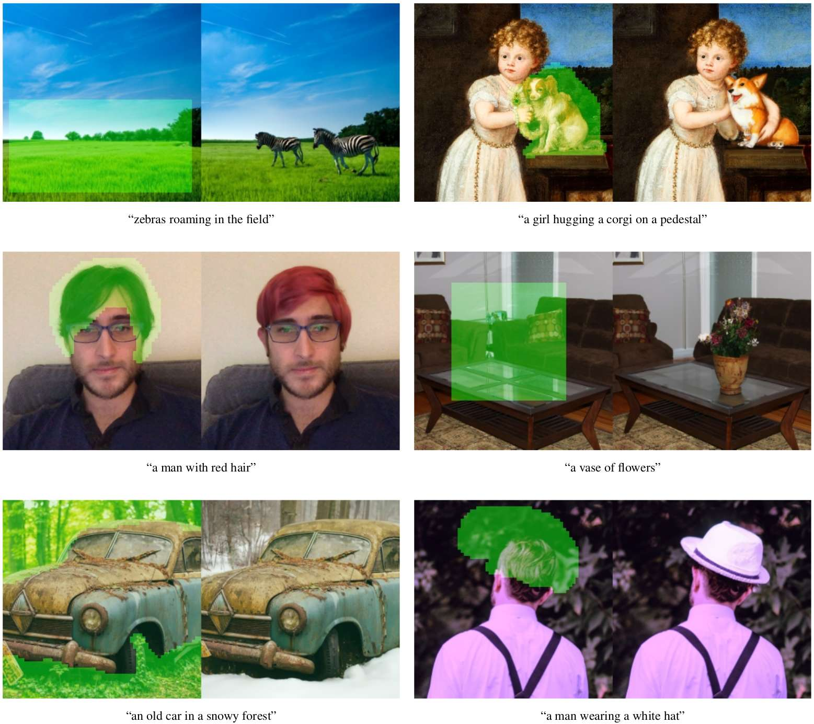

---
# Diffusion-Based Text-Conditional Image Generation

- Chitwan Saharia, William Chan, Saurabh Saxena, Lala Li, Jay Whang, et al.:
  **Photorealistic Text-to-Image Diffusion Models with Deep Language
  Understanding** https://arxiv.org/abs/2205.11487

---
# Normalizing Flows

- Laurent Dinh, David Krueger, Yoshua Bengio: **NICE: Non-linear Independent Components Estimation** https://arxiv.org/abs/1410.8516

- Laurent Dinh, Jascha Sohl-Dickstein, Samy Bengio: **Density estimation using Real NVP** https://arxiv.org/abs/1605.08803

- Diederik P. Kingma, Prafulla Dhariwal: **Glow: Generative Flow with Invertible 1x1 Convolutions** https://arxiv.org/abs/1807.03039

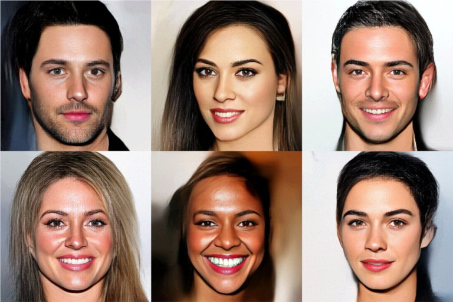
