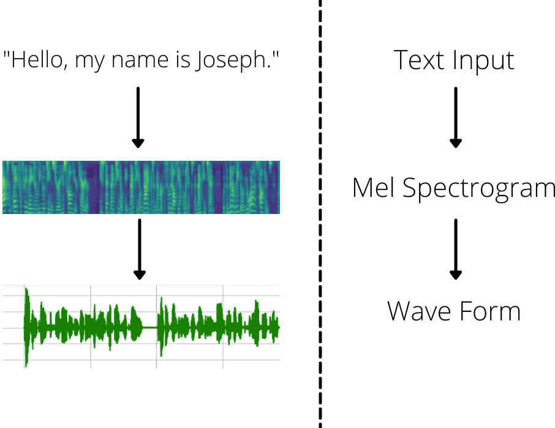
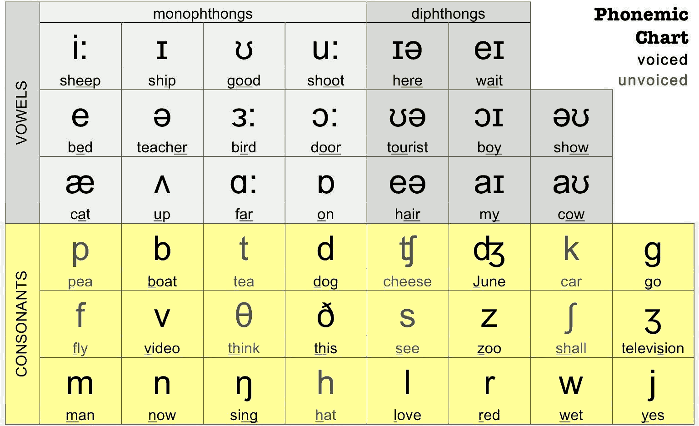
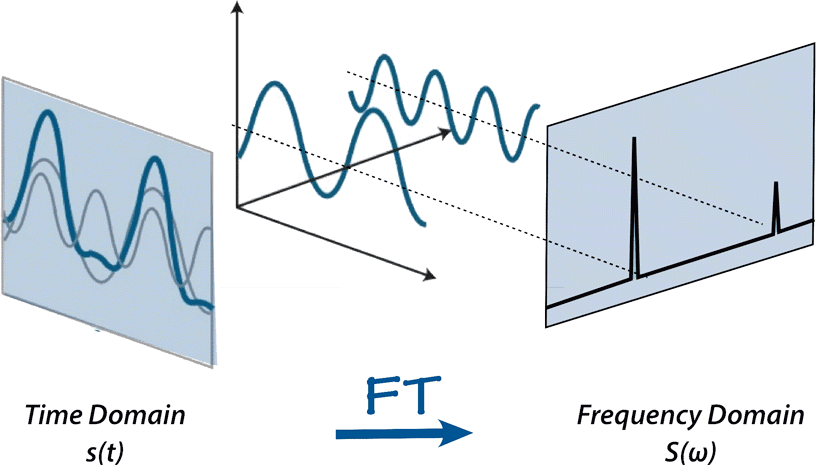
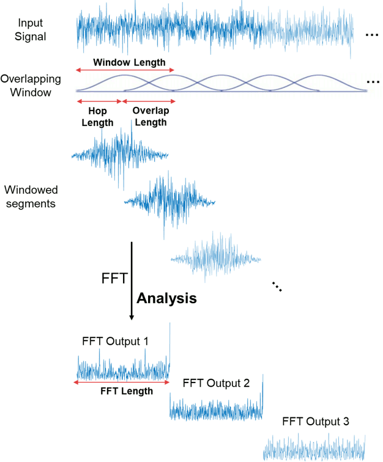
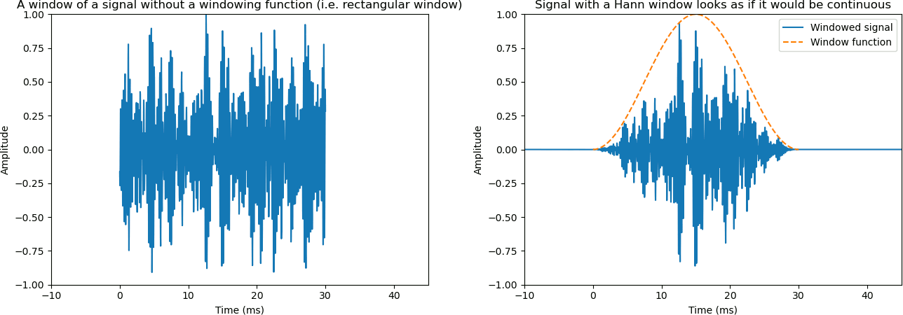
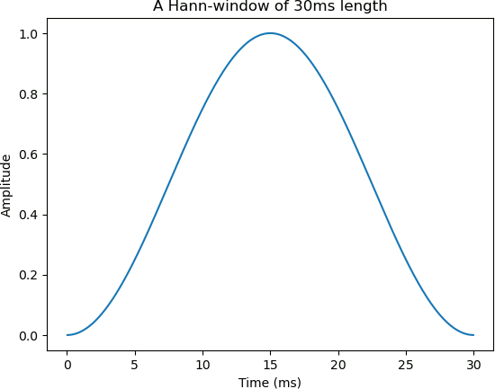

title: NPFL138, Lecture 14
class: title, langtech, cc-by-sa

# Speech Synthesis

## Milan Straka

### May 20, 2025

---
section: Mel Spectrograms
class: section
# Mel Spectrograms

---
# Speech Generation Pipeline

---
# Speech Generation Pipeline

Traditionally, the input text was represented by **phonemes**.

~~~
However, nowadays the input is most commonly represented using **characters**
(some systems still allow specifying some input words using phonemes to allow
more control over the output).

---
# Time vs Frequency Domain

A sound can be represented in the **time domain**, as a sequence of
amplitudes, i.e., how the signal changes over time.

~~~
Alternatively, it can be represented in a **frequency domain**, where
a signal is represented by a _spectrum_: the magnitudes and phases of sinusoids
with a collection of frequencies.

---
# Time vs Frequency Domain

To convert a signal between time and frequency domains, Fourier transform can be
used. In case of discrete-time signal, **discrete Fourier transform (DFT)** converts
~~~
- $N$ complex-valued equally-spaced samples in the time domain to
~~~

- $N$ complex-valued coefficients (magnitude and phase) of sinusoids with
  frequencies 1 Hz, 2 Hz, 3 Hz, …, $N$ Hz.

~~~
**Fast Fourier transform (FFT)** is an algorithm that can perform discrete
Fourier transform in in $𝓞(N \log N)$ time for $N=2^k$ a power of two.

~~~
When the input signal consists of only real values, the upper half of the
frequency spectrum is determined by the lower half ($x_{N-i} = \overline{x_i}$,
where $\overline x$ denotes complex conjugate); therefore, a discrete signal
of $N$ samples can be represented by sinusoids with frequencies of 1, 2, 3, …,
$\frac{N}{2}$.

---
# Spectrogram

We can represent an arbitrary-length signal by a **spectrogram**, a series of
fixed-length spectral densities (i.e., for every sinusoid, we compute some
real-valued density, usually _power density_ $x^2$).

~~~
The spectrogram is computed using **short-time Fourier transform (STFT)**, where
- DFT is performed on windows of fixed size,
~~~
- neighboring windows are shifted by a fixed hop length.

~~~
For every window, the signal is composed of sinusoids with frequencies up
to half of the window length.

~~~
In speech synthesis, assuming a sampling frequency of 22.05kHz or 24kHz,
commonly used values are 1024 for window length (denoted
commonly as _n_fft_; ~45ms) and hop length of 256 (circa 11ms).

---
# Spectrogram

To avoid discontinuities at the borders of the windows, _windowing_ is used.

~~~

Many possible window function exist; we will use the **Hann** window,
which is as suitably scaled cosine function.

---
# Mel Spectrogram

Linearly increasing frequencies are not perceived to be equal in distance from
one another by humans.

~~~
Therefore, the **mel scale** (from the word melody) was proposed, so that the
pitches were judged by listeners to be in equal distance.

~~~

There are in fact several mel scales, the most commonly used is
$$m = 2595 \log_{10} \Big(1 + \frac{f}{700}\Big).$$

---
# Mel Spectrogram

To convert spectrogram to mel spectrogram, a collection of triangular filters
equally-distanced in the mel scale is used.

~~~
Finally, we usually take the logarithm of the power spectrum, given that
humans percieve loudness on logarithmic scale (i.e., dBs are also a logarithmic scale).

---
# Mel Spectrogram

---
# Speech Generation Pipeline Revisited

In the context of speech synthesis, a **vocoder** (combination of words
voice and encoder) is the second part of the pipeline, converting
a (usually mel) spectrogram to a waveform.

---
section: WaveNet
class: section
# WaveNet

---
# WaveNet

WaveNet, proposed in 2016, was one of the first neural architectures that
produced high quality human speech.

~~~
Not many details were published in the original paper. From today's perspective,
WaveNet is a vocoder capable of converting mel spectrograms to waveforms.

~~~
In the following, we start the description without the mel spectrogram
conditioning, but we add it later.

---
# WaveNet

Our goal is to model speech, using a convolutional auto-regressive model
$$P(→x) = ∏_t P(x_t | x_{t-1}, …, x_1).$$

~~~

---
# WaveNet

However, to achieve larger receptive field, we utilize **dilated** (or **atrous**) convolutions:

---
class: tablewide
style: table {line-height: 1}
# Dilated Versus Regular Versus Strided Convolutions

| Regular Convolution | Strided Convolution |
|:--:|:--:|
|  |  |
| **Dilated Convolution** | **Transposed Strided Convolution** |
|  |  |

---
# WaveNet – Output Distribution

## Output Distribution

WaveNet generates audio with 16kHz frequency and 16-bit samples.

~~~
However, classification into $65\,536$ classes would not be efficient. Instead,
WaveNet adopts the $μ$-law transformation, which passes the input samples in
$[-1, 1]$ range through the $μ$-law encoding
$$\sign(x)\frac{\log(1 + 255|x|)}{\log(1 + 255)},$$
and the resulting $[-1, 1]$ range is linearly quantized into 256 buckets.

~~~
The model therefore predicts each samples using classification into 256 classes,
and then uses the inverse of the above transformation on the model predictions.

<audio controls style="width: 49%"><source src="https://upload.wikimedia.org/wikipedia/commons/f/f4/Larynx-HiFi-GAN_speech_sample.wav"></audio>
<audio controls style="width: 49%"><source src="https://upload.wikimedia.org/wikipedia/commons/d/da/Mu-law_audio_demo.flac"></audio>

---
# WaveNet – Architecture

~~~
The outputs of the dilated convolutions are passed through the _gated activation
unit_:
$$→z = \tanh(⇉W_f * →x) ⊙ σ(⇉W_g * →x).$$

---
# WaveNet

## Global Conditioning
Global conditioning is performed by a single latent representation $→h$,
changing the gated activation function to
$$→z = \tanh(⇉W_f * →x + ⇉V_f→h) ⊙ σ(⇉W_g * →x + ⇉V_g→h).$$

~~~
## Local Conditioning
For local conditioning, we are given a time series $→h$, possibly with a lower
sampling frequency (for example the mel spectrogram). We first use transposed
convolutions $→y = f(→h)$ to match resolution and then compute analogously to
global conditioning
$$→z = \tanh(⇉W_f * →x + ⇉V_f * →y) ⊙ σ(⇉W_g * →x + ⇉V_g * →y).$$

The authors mention that using repetition instead of transposed convolution
worked slightly worse.

---
# WaveNet

The original paper did not mention hyperparameters, but later it was revealed
that:
- 30 layers were used

~~~
  - grouped into 3 dilation stacks with 10 layers each
~~~
  - in a dilation stack, dilation rate increases by a factor of 2, starting
    with rate 1 and reaching maximum dilation of 512
~~~
- kernel size of a dilated convolution is 2 (and increased to 3 in Parallel
  WaveNet)
~~~
- residual connection has dimension 512
~~~
- gating layer uses 256+256 hidden units
~~~
- the $1×1$ convolutions in the output step produce 256 filters
~~~
- trained for $1\,000\,000$ steps using Adam with a fixed learning rate of 2e-4

---
# WaveNet

---
section: GLUs
class: section
# Gated Activations in Transformers

---
class: tablewide
style: table { line-height: 1.0 }
# Gated Activations in Transformers

Similar gated activations seem to work the best in Transformers, in the FFN
module.

~~~
| Activation Name | Formula | $\operatorname{FFN}(x; ⇉W_1, ⇉W_2)$ |
|:----------------|:-------:|:---:|
| ReLU            | $\max(0, x)$ | $\max(0, →x⇉W_1)⇉W_2$
~~~
| GELU            | $x Φ(x)$ | $\operatorname{GELU}(→x⇉W_1)⇉W_2$
~~~
| Swish           | $x σ(x)$ | $\operatorname{Swish}(→x⇉W_1)⇉W_2$
~~~

There are several variants of the new gated activations:

| Activation Name | Formula | $\operatorname{FFN}(x; ⇉W, ⇉V, ⇉W_2)$ |
|:----------------|:-------:|:---:|
| GLU (Gated Linear Unit) | $σ(→x⇉W + →b)⊙(→x⇉V + →c)$ | $(σ(→x⇉W)⊙→x⇉V)⇉W_2$
~~~
| ReGLU | $\max(0, →x⇉W + →b)⊙(→x⇉V + →c)$ | $(\max(0, →x⇉W)⊙→x⇉V)⇉W_2$
| GEGLU | $\operatorname{GELU}(→x⇉W + →b)⊙(→x⇉V + →c)$ | $(\operatorname{GELU}(→x⇉W)⊙→x⇉V)⇉W_2$
| SwiGLU | $\operatorname{Swish}(→x⇉W + →b)⊙(→x⇉V + →c)$ | $(\operatorname{Swish}(→x⇉W)⊙→x⇉V)⇉W_2$

---
# Gated Activations in Transformers

---
section: ParallelWaveNet
class: section
# Parallel WaveNet

---
style: .katex-display { margin: .8em 0 }
# Parallel WaveNet

Parallel WaveNet is an improvement of the original WaveNet by the same authors.

~~~
First, the output distribution was changed from 256 $μ$-law values to a Mixture of
Logistic (suggested in another paper – PixelCNN++, but reused in other architectures since):
$$x ∼ ∑_i π_i \operatorname{Logistic}(μ_i, s_i).$$

~~~

The logistic distribution is a distribution with a $σ$ as cumulative density function
(where the mean and scale is parametrized by $μ$ and $s$).
~~~
Therefore, we can write
$$P(x | →π, →μ, →s) = ∑_i π_i \bigg[σ\Big(\frac{x + 0.5 - μ_i}{s_i}\Big) - σ\Big(\frac{x - 0.5 - μ_i}{s_i}\Big)\bigg],$$
where we replace $-0.5$ and $0.5$ in the edge cases by $-∞$ and $∞$.

~~~
In Parallel WaveNet teacher, 10 mixture components are used.

---
style: .katex-display { margin: .8em 0 }
# Parallel WaveNet

Auto-regressive (sequential) inference is extremely slow in WaveNet.

~~~
Instead, we model $P(x_t)$ as $P(x_t | →z_{<t})
= \operatorname{Logistic}\big(x_t; μ^1(→z_{< t}), s^1(→z_{< t})\big)$
for a _random_ $→z$ drawn from a logistic distribution
$\operatorname{Logistic}(→0, →1)$. Therefore, using the reparametrization
trick,
$$x^1_t = μ^1(→z_{< t}) + z_t ⋅ s^1(→z_{< t}).$$

~~~
Usually, one iteration of the algorithm does not produce good enough results
– consequently, 4 iterations were used by the authors. In further iterations,
$$x^i_t = μ^i(→x^{i-1}_{< t}) + x^{i-1}_t ⋅ s^i(→x^{i-1}_{< t}).$$

~~~
After $N$ iterations, $P(→x^N_t | →z_{<t})$ is a logistic distribution
with location $→μ^\textrm{tot}$ and scale $→s^\textrm{tot}$:
$$μ^\textrm{tot}_t = ∑_{i=1}^N μ^i(→x^{i-1}_{< t}) ⋅ \Big(∏\nolimits_{j>i}^N s^j(→x^{j-1}_{< t})\Big) \textrm{~~and~~}
  s^\textrm{tot}_t = ∏_{i=1}^N s^i(→x^{i-1}_{< t}),$$
where we have denoted $→z$ as $→x^0$ for convenience.

---
style: .katex-display { margin: .8em 0 }
# Parallel WaveNet

The consequences of changing the model from $x_t = f(x_{t-1}, …, x_1)$ to
$$\begin{aligned}
x^1_t &= μ^1(→z_{< t}) + z_t ⋅ s^1(→z_{< t}) \\
x^i_t &= μ^i(→x^{i-1}_{< t}) + x^{i-1}_t ⋅ s^i(→x^{i-1}_{< t}) \\
\end{aligned}$$

are:
~~~
- During inference, the prediction can be computed in parallel, because
  $x^i_t$ depends only on $→x^{i-1}_{< t}$, not on $x^i_{< t}$.
~~~
- However, we cannot perform training in parallel.
~~~
  If we try maximizing the log-likelihood of an input sequence $→x^1$,
  we need to find out which $→z$ sequence generates it.
~~~
  - The $z_1$ can be computed using $x^1_1$.
~~~
  - However, $z_2$ depends not only on $x^1_1$ and $x^1_2$, but also on $z_1$;
    generally, $z_t$ depends on $→x^1$ and also on all $→z_{< t}$, and can be
    computed only sequentially.

~~~
Therefore, WaveNet can perform parallel training and sequential inference, while
the proposed model can perform parallel inference but sequential training.

---
# Probability Density Distillation

The authors propose to train the network by a **probability density distillation** using
a teacher WaveNet (producing a mixture of logistic with 10 components) with KL-divergence as a loss.

---
style: .katex-display { margin: .8em 0 }
# Probability Density Distillation

Therefore, instead of computing $→z$ from some gold $→x_g$, we
~~~
- sample a random $→z$;
~~~
- generate the output $→x$;
~~~
- use the teacher WaveNet model to estimate the log-likelihood
  of $→x$;
~~~
- update the student to match the log-likelihood of the teacher.

~~~
Denoting the teacher distribution as $P_T$ and the student distribution
as $P_S$, the loss is
$$D_\textrm{KL}(P_S || P_T) = H(P_S, P_T) - H(P_S).$$

~~~
Therefore, we do not only minimize cross-entropy, but we also try to keep the
entropy of the student as high as possible – it is indeed crucial not to match
just the mode of the teacher.
~~~
- Consider a teacher generating white noise, where every sample comes from
  $𝓝(0, 1)$ – in this case, the cross-entropy loss of a constant $→0$, complete
  silence, would be maximal.

~~~
In a sense, probability density distillation is similar to GANs. However,
the teacher is kept fixed, and the student does not attempt to fool it
but to match its distribution instead.

---
class: dbend
# Probability Density Distillation Details

Because the entropy of a logistic distribution $\operatorname{Logistic}(μ, s)$
is $\log s + 2$, the entropy term $H(P_S)$ can be rewritten as follows:
$$\begin{aligned}
H(P_S) &= 𝔼_{z∼\operatorname{Logistic}(0, 1)}\left[\sum_{t=1}^T - \log p_S(x_t|→z_{<t})\right] \\
       &= 𝔼_{z∼\operatorname{Logistic}(0, 1)}\left[\sum_{t=1}^T \log s(→z_{\lt t}, →θ)\right] + 2T.
\end{aligned}$$
Therefore, this term can be computed without having to generate $→x$.

---
class: dbend
# Probability Density Distillation Details

However, the cross-entropy term $H(P_S, P_T)$ requires sampling from $P_S$ to estimate:

~~~
$\displaystyle \kern6em{}\mathllap{H(P_S, P_T)} = ∫_{→x} -P_S(→x) \log P_T(→x)$

~~~
$\displaystyle \kern6em{} = ∑_{t=1}^T ∫_{→x} -P_S(→x) \log P_T(x_t|→x_{<t})$

~~~
$\displaystyle \kern6em{} = ∑_{t=1}^T ∫_{→x} -\textcolor{blue}{P_S(→x_{<t})}\textcolor{green}{P_S(x_t|→x_{<t})}\textcolor{red}{P_S(→x_{>t}|→x_{\leq t})} \log P_T(x_t|→x_{<t})$

~~~
$\displaystyle \kern6em{} = ∑_{t=1}^T 𝔼_{\textcolor{blue}{P_S(→x_{<t})}} \bigg[∫_{x_t} -\textcolor{green}{P_S(x_t|→x_{<t})} \log P_T(x_t|→x_{<t}) ∫_{→x_{>t}} \textcolor{red}{P_S(→x_{>t}|→x_{\leq t})}\bigg]$

~~~ ~~
$\displaystyle \kern6em{} = ∑_{t=1}^T 𝔼_{\textcolor{blue}{P_S(→x_{<t})}} \bigg[∫_{x_t} -\textcolor{green}{P_S(x_t|→x_{<t})} \log P_T(x_t|→x_{<t}) \underbrace{\,∫_{→x_{>t}} \textcolor{red}{P_S(→x_{>t}|→x_{\leq t})}}_1\bigg]$

~~~
$\displaystyle \kern6em{} = ∑_{t=1}^T 𝔼_{P_S(→x_{<t})} H\Big(P_S(x_t|→x_{<t}), P_T(x_t|→x_{<t})\Big).$

---
# Probability Density Distillation Details

$$H(P_S, P_T) = ∑_{t=1}^T 𝔼_{P_S(→x_{<t})} H\Big(P_S(x_t|→x_{<t}), P_T(x_t|→x_{<t})\Big)$$

We can therefore estimate $H(P_S, P_T)$ by:
- drawing a single sample $→x$ from the student $P_S$ _[a Logistic($→μ^\textrm{tot}, →s^\textrm{tot}$)]_,
~~~
- compute all $P_T(x_t | →x_{<t})$ from the teacher in parallel _[mixture of
  logistic distributions]_,
~~~
- and finally evaluate $H(P_S(x_t|→x_{<t}), P_T(x_t|→x_{<t}))$ by sampling
  multiple different $x_t$ from the $P_S(x_t|→x_{<t})$.

~~~
The authors state that this unbiased estimator has a much lower variance than
naively evaluating a single sequence sample under the teacher using the original formulation.

---
# Parallel WaveNet

The Parallel WaveNet model consists of 4 iterations with 10, 10, 10, 30 layers,
respectively. The dimension of the residuals and the gating units is 64
(compared to 512 in WaveNet).

~~~
The Parallel WaveNet generates over 500k samples per
second, compared to ~170 samples per second of a regular WaveNet – more than
a 1000 times speedup.

~~~
For comparison, using a single iteration with 30 layers achieve MOS of 4.21.

---
# Parallel WaveNet

The Parallel WaveNet can be trained to generate speech of multiple speakers
(using the global conditioning). Because such a model needs larger capacity,
it used 30 layers in every iteration (instead of 10, 10, 10, 30).

~~~

---
class: dbend
style: .katex-display { margin: .25em 0 }
# Parallel WaveNet – Additional Losses

To generate high-quality audio, the probability density distillation is not
entirely sufficient. The authors therefore introduce additional losses:
~~~
- **power loss**: ensures the power in different frequency bands is on average
  similar between the generated speech and human speech. For a conditioned
  training data $(→x, →c)$ and WaveNet student $g$, the loss is
  $$\big\|\operatorname{STFT}(g(→z, →c)) - \operatorname{STFT}(→x)\big\|^2.$$
~~~
- **perceptual loss**: apart from the power in frequency bands, we can use
  a pre-trained classifier to extract features from generated and human speech
  and add a loss measuring their difference. The authors propose the loss as
  squared Frobenius norm of differences between Gram matrices (uncentered
  covariance matrices) of features of a WaveNet-like classifier predicting
  phones from raw audio.
~~~
- **contrastive loss**: to make the model respect the conditioning instead of
  generating outputs with high likelihood independent on the conditioning,
  the authors propose a contrastive distillation loss ($γ=0.3$ is used in the
  paper):
  $$D_\textrm{KL}\big(P_S(→c_1) || P_T(→c_1)\big) - γ D_\textrm{KL}\big(P_S(→c_1) || P_T(→c_2)\big).$$

---
class: dbend
# Parallel WaveNet – Additional Losses

---
section: Tacotron 2
class: section
# Tacotron 2

---
# Tacotron 2

Tacotron 2 model presents end-to-end speech synthesis directly from text.
~~~
It consists of two components trained separately:
- a seq2seq model processing input characters and generating mel spectrograms;
- a Parallel WaveNet generating the speech from Mel spectrograms.

---
style: .katex-display { margin: .6em 0 }
# Tacotron 2

The Mel spectrograms used in Tacotron 2 are fairly standard:

~~~
- The authors propose a frame size of 50ms, 12.5ms frame hop, and a Hann window.

~~~
- STFT magnitudes are transformed into 80-channel Mel scale spanning 175Hz
  to 7.6kHz, followed by a log dynamic range compression (clipping input values
  to at least 0.01).

~~~
## Architecture

The characters are represented using 512-dimensional embeddings, processed
by 5 Conv+BN+ReLU with kernel size 5 and 512 channels, following
by a single bi-directional LSTM with 512 units.

---
style: .katex-display { margin: .5em 0 }
# Tacotron 2

To make sequential processing of input characters easier, Tacotron 2 utilizes
_location-sensitive attention_, which is an extension of the additive attention.
While the additive (Bahdanau) attention computes
$$\begin{gathered}
  →α_i = \mathrm{Attend}(→s_{i-1}, →h), \\
  α_{ij} = \softmax\big(→v^\top \tanh(⇉V→h_j + ⇉W→s_{i-1} + →b)\big),
\end{gathered}$$

~~~
the location-sensitive attention also inputs the previous cummulative attention
weights $→α̂_i$ into the current attention computation:
$$→α_i = \mathrm{Attend}(→s_{i-1}, →h, →α̂_{i-1}).$$

~~~
In detail, the previous attention weights are processed by a 1-D convolution with kernel $⇉F$:
$$α_{ij} = \softmax\big(→v^\top \tanh(⇉V→h_j + ⇉W→s_{i-1} + (⇉F * →α̂_{i-1})_j + →b)\big),$$
using 32-dimensional 1D convolution with kernel size 31,

---
# Tacotron 2

Usually, the current state in the attention $→s_{i-1}$ is represented using the decoder
cell state. However, in this model, it is beneficial for the attention to has
access to the generated spectrogram.

~~~
Therefore, a separate _attention RNN_ is used, which has to goal to represent
the “mel spectrogram generated so far”: its inputs are the decoder input
(the result of the pre-net) concatenated with the attention context vector
$→α_i^T →h$, and the output of this attention RNN is used as $→s_{i-1}$ in the
attention computation.

---
# Tacotron 2

The decoder predicts the spectrogram one frame at a time.
~~~
The predictions from the previous step are first passed through a _pre-net_
composed of 2 fully-connected ReLU layers with 256 units and concatenated with
attention context vector.

~~~
The decoder consists of 2 1024-dimensional LSTM cells and its output is linearly
projected to the predicted frame.

~~~
The stop-token is predicted from a concatenation of decoder output and attention
context vector, followed by a sigmoid activation.

~~~
The predicted spectrogram frame is post-processed by a _post-net_ composed
of 5 convolutional layers followed by batch normalization and tanh activation
(on all but the last layers), with 512 channels and kernel size 5.

~~~
The target objective is the MSE error of the spectrogram and the
decoder output both before and after the post-net.

---
# Tacotron 2

---
class: middle
# Tacotron 2

You can listen to samples at https://google.github.io/tacotron/publications/tacotron2/

---
# Tacotron 2

~~~

~~~

---
section: FastSpeech
class: section
# FastSpeech

---
# FastSpeech

FastSpeech performs non-autoregressive decoding of mel spectrogram from the
input text.

~~~
A hard character–spectrogram frame alignment is computed using some existing
system, and the representation of input character is then repeated according
to the alignment.

---
# FastSpeech

~~~

~~~
Later improved in FastPitch and FastSpeech 2 systems.

---
section: TTSAlign
class: section
# One TTS Alignment To Rule Them All

---
# One TTS Alignment To Rule Them All

---
style: .katex-display { margin: .8em 0 }
# One TTS Alignment To Rule Them All

Let $s_i$ denotes the $i$-th input text character, and
$→x_t$ be the $t$-th mel spectrogram frame.

~~~
Assuming we have access to some alignment
$$P(s_i | →x_t; →θ).$$

~~~
We can train the alignment to maximize the probability of all monotonic
alignments between the mel spectrogram and the input text:
$$𝓛(→θ; →X, →s) ≝ ∑_{\substack{→c\mathrm{~any~valid}\\\mathrm{monotonic~alignment}}} ∏_{t=1}^T P(c_t | →x_t; →θ).$$

~~~
Such a loss can be computed by exploiting the CTC loss (given that efficient
implementations for it already exist).

---
# One TTS Alignment To Rule Them All

~~~

~~~

---
# Alignment Prior

For faster alignment convergence (which makes the full model training faster),
during training we might use a static 2D prior that is wider near the center and
narrower near the corners.

~~~
The complete alignment is then the normalized product of the computed alignment
and the alignment prior.

~~~

